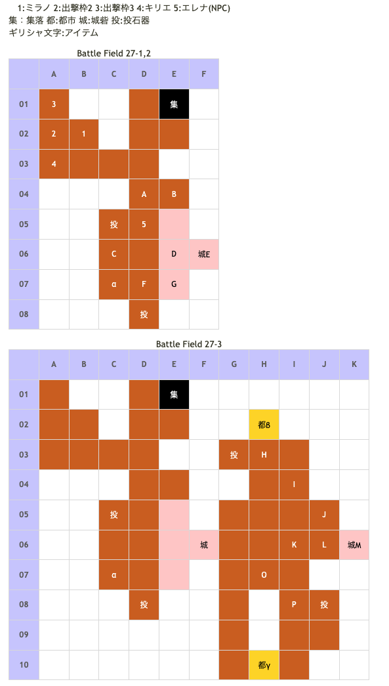

# Battle Field 27 贖罪の門

- カード8枚
- 3部構成。
- 投石器4。
- 敵ターンから開始。
- 27-1、敵の動きによってはエレナの士気がいきなり2000前後削られる為、なるべく急いで隣接させよう。
- 27-1、エレナへ隣接するとエレナ加入、使用済みカード復活、27-2へ
- 27-2、BF25と違いエレナを自軍扱いで戦闘出来るので、ブラッディクローを選択しておくと吉。

## 勝利条件 

27-1
- 味方ユニットがエレナに隣接

27-2
- 特定地点へ到達

27-3
- レオンの撃破

## 敗北条件 

27-1
- ミラノorエレナorキリエの戦死
- カードを使い切る

27-2、27-3
- ミラノorキリエの戦死
- カードを使い切る

## マップ 

## 取得可能アイテム 

|名前|時期|-|位置|備考|
|---|---|---|---|---|
|マナストーン|27-1〜|拾|α|キリエ限定、[Battle Field 31](BattleField31.md)で「マジカルソード」の入手に必要|
|キスオブデス(カード)|27-3|拾|β|夜限定　TNVが0になる|
|ダークマター|27-3|交|γ|夜限定、エレナを除く出撃ユニット4人のTNV12以上 （メインメニューに表示されるTNVにエレナのNVは含まれない） 手持ちのアイテムからランダムで交換　※「妖しの果実」と二択 [Battle Field 31](BattleField31.md)で「ダークセイバー」の入手に必要|
|妖しの果実|27-3|交|γ|夜限定、エレナを除く出撃ユニット4人のTNV11以下 （メインメニューに表示されるTNVにエレナのNVは含まれない） 手持ちのアイテムからランダムで交換　※「ダークマター」と二択|
|ひらひらリボン(2) or小さな胸あて(2)|27-2|落|E(エミリオ)|LUK5.0 [Battle Field 25](BattleField25.md)で「ひらひらリボン」入手済みの場合「小さな胸あて」所持|
|悲槍シルヴィア(2)|27-3|落|M(レオン)|LUK1.0|

## 友軍ユニット 

- エレナ ： ブラッディクロー （Pow 1500 Mov 9）

|NO.|名前|ユニット|Lv|士気|GEN|ATK|TEC|LUK|POW|アイテム|備考|
|---|---|---|---|---|---|---|---|---|---|---|---|
|5|エレナ|アサシン|11|5540|2.3|3.0|4.0|4.0|-|ミーティア(3)|クリティカル率50%(装備)|

- 備考：エレナはMVPにはなれないが、経験値は取得可能。

## 敵ユニット 

### 27-1、27-2

- エミリオ隊 ： グラヴィティカオス （Pow 1600 Mov 9）

|No.|名前|ユニット|Lv|士気|GEN|ATK|TEC|LUK|POW|アイテム|備考|
|---|---|---|---|---|---|---|---|---|---|---|---|
|A|緋天騎兵|グリフライダー|10|2260|2.6|2.6|2.5|3.2|40|装備なし||
|B|帝国兵|ヴァルキリー|9|1950|2.1|2.5|3.2|2.5|40|装備なし||
|C|緋天騎兵|グリフライダー|10|2480|2.6|2.6|2.5|3.2|40|装備なし||
|D|帝国兵|ウィッチ|9|2390|2.1|2.1|3.5|3.2|40|装備なし||
|E|エミリオ|グリフライダー|12|5860|2.5|3.2|4.2|5.0|120|ひらひらリボン(2) or小さな胸あて(2)|○ステータス異常無効(ひらひらリボン) 弓系ユニットに強い(小さな胸あて) ステータスは小さな胸あて装備時のもの|
|F|帝国兵|ヴァルキリー|9|2230|2.1|2.5|3.2|2.5|40|装備なし||
|G|帝国兵|ウィッチ|9|2390|2.1|2.1|3.5|3.2|40|装備なし||

- 備考：焼き鳥可能。 エミリオはLukが高くクリティカルが怖いが、ユニオンやリンクで投石器2つ使うと戦闘開始直後に1人に減らせる為、カードのPowによっては1ターンで始末出来る。

### 27-3

- レオン隊 ： チャリオット （Pow 2200 Mov 9）

|No.|名前|ユニット|Lv|士気|GEN|ATK|TEC|LUK|POW|アイテム|備考|
|---|---|---|---|---|---|---|---|---|---|---|---|
|H|帝国兵|アサシン|9|2170|1.6|2.1|3.5|3.5|40|装備なし||
|I|重槍兵|ナイト|10|2750|3.1|2.6|2.5|1.9|40|装備なし||
|J|重槍兵|ナイト|10|2750|3.1|2.6|2.5|1.9|40|装備なし||
|K|重槍兵|ナイト|10|2750|3.1|2.6|2.5|1.9|40|装備なし||
|L|帝国兵|アサシン|9|2170|1.6|2.1|3.5|3.5|40|装備なし||
|M|レオン|ナイト|10|6700|3.3|4.0|4.0|1.0|120|悲槍シルヴィア(2)|常にゲージ減少(装備)|
|N|重槍兵|ナイト|10|2750|3.1|2.6|2.5|1.9|40|装備なし||
|O|帝国兵|アサシン|9|2170|1.6|2.1|3.5|3.5|40|装備なし||

- 備考：レオンは装備効果の為、ゲージの溜まりが遅い。南にある投石器を使いつつユニオンで袋叩きにすれば1ターン撃破も可能。

## 戦闘中イベント 

27-2
- エミリオ撃破で帝国兵、緋天騎兵グループ消滅。

27-3
- マップ南西(バルダック砦←←←↓)でマナストーン入手(キリエ限定)
- 北部、滅びの町ミデレードでキスオブデス(power:2950,move:6,Ace:All)。夜のみマップ上に出現。
- 南部、夜の町レイシャンクで手持ちのアイテムからランダムでダークマターと交換。（TNV12以上でダークマター）
  - 名声が低い場合妖しの果実と交換になる。（TNV11以下で妖しの果実）
- レオンと味方ユニット隣接・戦闘前後にそれぞれ会話。戦闘結果により戦闘後会話変化
- レオン撃破で帝国兵、重槍兵グループ消滅。

## 勝利後イベント 

- エレナが一時離脱

## MVPターン制限 

- ＋２：１８ターン以下
- ＋１：１９ターン以上
- 無し：リトライ

## 関連 

- [Chapter 4](Chapter4.md)

### 次 

- [Battle Field 28](BattleField28.md)

### 前 

- [Battle Field 26](BattleField26.md)
