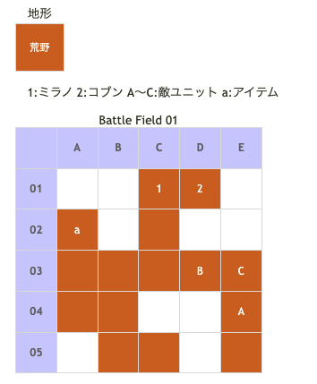

# Battle Field 01 盗賊の砦

## 勝利条件 

- すべての敵を撃破せよ！

## 敗北条件 

- ミラノが戦死すると…
- カードを使い果たすと…

## マップ 

## 取得可能アイテム 

|名前|時期|-|位置|備考|
|---|---|---|---|---|
|カチューシャ(2)|01|拾|a(A02)||
|鉄のチョーカー(2)|01|落|A(？？？)|必ず落とす|

## 味方初期ユニット 

|名前|ユニット|Lv|士気|GEN|ATK|TEC|LUK|装備|備考|
|---|---|---|---|---|---|---|---|---|---|
|ミラノ|ストレイシーフ|3|3150|2.4|2.7|3.0|3.0|シルヴァームーン(7)|○連戦ハンデなし(装備)|
|コブン|シーフ|2|1880|2.0|2.3|2.7|2.5|ケモノのマント(3)|○全地形効果に+10%(装備)|

- これ以後全てのBFにおいて、キャラのステータスの一の位が大星の数、小数点第一位が小星の数を表す。
- コブンはスポット参戦。経験値取得不可

## 敵ユニット 

- 敵部隊(？？？隊) : レヴォリューション (Power:900 Move:10 Ace:剣)

|No.|名前|ユニット|Lv|士気|GEN|ATK|TEC|LUK|POW|装備|備考|
|---|---|---|---|---|---|---|---|---|---|---|---|
|A|？？？|ヴァルキリー|3|1160|2.4|2.2|4.0|2.5|120|鉄のチョーカー(2)|○クリティカル回避(装備)|
|B|？？？|バンディット|1|470|1.7|2.0|1.7|2.6|40|装備なし||
|C|？？？|アサシン|1|320|1.3|1.7|3.1|3.1|40|装備なし||

## 戦闘中イベント 

- チュートリアルコーナー＆戦闘チュートリアル
- ミラノと？？？隣接後、戦闘後に会話
- マップ左上隅(A02)にアイテム「カチューシャ」

## 勝利後イベント 

- レヴォリューション入手 (Power:1300 Move:10 Ace:剣)
- ユグドラ加入
- バニッシュ入手 (Power:1200 Move:7 Ace:剣)
- サンクチュアリ入手 (Power:1100 Move:8 Ace:All)

## MVPターン数制限 

- ＋２：４ターン以内
- ＋１：５ターン以上
- 無し：リトライ

## GBA版からの変更点 

- アサシンとバンディットの位置入れ替え
- バニッシュのPower:1150→1200

## 戦術アドバイス 

敵が移動しないのでMVP+2をねらうならコブンでアサシンかバンディットを倒す必要がある。 
このBF以降ユニットとしてコブンを使うことができないので、堪能しておきましょう。 
最初のターンで「スティール」選択。コブンでバンディットを倒し、ミラノはカチューシャを 
回収してからアサシンの隣に移動させてターンEnd。 
敵ターンでアサシンが攻撃してくるので、ミラノで反撃して倒す。 
自ターン、マインドチェンジを選択してミラノでアイギナを攻撃。中断セーブしてターンEnd。 
敵ターン、アイギナを反撃で倒して終了。MVP報酬はGenかTecを上げるのがオススメ。ATKはいらない。 

## 関連 

- [Chapter 1](Chapter1.md)

### 次 

- [Battle Field 02](BattleField02.md)
