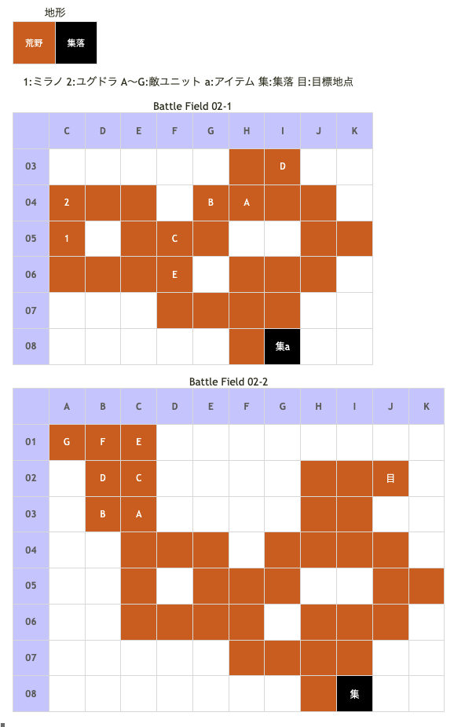

# Battle Field 02 狼の口

- 2部構成
- インザーギ撃破で02-2へ
- 02-2の敵はProtect!になってます。撃破はできませんが、戦闘は勝てるのでMVP+2を狙わないなら稼ぎにどうぞ

## 勝利条件 

02-1
- インザーギ傭兵部隊を撃破せよ！

02-2
- 全員、狼の口を突破せよ！

## 敗北条件 

02-1、02-2
- ミラノorユグドラが戦死すると…
- カードを使い果たすと…

## マップ 

## 取得可能アイテム 

|名前|時期|-|位置|備考|
|---|---|---|---|---|
|毛皮|02-1|拾|a(I08 集落)|ミラノ限定の強奪イベント [Battle Field 03](BattleField03.md)で毛皮のコートとの交換に必要|
|皮の帽子(2)|02-1|落|A(インザーギ)|LUK2.0|

## 味方初期ユニット 

|名前|ユニット|Lv|士気|GEN|ATK|TEC|LUK|装備|備考|
|---|---|---|---|---|---|---|---|---|---|
|ユグドラ|ソードメイデン|1|2800|3.0|2.2|1.9|1.5|絹のコルセット(6)|Aggressive神聖 ○反撃を完全ガード(装備)|

## 敵ユニット 

### 02-1

- 帝国軍(インザーギ隊) : バンシーズクライ (Power:650 Move:8 Ace:剣)

|No.|名前|ユニット|Lv|士気|GEN|ATK|TEC|LUK|POW|装備|備考|
|---|---|---|---|---|---|---|---|---|---|---|---|
|A|インザーギ|フェンサー|2|1010|2.4|2.1|2.3|2.7|120|皮の帽子(2)|○パニック回避(装備)|
|B|傭兵|フェンサー|1|330|1.9|2.0|2.2|1.7|40|装備なし||
|C|傭兵|フェンサー|1|410|1.9|2.0|2.2|1.7|40|装備なし||
|D|傭兵|バンディット|1|360|1.7|2.0|1.7|2.6|40|装備なし||
|E|傭兵|バンディット|1|290|1.7|2.0|1.7|2.6|40|装備なし||

### 02-2

- 帝国軍(レオン隊) : チャリオット (Power:2400 Move:9 Ace:槍）

|No.|名前|ユニット|Lv|士気|GEN|ATK|TEC|LUK|POW|装備|備考|
|---|---|---|---|---|---|---|---|---|---|---|---|
|A|レオン|ナイト|7|4800|2.6|3.0|3.3|2.4|120|ファランクス(3)|Protect! ○弓系ユニットに強い(装備)|
|B|重槍兵|ナイト|5|1940|2.4|2.2|2.4|1.8|40|装備なし|Protect!|
|C|重槍兵|ナイト|5|1940|2.4|2.2|2.4|1.8|40|装備なし|Protect!|
|D|重槍兵|ナイト|5|1940|2.4|2.2|2.4|1.8|40|装備なし|Protect!|
|E|重槍兵|ナイト|5|1940|2.4|2.2|2.4|1.8|40|装備なし|Protect!|
|F|重槍兵|ナイト|5|1940|2.4|2.2|2.4|1.8|40|装備なし|Protect!|
|G|重槍兵|ナイト|5|1940|2.4|2.2|2.4|1.8|40|装備なし|Protect!|

## 戦闘中イベント 

02-1
- 戦闘チュートリアル
- 集落(G06)でアイテム「毛皮」入手(ミラノ限定)
- ミラノとインザーギ隣接後、戦闘後に会話
- ユグドラとインザーギ隣接後、戦闘後に会話
- インザーギ撃破でインザーギ隊消滅

02-2
- ミラノとレオン隣接後、戦闘後に会話
- ユグドラとレオン隣接後、戦闘後に会話

## 戦術アドバイス 

1手目：MOVE8以上のカードを選択。オススメはサンクチュアリorレヴォリューション。  
　　　 ミラノでフェンサーを倒し、そのフェンサーがいた場所にユグドラを配置する。  
2手目：スティールを選択。ユグドラは右上進軍し敵を倒す、ミラノは右下に進んで毛皮を回収。  
　　　 回収後は右上に移動する。  
3手目：MVPをユグドラに取らせたい場合は、ユグドラとミラノをインザーギの左右に配置し、  
　　　 ユグドラでインザーギに攻撃、運が悪いと負けるので事前に中断セーブ。  
　　　 そのままターンEnd。インザーギはミラノに攻撃してくるので反撃で倒す。  
　　　 しかし、ミラノのATKが大星3以上の場合、ユグドラに攻撃してくる。  
　　　 この場合、確実にユグドラが負けてしまう。その為、以前の章でミラノのMVPをATK以外にすると良い。
　　　 これも勝てるかどうかは五分五分なので事前に中断セーブ。  
　　　 レオン出現後は、無視してさくっとクリア。  
　　　 MVPをミラノに取らせたい場合は、ミラノだけをインザーギの隣に移動させ、上の  
　　　 バンディットを攻撃、倒してターンEnd。敵ターンではインザーギに反撃で勝つこと。  
　　　 自軍ターン、ミラノでインザーギを攻撃、倒す。  
　　　 レオンは同様に無視してクリア。  

## 勝利後イベント 

- バンシーズクライ入手 (Power:1050 Move:8 Ace:剣)

## MVPターン数制限 

- ＋２：９ターン以内
- ＋１：１０ターン以上
- 無し：リトライ

## GBA版からの変更点 

- 一部の敵のステータス変更

## 関連 

- [Chapter 1](Chapter1.md)

### 次 

- [Battle Field 03](BattleField03.md)

### 前 

- [Battle Field 01](BattleField01.md)
