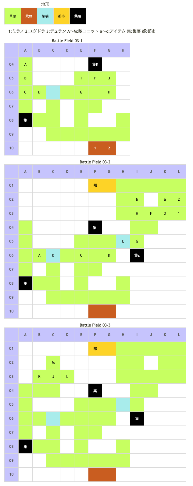

# Battle Field 03 オーランド西部

- 3部構成
- 03-1のユーディはProtect!です
- 03-1で倒した部隊は03-2で復活します。MVP+2を狙わないならユーディと合わせて稼ぎにどうぞ
- メダリオンは03-1と03-2で2回取れます
- デュランと合流して03-2へ
- ユーディを撃破して03-3へ

## 勝利条件 

03-1
- 騎士デュランと合流せよ！（全員、デュランと隣接させればOK）

03-2
- すべての敵を撃破せよ！

03-3
- 戦乙女アイギナを撃破せよ！

## 敗北条件 

03-1
- ユグドラorミラノorデュランが戦死すると…
- カードを使い果たすと…

03-2、03-3
- ユグドラorミラノが戦死すると…
- カードを使い果たすと…

## マップ 

## 取得可能アイテム 

|名前|時期|-|位置|備考|
|---|---|---|---|---|
|メダリオン|03-1,03-2|落|E(帝国兵)|必ず落とす。2回取れる|
|ココリの実|03-2|拾|a(K02)||
|トラップ|03-2|拾|b(I02)|[Battle Field 23](BattleField23.md)でエルフィンボウとの交換に必要|
|毛皮のコート|03-2|換|c(I06 集落)|[Battle Field 02](BattleField02.md)で手に入れた「毛皮」と交換|
|ルビースタッフ(5)|03-2|落|A(ユーディ)|LUK3.0|
|フランベルジェ(2)|03-3|落|J(アイギナ)|LUK3.0|

## 味方初期ユニット 

|名前|ユニット|Lv|士気|GEN|ATK|TEC|LUK|装備|備考|
|---|---|---|---|---|---|---|---|---|---|
|デュラン|ナイト|3|3210|3.0|3.0|2.0|1.7|パラディンランス(2)|○神聖攻撃力アップ(装備)|
- デュランは03-1では操作不可、経験値取得不可です。03-2から操作でき、経験値も入ります。

## 敵ユニット 

### 03-1、03-2

- 帝国軍(ユーディ隊) : フレイム (Pow:1000 Mov:7 Ace:杖)

|No.|名前|ユニット|Lv|士気|GEN|ATK|TEC|LUK|POW|装備|備考|
|---|---|---|---|---|---|---|---|---|---|---|---|
|A|ユーディ|ウィッチ|4|1640|2.1|2.0|3.5|3.3|120|ルビースタッフ(5)|○火炎攻撃力アップ(装備) 03-1はProtect!|
|B|宮廷魔術師|ウィッチ|2|970|1.7|1.7|3.2|2.7|40|装備なし||
|C|宮廷魔術師|ウィッチ|2|880|1.7|1.7|3.2|2.7|40|装備なし||
|D|宮廷魔術師|ウィッチ|2|820|1.7|1.7|3.2|2.7|40|装備なし||

- 備考
  - このステージでのウィッチは強敵。ATKの高いデュランを架橋に配置して任せてしまうのが無難。

- 帝国軍(帝国兵隊) : リフレッシュメント (Pow:650 Mov:3 Ace:All)

|No.|名前|ユニット|Lv|士気|GEN|ATK|TEC|LUK|POW|装備|備考|
|---|---|---|---|---|---|---|---|---|---|---|---|
|E|帝国兵|ナイト|2|1270|2.1|2.0|2.3|1.7|40|メダリオン(1)|－士気回復専用(装備)|
|F|帝国兵|ナイト|2|840|2.1|2.0|2.3|1.7|40|装備なし||
|G|帝国兵|ナイト|2|1080|2.1|2.0|2.3|1.7|40|装備なし||
|H|帝国兵|フェンサー|1|680|1.9|2.0|2.2|1.7|40|装備なし||
|I|帝国兵|フェンサー|1|910|1.9|2.0|2.2|1.7|40|装備なし||

- 備考
  - 03-1のメダリオンは、03-2移行時に敵ユニットによって消去されるため、03-1内に回収しておく。
  - H5、C6の橋にデュランを配置して迎撃するのがポイント。
  - 架橋に陣取るメダリオン所持ナイトは、ユニオンを組むために移動することがある。

### 03-3

- 帝国軍(アイギナ隊) : レヴォリューション (Pow:1050 Mov:10 Ace:剣)

|No.|名前|ユニット|Lv|士気|GEN|ATK|TEC|LUK|POW|装備|備考|
|---|---|---|---|---|---|---|---|---|---|---|---|
|J|アイギナ|ヴァルキリー|5|2060|2.2|3.0|3.5|3.0|120|フランベルジェ(2)|○火炎攻撃力アップ(装備)|
|K|親衛隊|ヴァルキリー|2|800|1.7|2.0|2.7|2.3|40|装備なし||
|L|親衛隊|ヴァルキリー|2|810|1.7|2.0|2.7|2.3|40|装備なし||
|M|親衛隊|ヴァルキリー|2|770|1.7|2.0|2.7|2.3|40|装備なし||

- 備考
  - アイギナからのアイテム入手はLUK3のミラノで撃破が必須となるが、相性差が厳しい。 HARDだと1対3でも押し負けるので、ほぼクリティカル狙いになる。
  - このステージのアイギナは積極的に移動するので、おびき寄せると楽。G10の荒野にミラノを配置し、デュランをE08に配置すれば、連戦の上相性差がなくなるのでハードでも運に頼らずアイギナからアイテム入手できる。
  - アイギナのRage攻撃はユグドラには無効なので、レベル差にしては少ない被害で経験値を稼ぐ事が出来る。ターン数にも余裕があるので、ここでLv3（或いはその目前）程度まで経験稼ぎをしておくと後が少し楽。（とはいえ、無理に稼ぐ必要はない）

## 戦闘中イベント 

03-1
- チュートリアルコーナー
- ミラノとユーディ隣接後、戦闘後に会話
- ユグドラとユーディ隣接後、戦闘後に会話
- E(帝国兵)撃破で帝国兵隊消滅
- 合流後デュラン加入

03-2
- チュートリアルコーナー
- 集落(A08)で会話イベント(03-1でも可)
- 都市(F01)で会話イベント
- 集落(F04)で会話イベント(03-1でも可)
- 集落(I06)でアイテム交換イベント。「毛皮」→「毛皮のコート」(夜以外)
- E(帝国兵)撃破で帝国兵隊消滅
- 各ユニットとユーディ隣接後、戦闘後に会話
- ユーディ撃破でユーディ隊消滅

03-3
- 各ユニットとアイギナ隣接後、戦闘後に会話

## 勝利後イベント 

- エースガード入手 (Power:1400 Move:4 Ace:All)
- フレイム入手 (Power:1350 Move:7 Ace:杖)

## MVPターン数制限 

- ＋２：３２ターン以内
- ＋１：３３ターン以上
- 無し：リトライ

## GBA版からの変更点 

- E(帝国兵)のProtect!が消えた

## 関連 

- [Chapter 1](Chapter1.md)

### 次 

- [Battle Field 04](BattleField04.md)

### 前 

- [Battle Field 02](BattleField02.md)
