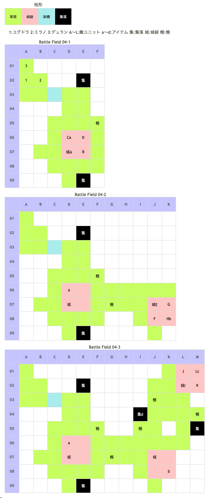

# Battle Field 04 オーランド東部

- 3部構成
- 各砦を制圧すると次へ移行

## 勝利条件 

04-1
- 東方第1砦を制圧せよ！

04-2
- 東方第2砦を制圧せよ！

04-3
- 東方第3砦を制圧せよ！

## 敗北条件 

04-1、04-2、04-3
- ユグドラorミラノが戦死すると…
- カードを使い果たすと…

## マップ 

## 取得可能アイテム 

|名前|時期|-|位置|備考|
|---|---|---|---|---|
|帝国兵法書天ノ巻|04-1|拾|D06(城塞)a||
|四葉のクローバー|04-1～3|拾|(草原)|ユグドラを草原に配置時1/64の確率で入手 [Battle Field 32](BattleField32.md)でクローバーライトとの交換に必要|
|帝国兵法書地ノ巻|04-2|拾|K08(城塞)b||
|帝国兵法書人ノ巻|04-3|拾|M01(城塞)c||
|白山羊のミルク|04-3|拾|I04(集落)d||
|メダリオン|04-1 04-2 04-3|落|A(守備隊長) E(守備隊長) I(守備隊長)|必ず落とす|

## 敵ユニット 

### 04-1

- 帝国軍(守備隊長隊) : シールドバリア (Pow:700 Mov:6 Ace:All)

|NO.|名前|ユニット|Lv|士気|GEN|ATK|TEC|LUK|POW|アイテム|備考|
|---|---|---|---|---|---|---|---|---|---|---|---|
|A|守備隊長|ナイト|3|2470|2.3|2.0|2.3|1.7|80|メダリオン(1)|－士気回復専用(装備)|
|B|衛兵|フェンサー|2|1410|2.0|2.1|2.3|1.7|40|装備なし||
|C|衛兵|フェンサー|2|1410|2.0|2.1|2.3|1.7|40|装備なし||
|D|衛兵|フェンサー|2|1410|2.0|2.1|2.3|1.7|40|装備なし||

### 4-2

- 帝国軍(守備隊長隊) : シールドバリア (Pow:800 Mov:6 Ace:All)

|NO.|名前|ユニット|Lv|士気|GEN|ATK|TEC|LUK|POW|アイテム|備考|
|---|---|---|---|---|---|---|---|---|---|---|---|
|E|守備隊長|ナイト|3|2470|2.3|2.0|2.3|1.7|80|メダリオン(1)|－士気回復専用(装備)|
|F|衛兵|バンディット|2|1210|1.7|2.1|1.7|1.8|40|装備なし||
|G|衛兵|バンディット|2|1210|1.7|2.1|1.7|1.8|40|装備なし||
|H|衛兵|バンディット|2|1210|1.7|2.1|1.7|1.8|40|装備なし||

### 4-3

- 帝国軍(守備隊長隊) : シールドバリア (Pow:900 Mov:6 Ace:All)

|NO.|名前|ユニット|Lv|士気|GEN|ATK|TEC|LUK|POW|アイテム|備考|
|---|---|---|---|---|---|---|---|---|---|---|---|
|I|守備隊長|ナイト|3|2470|2.3|2.0|2.3|1.7|80|メダリオン(1)|－士気回復専用(装備)|
|J|衛兵|ハンター|2|1500|2.0|1.7|3.2|2.3|40|装備なし||
|K|衛兵|ハンター|2|1500|2.0|1.7|3.2|2.3|40|装備なし||
|L|衛兵|ハンター|2|1500|2.0|1.7|3.2|2.3|40|装備なし||

## 戦闘中イベント 

- 集落(E02、E09、M05)で会話イベント
- 集落(I04)で「白山羊のミルク」入手
- 各ユニットと守備隊長隣接後、戦闘後に会話

## 勝利後イベント 

- シールドバリア入手 (Power:1500 Move:6 Ace:All)

## MVPターン数制限 

- ＋２：１８ターン以内
- ＋１：１９ターン以上
- 無し：リトライ

## 戦術アドバイス

- 四つ葉のクローバーを入手したい時は、ユグドラを１歩ずつ移動確定させること。普通に移動していても、見つかる確率は高くない。（セーブ＆ロードを使ってしまうのが一番だが……）
- 城砦地形＆バンディット（ユグドラ）、フェンサー（デュラン）、ナイト（ミラノ）と、それぞれが容易に倒せる敵が多い。ちょっと意識する程度でMVPを狙ったユニットに取らせることが出来るので、今後の戦略に応じて考えるといいだろう。
- このマップは敵撃破でなく、特定地点への移動が勝利条件。アイテム全回収をする前に敵を全滅してしまっても問題はない。MVP+2を狙う場合、早めに倒せば敵にターンが回らないので余裕が生じる。
- どのマップでもそうだが、ＣＰＵは「多く戦闘する」ことより、被害を最小にする（勝てないバトルを減らす）ようにユニオンを組む。連戦を誘ってまとめて始末しようと、相性の良いユニットを単騎突撃させてもうまくいかない事も多いので、良く考えよう。
- ただし一方で、CPUは城砦等の地形効果はほとんど考えずに動いてくる。城砦から草原へわざわざ移動して、アッサリ撃破されるような事も多い。

## 関連 

- [Chapter 1](Chapter1.md)
- [Chapter 2](Chapter2.md)

### 次 

- [Battle Field 05](BattleField05.md)

### 前 

- [Battle Field 03](BattleField03.md)
