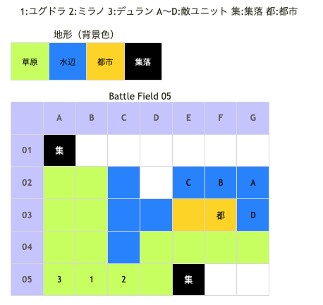

# Battle Field 05 ロルカ湖畔

## 勝利条件 

- 水の民イシーヌを撃破せよ！

## 敗北条件 

- ユグドラorミラノが戦死すると…
- カードを使い果たすと…

## マップ 

## 取得可能アイテム 

|名前|時期|-|位置|備考|
|---|---|---|---|---|
|メダリオン|05|落|B～D(水の民)|必ず落とす|
|アイスジャベリン|05|落|A(イシーヌ)|LUK3.0|

## 敵ユニット 

- 公国軍(イシーヌ隊) : ブリザード (Pow:1000 Mov:7 Ace:槍)

|NO.|名前|ユニット|Lv|士気|GEN|ATK|TEC|LUK|POW|アイテム|備考|
|---|---|---|---|---|---|---|---|---|---|---|---|
|A|イシーヌ|ウンディーネ|4|3600|2.1|2.5|2.7|3.3|120|アイスジャベリン(5)|○冷気攻撃力アップ(装備)|
|B|水の民|ウンディーネ|3|1500|1.8|2.0|2.7|2.3|40|メダリオン(1)|－士気回復専用(装備)|
|C|水の民|ウンディーネ|3|1500|1.8|2.0|2.7|2.3|40|メダリオン(1)|－士気回復専用(装備)|
|D|水の民|ウンディーネ|3|1500|1.8|2.0|2.7|2.3|40|メダリオン(1)|－士気回復専用(装備)|

## 戦闘中イベント 

- チュートリアルコーナー
- 集落(A01、E05)で会話イベント
- 都市(F03)で会話イベント
- 各ユニットとイシーヌ隣接後、戦闘後に会話

## 勝利後イベント 

- ブリザード入手 (Power:1400 Move:7 Ace:槍)

## MVPターン数制限 

- ＋２：７ターン以内
- ＋１：８ターン以上
- 無し：リトライ

## 関連 

- [Chapter 1](Chapter1.md)
- [Chapter 2](Chapter2.md)

### 次 

- [Battle Field 06](BattleField06.md)

### 前 

- [Battle Field 04](BattleField04.md)
