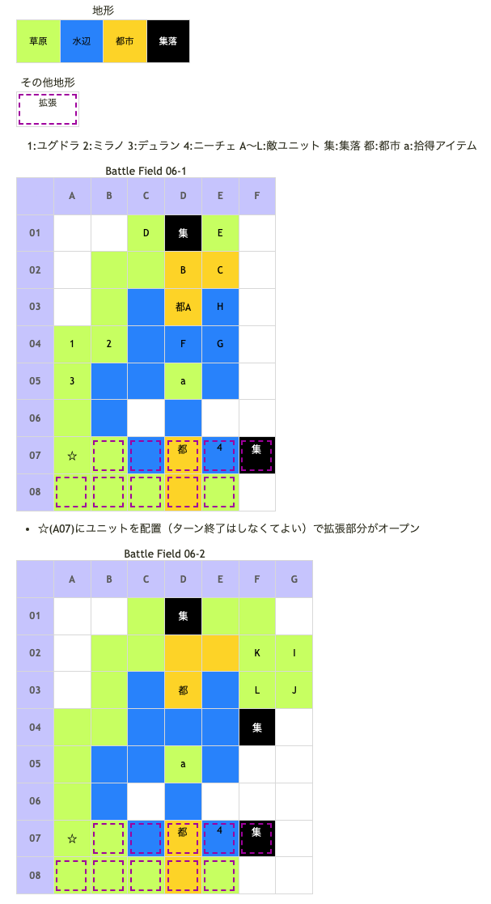

# Battle Field 06 フェリナス湖畔

- 2部構成
- 湖畔の町ヴェラス到着で06-2へ

## 勝利条件 

06-1
- 湖畔の町ヴェラスを解放せよ！

06-2
- ジルヴァ暗殺部隊を撃破せよ！

## 敗北条件 

06-1、06-2
- ユグドラorミラノが戦死すると…
- カードを使い果たすと…

## マップ 

## 取得可能アイテム 

|名前|時期|-|位置|備考|
|---|---|---|---|---|
|癒しのハーブ|06|拾|a(D05)|ニーチェのみ|
|キルブレード|06-1|落|A(オルテガ)|LUK2.0|
|鋼のペルソナ|06-2|落|I(ジルヴァ)|LUK3.0|
|疾風の弓|06-2|落|J(エレナ)|LUK3.0|
|メダリオン|06|落|F(ウンディーネ) G(ウンディーネ) H(ウンディーネ)|必ず落とす|

## 味方初期ユニット 

|名前|ユニット|Lv|士気|GEN|ATK|TEC|LUK|装備|備考|
|---|---|---|---|---|---|---|---|---|---|
|ニーチェ|ウンディーネ|4|3640|2.1|2.7|2.7|3.3|珊瑚のスピア(2)|○水辺で士気回復(装備)|

- マップ拡張で味方に入れた場合のステータスです

## 敵ユニット 

### 06-1

- 山賊団(オルテガ隊) : ミラージュ (Pow:850 Mov:4 Ace:All)

|NO.|名前|ユニット|Lv|士気|GEN|ATK|TEC|LUK|POW|アイテム|備考|
|---|---|---|---|---|---|---|---|---|---|---|---|
|A|オルテガ|バンディット|5|3920|1.0|3.0|1.8|2.4|120|キルブレード(2)|○一騎討ちで必勝(装備)|
|B|山賊|バンディット|3|1460|1.8|2.2|1.7|2.7|40|装備なし||
|C|山賊|バンディット|3|1460|1.8|2.2|1.7|2.7|40|装備なし||
|D|山賊|アサシン|3|1380|1.4|1.8|3.2|3.2|40|装備なし||
|E|山賊|アサシン|3|1380|1.4|1.8|3.2|3.2|40|装備なし||

- 公国軍(水の民隊) : ブリザード (Pow:800 Mov:7 Ace:槍)

|NO.|名前|ユニット|Lv|士気|GEN|ATK|TEC|LUK|POW|アイテム|備考|
|---|---|---|---|---|---|---|---|---|---|---|---|
|F|水の民|ウンディーネ|4|1670|1.9|2.1|3.0|2.3|40|メダリオン(1)|－士気回復専用(装備)|
|G|水の民|ウンディーネ|4|1670|1.9|2.1|3.0|2.3|40|メダリオン(1)|－士気回復専用(装備)|
|H|水の民|ウンディーネ|4|1670|1.9|2.1|3.0|2.3|40|メダリオン(1)|－士気回復専用(装備)|

### 06-2

- 帝国軍(ジルヴァ隊) : ブラッディクロー (Pow:1050 Mov:9 Ace:弓)

|NO.|名前|ユニット|Lv|士気|GEN|ATK|TEC|LUK|POW|アイテム|備考|
|---|---|---|---|---|---|---|---|---|---|---|---|
|I|ジルヴァ|アサシン|5|2760|2.0|2.2|2.6|3.3|120|鋼のペルソナ(1)|○パニック回避(装備)|
|J|エレナ|アサシン|1|1930|1.7|1.9|2.7|3.5|120|疾風の弓(3)|○瞬間チャージ(装備)|
|K|帝国兵|フェンサー|3|1140|2.0|2.2|2.3|1.7|40|装備なし||
|L|帝国兵|フェンサー|3|1140|2.0|2.2|2.3|1.7|40|装備なし||

- 備考
  - 2部構成であるため、ニーチェでもMVP獲得可能。

## 戦闘中イベント 

06-1
- ☆(A07)に味方ユニットを配置するとマップが拡張され、都市(D07)に配置するとニーチェが加入
- 集落(F07)で会話イベント
- a(D05)で「癒しのハーブ」入手(ニーチェのみ)
- 各ユニットとオルテガ隣接後、戦闘後に会話
- 各ユニットと水の民隣接後、戦闘後に会話

06-2
- チュートリアルコーナー
- 各ユニットとエレナ隣接後、戦闘後に会話
- 各ユニットとジルヴァ隣接後、戦闘後に会話
- 集落(F04)で会話イベント

## 勝利後イベント 

- ブラッディクロー入手 (Power:1700 Move:9 Ace:弓)

## MVPターン数制限 

- ＋２：１８ターン以内
- ＋１：１９ターン以上
- 無し：リトライ

## 関連 

- [Chapter 2](Chapter2.md)

### 次 

- [Battle Field 07](BattleField07.md)

### 前 

- [Battle Field 05](BattleField05.md)
