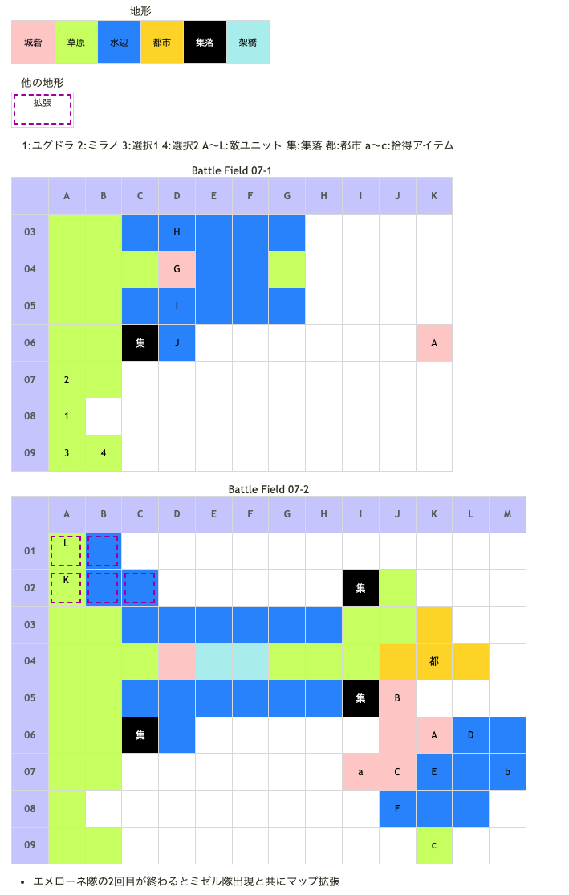

# Battle Field 07 水の都エリーゼ

- 2部構成
- スキルが使用可能に
- 味方ユニットを橋塔に移動させると07-2へ

## 勝利条件 

07-1
- フローランドへ橋を架けよ！

07-2
- 水の女王エメローネを撃破せよ！

## 敗北条件 

07-1、07-2
- ユグドラorミラノが戦死すると…
- カードを使い果たすと…

## マップ 

## 取得可能アイテム 

|名前|時期|-|位置|備考|
|---|---|---|---|---|
|ブレイヴリング(2)|07-1|落|G(イシーヌ)|LUK3.0|
|悠久のグングニル(4)|07-2|落|A(エメローネ)|LUK3.0|
|アクエリアス|07-2|拾|a||
|きれいな貝殻|07-2|拾|b|ニーチェのみ [Battle Field 10](BattleField10.md)で貝殻の胸当てとの交換に必要|
|エレミナミント(1)|07-2|拾|c|[Battle Field 29](BattleField29.md)で沐浴イベントを見るのに必要。 Check it out!|
|羽根付きサンダル(2)|07-2|落|K(ミゼル)|LUK4.0 おそらくスティール必須|
|メダリオン|07-1 07-2 |落|H～J(ウンディーネ) B～F(ウンディーネ) L(賞金稼ぎ)|必ず落とす|

## 敵ユニット 

### 07-1

- 公国軍(エメローネ隊) : ブリザード (Pow:1150 Mov:7 Ace:槍)

|No.|名前|ユニット|Lv|士気|GEN|ATK|TEC|LUK|POW|装備|備考|
|---|---|---|---|---|---|---|---|---|---|---|---|
|A|エメローネ|ウンディーネ|6|4480|3.0|2.7|3.0|3.4|120|悠久のグングニル(4)|○スキル持続時間２倍(装備)|

- 公国軍(イシーヌ隊) : ブリザード (Pow:1050 Mov:7 Ace:槍)

|No.|名前|ユニット|Lv|士気|GEN|ATK|TEC|LUK|POW|装備|備考|
|---|---|---|---|---|---|---|---|---|---|---|---|
|G|イシーヌ|ウンディーネ|5|3940|3.0|2.6|3.0|3.3|120|ブレイブリング(2)|○劣勢で士気回復(装備)|
|H|水の民|ウンディーネ|3|1500|1.8|2.0|2.7|2.3|40|メダリオン(1)|－士気回復専用(装備)|
|I|水の民|ウンディーネ|3|1500|1.8|2.0|2.7|2.3|40|メダリオン(1)|－士気回復専用(装備)|
|J|水の民|ウンディーネ|3|1500|1.8|2.0|2.7|2.3|40|メダリオン(1)|－士気回復専用(装備)|

### 07-2

- 公国軍(エメローネ隊) : ブリザード (Pow:1150 Mov:7 Ace:槍)

|No.|名前|ユニット|Lv|士気|GEN|ATK|TEC|LUK|POW|装備|備考|
|---|---|---|---|---|---|---|---|---|---|---|---|
|A|エメローネ|ウンディーネ|6|4480|3.0|2.7|3.0|3.4|120|悠久のグングニル(4)|○スキル持続時間２倍(装備)|
|B|水の民|ウンディーネ|4|1670|1.9|2.1|3.0|2.3|40|メダリオン(1)|－士気回復専用(装備)|
|C|水の民|ウンディーネ|4|1670|1.9|2.1|3.0|2.3|40|メダリオン(1)|－士気回復専用(装備)|
|D|水の民|ウンディーネ|3|1500|1.8|2.0|2.7|2.3|40|メダリオン(1)|－士気回復専用(装備)|
|E|水の民|ウンディーネ|3|1500|1.8|2.0|2.7|2.3|40|メダリオン(1)|－士気回復専用(装備)|
|F|水の民|ウンディーネ|3|1500|1.8|2.0|2.7|2.3|40|メダリオン(1)|－士気回復専用(装備)|

- ミゼル隊(ミゼル隊) : サンダーボルト (Pow:850 Mov:7 Ace:弓)

|No.|名前|ユニット|Lv|士気|GEN|ATK|TEC|LUK|POW|装備|備考|
|---|---|---|---|---|---|---|---|---|---|---|---|
|K|ミゼル|ハンター|5|3780|1.9|2.2|3.5|4.0|120|羽根付きサンダル(2)|－全地形効果を０％(装備)|
|L|賞金稼ぎ|バンディット|4|1590|1.8|2.3|1.8|3.0|40|メダリオン(1)|－士気回復専用(装備)|

## 戦術アドバイス 

以下MVP＆全アイテム取得の例（メダリオンは１つ略奪される）

＊ここでは自軍の士気ダメージを最小に抑えつつ、将来性のあるカードのPowを上げることを考えながら攻略しています。また、とくに触れられていない限りデュエルには勝利しているものとします。

条件:デュランに「毛皮のコート」を装備。

Ⅰ
１．　ブラッディクロー選択。ミラノを一番下のウンディーネの左へ置く。ミラノの左下１にニーチェ、左下２にデュランを置いて、ミラノで仕掛ける。ダイヤモンドダストにより水地形は氷結状態になる。
反撃：ウンディーネは３人でユニオンするよう動き、仕掛けてくる。自ターンに攻撃した２人は倒れる。のち、残った１人はイシーヌの左へ。

２．ブリザード選択。ミラノをイシーヌの下へ。メダリオンを回収しながらミラノの左下１にニーチェ、左下２にデュランを置いてミラノで仕掛け、ウンディーネを倒す。ユグは１mov。
反撃：イシーヌがミラノへ仕掛ける。

３．スティール選択。デュランはいちばん右奥へmov。ミラノ、ニーチェで組んでイシーヌを倒す。ユグを上方へmov。ニーチェでブレイヴリング、メダリオンを回収しつつ制圧しクリア。

Ⅱ
１．ブラッディクロー選択。デュランは敵を乗り越えてアクエリアスの回収ポイントへ。ミラノは水辺から移動してユグのユニオンに入らないところへ。ニーチェは次ターンにエメローネに仕掛けることができる位置までmov。デュランで右のウンディーネに仕掛け（４連戦）、２人目３人目は倒す。
反撃：相手は移動せず、そのままデュランの右側のウンディーネが仕掛けてくるので２人とも倒す。

２．レボリューション選択。ニーチェはメダリオン回収しつつエメローネの下へ。デュランと組んで仕掛ける。
反撃：エメローネはデュランへ仕掛ける。ユニオンしているウンディーネを倒す。
ミゼル隊出現。バンデッド、ミゼルの順でユグに仕掛ける。バンデッドは武器相性で倒せる。ミゼルにはレボ使用で勝利。のち、ミゼルはユグに隣接するよう移動。この際１つメダリオンを略奪される。

３．スティール選択。ミラノをミゼルの右へ。ユグと組んで仕掛ける。羽根付きサンダルを盗みつつ倒す。ニーチェはエレミナミント、きれいな貝殻を回収して元の位置へ。

反撃：エメローネがニーチェに仕掛ける。

４．エースガード選択。ニーチェ、デュランでエメローネに仕掛ける。

反撃：エメローネがニーチェへ。ここで撃破し、悠久のグングニルＧＥＴしてクリア。
LUKの低いデュランで倒すとアイテムを落とさないので注意。

☆16Turn/MVP デュラン

- 備考
  - デュランに毛皮のコート(冷気攻撃は無効)を装備させるとAggressive+スキルを無効化出来るので進め易い。 （ここまで使わずに取っておいても、以降で冷気対策が必要となりそうな場面はBF49くらいしか無い）
  - 07-2は、ニーチェとデュランをエメローネ部隊に向かわせ、ミラノとユグドラをミゼル隊迎撃に振り分けると丁度良い。
  - ミゼル迎撃は、解氷とアイテム(賞金稼ぎのメダリオン回収とミゼル士気低下撤退)に注意。 スティール以外には、対サンダーボルト用のシールドバリアとユグドラ単体時のレヴォリューションが有効。

## 戦闘中イベント 

07-1
- チュートリアルコーナー
- 各ユニットとイシーヌ隣接後、戦闘後に会話
- 集落(C06)で会話イベント

07-2
- エメローネ隊の２回目が終わるとミゼル隊出現＆マップ拡張
- 各ユニットと水の民隣接後、戦闘後に会話
- 各ユニットとエメローネ隣接後、戦闘後に会話
- 各ユニットとミゼル隣接後、戦闘後に会話
- ミゼルは士気を0にすればサンダーボルト入手
- 集落(I02、I05)で会話イベント
- 都市(K04)で会話イベント
- a(I07)で「アクエリアス」入手
- b(M07)で「きれいな貝殻」入手
- c(K09)で「エレミナミント」入手

## 勝利後イベント 

- サンダーボルト入手 (Power:1550 Move:7 Ace:弓)

## MVPターン数制限 

- ＋２：２１ターン以内
- ＋１：２２ターン以上
- 無し：リトライ

## 関連 

- [Chapter 2](Chapter2.md)

### 次 

- [Battle Field 08](BattleField08.md)

### 前 

- [Battle Field 06](BattleField06.md)
