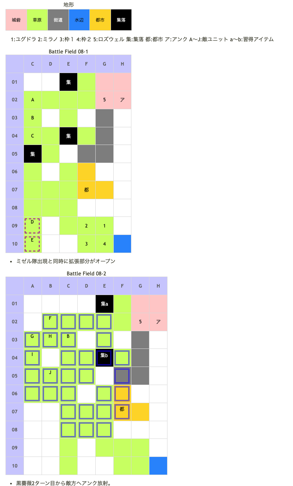

# Battle Field 08 黒薔薇領

- 2部構成
- ゴーレムを全て破壊すると08-2へ
- 敵がアイテムブレイクを使ってくるので注意

## 勝利条件 

08-1
- すべてのゴーレムを撃破せよ！

08-2
- 魔剣士ラッセルを撃破せよ！

## 敗北条件 

08-1
- ユグドラorミラノorロズウェルが戦死すると…
- カードを使い果たすと…
- すべての集落が破壊されると…

08-2
- ユグドラorミラノorロズウェルが戦死すると…
- カードを使い果たすと…

## マップ 

## 取得可能アイテム 

|名前|時期|-|位置|備考|
|---|---|---|---|---|
|ラッキーブルーム|8-1〜|落|B(ロザリィ)|LUK4.0|
|羽根付きサンダル or丈夫な長靴|8-1〜|落|E(ミゼル)|LUK3.0 7-2で羽根付きサンダル入手済みの場合、丈夫な長靴を所持|
|マージリング|8-2|拾|E01(集1)α|8-1でゴーレムに集落を破壊されると取れない|
|ダウジングロッド|8-2|拾|E04(集2)β|8-1でゴーレムに集落を破壊されると取れない T.N.V9以上 ※まやかしの笛と二択 [Battle Field 24](BattleField24.md)でエレメント入手に必要|
|まやかしの笛|8-2|拾|E04(集2)β|8-1でゴーレムに集落を破壊されると取れない T.N.V8以下 ※ダウジングロッドと二択|
|斬鉄剣|8-2|落|G(ラッセル)|LUK3.0|

## 友軍ユニット 

- 黒薔薇軍 ： ネクロゲート （power 1500　move 11）

|NO.|名前|ユニット|Lv|士気|GEN|ATK|TEC|LUK|POW|アイテム|備考|
|---|---|---|---|---|---|---|---|---|---|---|---|
|5|ロズウェル|ネクロマンサー|6|4020|20|27|34|22|-|ガーゴイルロッド(3)|夜間に強い(装備)|

## 敵ユニット 

### 8-1

- 白薔薇軍 ： メイクドール （power 1500　move 11）

|NO.|名前|ユニット|Lv|士気|GEN|ATK|TEC|LUK|POW|アイテム|備考|
|---|---|---|---|---|---|---|---|---|---|---|---|
|A|ゴモラ2号|ゴーレム|4|1740|23|23|18|18|40|装備なし||
|B|ロザリィ|ウィッチ|6|4640|30|24|34|40|120|ラッキーブルーム(3)|○確実に戦利品出現 Protect!|
|C|ソドム1号|ゴーレム|4|1740|23|23|18|18|40|装備なし||

- ミゼル隊 ： サンダーボルト （power 1150　move 07）

|NO.|名前|ユニット|Lv|士気|GEN|ATK|TEC|LUK|POW|アイテム|備考|
|---|---|---|---|---|---|---|---|---|---|---|---|
|D|ミゼル|ハンター|6|4140|20|23|34|34|120|羽根付きサンダル(2) or丈夫な長靴(1)|6-2で羽根付きサンダル入手 済みの場合、丈夫な長靴所持 賞金稼ぎの撃破及び ミゼルの士気低下で撤退 装備無しのステータス|
|E|賞金稼ぎ|バンディッド|5|1750|19|24|18|30|40|メダリオン(1)|－士気回復専用(装備)|

- 備考
  - ゴーレムは1ターン1歩しか進めない。
  - 南のゴーレムは5C（マップには表記してないが集落があり、必ず破壊される）→5D→4D→集落の順に動くのでやや余裕あり。
  - ゴーレムは最短で自軍２ターンで葬れるが、その場合ミゼル隊は登場しない。
  - ロザリィ隊は隣接しても攻撃を仕掛けてこない。
  - アイテムとMVP+2狙いの場合、ミゼル隊登場の直後にゴーレムを撃破する必要がある。

### 8-2

- 白薔薇軍 ： メイクドール （power 1500　move 11）

|NO.|名前|ユニット|Lv|士気|GEN|ATK|TEC|LUK|POW|アイテム|備考|
|---|---|---|---|---|---|---|---|---|---|---|---|
|B|ロザリィ|ウィッチ|6|(8-1を継続)|30|24|34|40|120|ラッキーブルーム(3)|確実に戦利品出現(装備)|

- 帝国軍 ： アイテムブレイク （power 1200　move 08）

|NO.|名前|ユニット|Lv|士気|GEN|ATK|TEC|LUK|POW|アイテム|備考|
|---|---|---|---|---|---|---|---|---|---|---|---|
|F|帝国兵|フェンサー|4|1350|21|23|23|18|40|装備なし||
|G|ラッセル|フェンサー|7|2600|20|30|40|31|120|斬鉄剣(3)|ゴーレムに強い(装備) 魔砲発射までProtect!|
|H|帝国兵|ヴァルキリー|4|1350|18|21|30|23|40|装備なし||
|I|帝国兵|ヴァルキリー|4|1350|18|21|30|23|40|装備なし||
|J|帝国兵|フェンサー|4|1350|21|23|23|18|40|装備なし||

- 備考
  - ロザリィは、8-1から引き続き不動な上こちらが隣接しても仕掛けてこないが、ユニオン等で戦闘する場合、Lukが高くやたらとフラッシュアタックやクリティカルを発生させる。
  - シールドバリアなどを活用しないと倒すのが辛い。夕方固定なので使えるスキルに注意。
  - アイテムは、ニーチェ（悠久のグングニル装備）かミラノ（スティール）で獲得できる。
  - スティールで奪えば能力も下がって一石二鳥だが、盗んだ時の戦闘ではミラノ（無装備）が負ける可能性があるので、負けたくない場合は皮の帽子を装備するなどして対処すること。
  - ロザリィはユニオンリーダーがラッセル隊の場合はスキル発動ができないので、幾分相手にするのが楽になる。
  - ミゼル隊は8-1で倒さなかった場合、そのまま8-2に居続ける。
  - MVP+2を狙う場合、ロザリィはともかくミゼル隊は早く潰さないとターン数がかさむので注意。 ミゼル隊は、帝国軍登場後の自ターンで壊滅が狙い目。
  - ミゼル隊がリーダーの場合はラッセル隊もサンダーボルトを使えるので、神聖無効を当てにしてヴァルキリーにユグドラをぶつける際には注意。
  - ロズウェルがラッセルかフェンサーのアイテムブレイクを喰らい、ガーゴイルロッドを破壊されると次のBF09で入手出来なくなるので注意。
  - ミラノに「一騎打ち必勝」を付けるとロザリィなどから盗む際やらラッセルやらに勝率が上がる。
結構助かる場面が多いんでオススメする。

## 戦闘中イベント 

## 勝利後イベント 

## MVPターン数制限 

- ＋２：２３ターン以下
- ＋１：２４ターン以上
- 無し：リトライ

## 関連 

- [Chapter 2](Chapter2.md)

### 次 

- [Battle Field 09](BattleField09.md)

### 前 

- [Battle Field 07](BattleField07.md)
