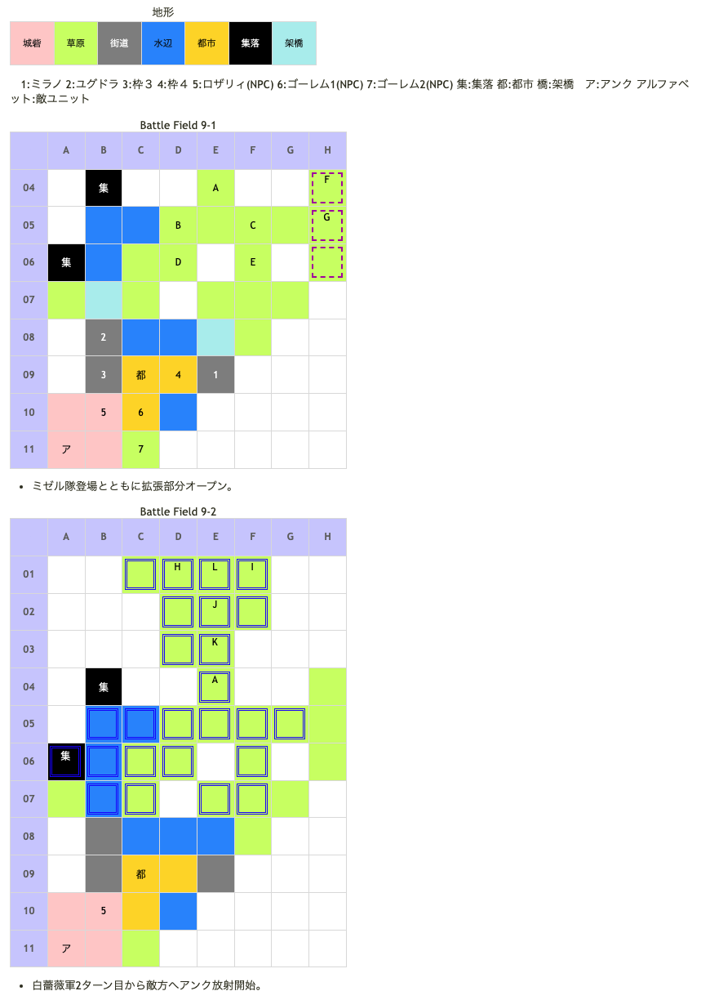

# Battle Field 09 白薔薇領

- 2部構成
- ロザリィ+ゴーレム2体が友軍（ユニオンに組み込めるが操作・経験値取得不可能）
- 橋が落ちるとゴーレム消滅。ただしニーチェのダイアモンドダストで凍結させていると残り続ける。
- 夜間固定な為ミラージュやサンクチュアリが使えない。
- 9-1勝利条件達成後、ロズウェルの北側に敵増援、そのまま敵の進撃。

## 勝利条件 

9-1
- 全ての橋の破壊

9-2
- レオンの撃破

## 敗北条件 

9-1
- ユグドラorミラノorロザリィorゴーレムの戦死
- カードを使い切る
- スケルトンが橋を渡る

9-2
- ユグドラorミラノorロザリィの戦死
- カードを使い切る

## マップ 

## 取得可能アイテム 

|名前|時期|-|位置|備考|
|---|---|---|---|---|
|ガーゴイルロッド(3)|9|落|A(ロズウェル)|LUK2.0|
|ファランクス(3)|9-2|落|L(レオン)|LUK2.0|
|メダリオン|9|落|F(賞金稼ぎ)|必ず落とす|
|羽根付きサンダル(2) or丈夫な長靴(1) orレンジャーブーツ(2)|9|落|G(ミゼル)|LUK☆3 BF7、BF8でアイテムを落すor盗んだかどうかで所持アイテムが変化|

## 友軍ユニット 

- 白薔薇軍 ： メイクドール （power 1150　move 11）

|NO.|名前|ユニット|Lv|士気|GEN|ATK|TEC|LUK|POW|アイテム|備考|
|---|---|---|---|---|---|---|---|---|---|---|---|
|5|ロザリィ|ウィッチ|6|4640|2.6|2.0|4.0|4.0|-|ラッキーブルーム(3) orふりふりレース(2)|○確実に戦利品出現 or○瞬間チャージ ステータスはふりふりレース 装備時のもの|
|6|デスト3号|ゴーレム|4|1740|2.3|2.3|1.8|1.8|-|装備なし|9-2では消滅|
|7|ロイヤ4号|ゴーレム|4|1740|2.3|2.3|1.8|1.8|-|装備なし|9-2では消滅|

## 敵ユニット 

### 9-1

- 黒薔薇軍 ： ネクロゲート （power 1500　move 11）

|NO.|名前|ユニット|Lv|士気|GEN|ATK|TEC|LUK|POW|アイテム|備考|
|---|---|---|---|---|---|---|---|---|---|---|---|
|A|ロズウェル|ネクロマンサー|6|4740|2.0|2.7|3.4|2.2|120|ガーゴイルロッド(3)|夜間が得意(装備) Protect!|
|B|シモベ|スケルトン|4|1670|1.8|1.8|3.0|3.3|40|装備なし||
|C|シモベ|スケルトン|4|1670|1.8|1.8|3.0|3.3|40|装備なし||
|D|シモベ|スケルトン|4|1670|1.8|1.8|3.0|3.3|40|装備なし||
|E|シモベ|スケルトン|4|1670|1.8|1.8|3.0|3.3|40|装備なし||

- ミゼル隊 ： サンダーボルト （power 1150　move 07）

|NO.|名前|ユニット|Lv|士気|GEN|ATK|TEC|LUK|POW|アイテム|備考|
|---|---|---|---|---|---|---|---|---|---|---|---|
|F|賞金稼ぎ|バンディッド|5|1670|1.9|2.4|1.8|3.0|40|メダリオン(1)|－士気回復専用(装備)|
|G|ミゼル|ハンター|6|4140|2.2|2.3|4.0|3.4|120|羽根付きサンダル(2) or丈夫な長靴(1) orレンジャーブーツ(2)|BF7、BF8でアイテムを入手したか どうかで所持アイテムが変化 賞金稼ぎ撃破＆ミゼルの士気 低下で撤退(アイテム入手不可能) ステータスはレンジャーブーツ 装備時のもの|

- 備考
  - スケルトンは「ユニオンリーダー」にはならないが、「ユニオンメンバー」にはなる。
  - ロズウェルは移動しないが、隣接すると戦闘を仕掛けてくる。
  - 夜間固定な為、ガーゴイルロッドを奪えば能力も下がって楽になる。
  - 対ロズウェルには、ユグドラをユニオンリーダーにしなければならないのでリスクは高いが、バニッシュが強力。
  - ミゼル隊はロズウェルとユニオンを組むように動く。出現前にF05かG05にユニットを置いておくと始末するのが楽。

### 9-2

- 黒薔薇軍 ： ネクロゲート （power 1500　move 11）

|NO.|名前|ユニット|Lv|士気|GEN|ATK|TEC|LUK|POW|アイテム|備考|
|---|---|---|---|---|---|---|---|---|---|---|---|
|A|ロズウェル|ネクロマンサー|6|9-1を継続|2.0|2.7|3.4|2.2|120|ガーゴイルロッド(3)|Rage暗黒 夜間が得意(装備)|

- 帝国軍 ： チャリオット （power 1200　move 09）

|NO.|名前|ユニット|Lv|士気|GEN|ATK|TEC|LUK|POW|アイテム|備考|
|---|---|---|---|---|---|---|---|---|---|---|---|
|H|帝国兵|アサシン|4|1320|1.4|1.8|3.3|3.3|40||Rage暗黒|
|I|帝国兵|アサシン|4|1320|1.4|1.8|3.3|3.3|40||Rage暗黒|
|J|重騎兵|ナイト|4|1400|2.3|2.1|2.3|1.8|40|||
|K|重騎兵|ナイト|4|1400|2.3|2.1|2.3|1.8|40|||
|L|レオン|ナイト|7|2950|2.6|3.0|3.3|2.4|120|ファランクス(3)|弓系ユニットに強い(装備) 魔砲イベント前はProtect!|

- 備考
  - 9-1で勝利条件を満たす直前にロズウェルの下に自軍ユニットを配置しておくと、9-2開始時にレオン隊からの先制攻撃を避けることができる。

## 戦闘中イベント 

9-1
- 黒薔薇2ターン目の後に敵増援、そのままミゼルの進撃
- シモベと味方ユニット隣接で会話。
- ミゼル撃破で賞金稼ぎ消滅。

9-2
- 白薔薇2ターン目から魔砲ダメージ（敵現在士気の25%）
- 魔砲イベントまでレオンはプロテクト。
- レオンと味方ユニット隣接・戦闘前後にそれぞれ会話。戦闘結果により戦闘後会話変化
- レオン撃破で帝国兵グループ消滅、ロズウェル撤退

## 勝利後イベント 

- BF7,8で未入手&ミゼルの士気を0にした場合サンダーボルト入手（power:1550,move:7,Ace:弓）
- ロズウェルの士気を0にした場合ネクロゲート入手(power:1400,move:11,Ace:杖)
- チャリオット入手(power:1800,move:9,Ace:槍)

## MVPターン制限 

- ＋２：２１ターン以下
- ＋１：２２ターン以上
- 無し：リトライ

## 関連 

- [Chapter2](Chapter2.md)

### 次 

- [Battle Field 10](BattleField10.md)

### 前 

- [Battle Field 08](BattleField08.md)
