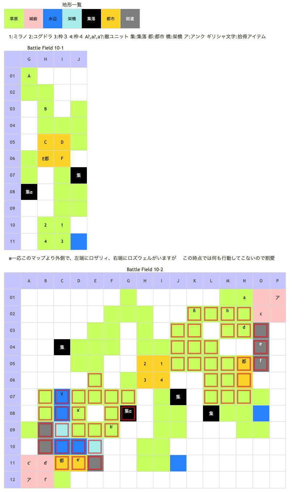

# Battle Field 10 ヴァーレンヒルズ

- 2部構成
- 10-1勝利条件達成後、全ユニットが都市へ移動し、自軍の進軍
- 10-2、どちらを倒したかにより分岐。倒さなかった方が次のMAPで仲間になる。
- ロザリィを撃破すると11Aへ、ロズウェルを撃破すると11Bへ。

## 勝利条件 

10-1
- 特定位置へ到達（味方を中立都市マーヴェルに移動させればOK）

10-2
- ロズウェルorロザリィの撃破

## 敗北条件 

10-1、10-2
- ユグドラorミラノの戦死
- カードを使い切る

## マップ 

## 取得可能アイテム 

|名前|時期|-|位置|備考|
|---|---|---|---|---|
|貝殻の胸当て(2)|10|換|α|[Battle Field 07](BattleField07.md)で手に入るきれいな貝殻必須 ニーチェで夜限定|
|黒曜石|10-2|拾|K02(草原)β|[Battle Field 11B](BattleField11B.md)でブラックブランドとの交換に必要|
|魔水晶|10-2|拾|C07(水辺)γ|[Battle Field 11A](BattleField11A.md)でクリスタルロッドとの交換に必要|
|凶刃ベルセルク(1)|10-1|落|E(オルテガ)|LUK2.0|
|ヘッドギア(2)|10-1|落|F(インザーギ)|LUK3.0|
|ラッキーブルーム(3) orふりふりレース(2)|10-2|落|d'(ロザリィ)|LUK4.0 BF8でラッキーブルームを取得した場合にふりふりレース所持|
|ガーゴイルロッド(3) or闇夜のローブ(3)|10-2|落|c(ロズウェル)|LUK2.0 BF9でガーゴイルロッドを取得した場合に闇夜のローブ所持|

## 敵ユニット 

### 10-1

- 山賊団 ： ミラージュ （power 1200　move 04）

|NO.|名前|ユニット|Lv|士気|GEN|ATK|TEC|LUK|POW|アイテム|備考|
|---|---|---|---|---|---|---|---|---|---|---|---|
|A|山賊|バンディット|4|1590|1.8|2.3|1.8|3.0|40|装備なし||
|B|山賊|バンディット|4|1590|1.8|2.3|1.8|3.0|40|装備なし||
|C|山賊|バンディット|4|1590|1.8|2.3|1.8|3.0|40|装備なし||
|D|山賊|アサシン|5|1660|1.5|1.9|3.3|3.3|40|装備なし||
|E|オルテガ|オルテガ|7|4560|2.2|3.0|1.6|2.4|120|凶刃ベルセルク(1)|常時Rage以上(装備)|
|F|インザーギ|フェンサー|6|2120|3.0|2.7|2.4|3.0|120|ヘッドギア(2)|ステータス異常無効(装備)|

- 備考
  - 10-1の間も白薔薇軍、黒薔薇軍のターンが加算されるので、山賊団を早急に始末しないとMVP+2は厳しい。というか、全アイテムを狙うとほぼ無理。
  - インザーギは山賊団2ターン目から動き出す。
  - 全アイテム取得&MVP+2(ロズウェル撃破)
    - デュランにアイスジャベリンを装備。
    - 10-1は9ターンまでに終わらせる。ヘッドギアはスティールが無難か。貝殻の胸当てをとってからクリア条件を満たす。
    - 10ターン目。ネクロガードを使用。デュランを02Lへ。途中でβを入手。そのままbに攻撃。ニーチェを07Eへ。
    - 13ターン目、ブリザードを使用。ニーチェでγを入手、07Dで待機。デュランを01Oへ移動させ、ロズウェルに攻撃。白薔薇軍ターン、1が攻撃してくるので戦闘でダイアモンドダストを使う。
    - 16ターン目、チャリオット使用。デュランはロズウェルの士気を削る。ミラノを06I、ユグドラ、デュランのLukが★2未満の場合、ニーチェを04Iへ。
    - 19ターン目、スティールを使用。ミラノを12Cへ。このターンか次白薔薇軍ターンにロザリィからスティール。
    - 22ターン目か23ターン目にLukが★2以上のキャラがとどめをさすようにして終了。

### 10-2

- 黒薔薇軍 ： ポイズンブレス （power 1500　move 10）

|NO.|名前|ユニット|Lv|士気|GEN|ATK|TEC|LUK|POW|アイテム|備考|
|---|---|---|---|---|---|---|---|---|---|---|---|
|a|黒薔薇兵|ネクロマンサー|5|1830|1.9|2.2|3.0|3.0|40|装備なし||
|b|シモベ|スケルトン|4|1670|1.8|1.8|3.0|3.3|40|装備なし||
|c|ロズウェル|ネクロマンサー|6|3340|3.4|2.3|3.2|2.6|120|ガーゴイルロッド(3) or闇夜のローブ(3)|BF9でガーゴイルロッドを入手 している場合は闇夜のローブ所持 ステータスは闇夜のローブ 装備時のもの|
|d|黒薔薇兵|ネクロマンサー|5|1830|1.9|2.2|3.0|3.0|40|装備なし||
|e|シモベ|スケルトン|4|1670|1.8|1.8|3.0|3.3|40|装備なし||
|f|シモベ|スケルトン|4|1670|1.8|1.8|3.0|3.3|40|装備なし||

- 白薔薇軍 ： アースクウェイク （power 1500　move 10）

|NO.|名前|ユニット|Lv|士気|GEN|ATK|TEC|LUK|POW|アイテム|備考|
|---|---|---|---|---|---|---|---|---|---|---|---|
|a'|ディナ7号|ゴーレム|4|1740|2.3|2.3|1.8|1.8|40|装備なし||
|b'|ランチ6号|ゴーレム|4|1740|2.3|2.3|1.8|1.8|40|装備なし||
|c'|白薔薇兵|ウィッチ|5|1830|1.9|1.9|3.3|3.0|40|装備なし||
|d'|ロザリィ|ウィッチ|6|3240|2.6|2.0|4.0|4.0|120|ラッキーブルーム(3) orふりふりレース(2)|BF8でラッキーブルームを入手 している場合はふりふりレース所持 ステータスはふりふりレース 装備時のもの|
|e'|レック5号|ゴーレム|4|1740|2.3|2.3|1.8|1.8|40|装備なし||
|f'|白薔薇兵|ウィッチ|5|1830|1.9|1.9|3.3|3.0|40|装備なし||

- 備考
  - ゴーレムにアースクウェイクを撃たれると2マス以内にある橋が破壊され、橋の上に居るユニットがニーチェを除いて戦死する。
    - 一見プレイヤー側にメリットは無さそうだが、ニーチェだけは得意地形が増えるため、わざと橋を破壊させる手もある。
  - 黒薔薇軍、白薔薇軍と戦闘をした次の各陣営のターンから毎ターン魔砲が飛んで来る。両陣営に戦闘を仕掛けると両方から撃たれる。
  - 敵から仕掛けられた場合も魔砲が発射されるようになる。
  - ゴーレムを一撃で仕留められない限り、橋の維持は難しい。ダイヤモンドダストで凍結させて進路を確保すると攻め易くなる。
  - ロザリィを撃破する場合は、街道デュランで士気を削りつつ、止めにスティールで奪うと良い。
  - MVP+2条件である23ターン以内にロザリィからふりふりレースを盗んだ上でロズウェルを撃破可能。その場合BF11Bでロザリィはラッキーブルームを装備している。盗む場合はニーチェでゴーレムを倒しておくか、ブリザードで川を凍らせておく必要がある。アンクによるダメージ覚悟でロザリィ側の諸隊を（シールドバリアかマインドチェンジで）減らしてから22ターン目にスティールすることを薦める。
  - ロザリィ撃破のパターンではMVP+2条件が実質22ターンになってしまうが、やはりアイテム全回収との両立は可能。流石に砲撃ダメージを回避する余裕はないため、デュランあたりにブレイヴリングを装備させると良い。成長経過にもよるが、デュランならGen・Atk両方のパラメータを伸ばすことができ、白薔薇領で砲撃に耐えながら手下を片づけるのにうってつけ。ミラノはロズウェルにスティールを仕掛ける関係で黒薔薇領に向かうことになるが、こちらは安全地帯を活用できる。

## 戦闘中イベント 

10-1
- 夜にニーチェで中央西の集落へ行くと「きれいな貝殻」→「貝殻の胸あて」
- インザーギと味方ユニット隣接・戦闘前後にそれぞれ会話。戦闘結果により戦闘後会話変化
- オルテガと味方ユニット隣接・戦闘前後にそれぞれ会話。戦闘結果により戦闘後会話変化
- オルテガを撃破すると山賊グループ消滅、インザーギ撤退

10-2
- 西側架橋の2マス北に魔水晶
- ロズウェルの4マス西に黒曜石
- 黒薔薇軍と戦闘した次の黒薔薇軍ターン以降、クリアまで毎ターン魔砲ダメージ（現在士気の25%） ユニット移動時に表示される赤枠が魔砲の範囲
- 白薔薇軍と戦闘した次の白薔薇軍ターン以降、クリアまで毎ターン魔砲ダメージ（現在士気の25%） ユニット移動時に表示される赤枠が魔砲の範囲
- ロズウェルと味方ユニット隣接・戦闘前後にそれぞれ会話。戦闘結果により戦闘後会話変化
- ロズウェル撃破で黒薔薇軍グループ消滅
- ロザリィと味方ユニット隣接・戦闘前後にそれぞれ会話。戦闘結果により戦闘後会話変化
- ロザリィ撃破で白薔薇軍グループ消滅

## 勝利後イベント 

- ロズウェル撃破時ポイズンブレス入手(power:1650,move:10,Ace:塊)
- ロザリィ撃破時アースクウェイク入手(power:1650,move:10,Ace:塊)

## MVPターン制限 

- ＋２：２３ターン以下
- ＋１：２４ターン以上
- 無し：リトライ

## 関連 

- [Chapter2](Chapter2.md)

### 次 

- ロザリィを撃破時[Battle Field 11Aへ](BattleField11A.md)
- ロズウェルを撃破時[Battle Field 11Bへ](BattleField11B.md)

### 前 

- [Battle Field 09](BattleField09.md)
