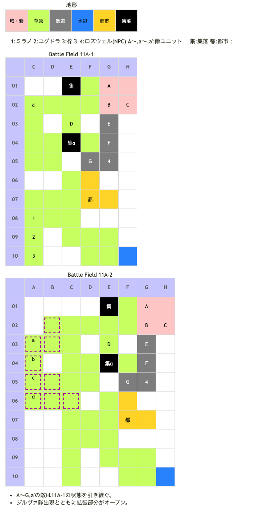

# Battle Field 11A 黒薔薇領

- BF10でロザリィ撃破した場合のルート
- 2部構成
- 出撃枠3人
- 友好軍ロズウェル
- ロズウェルに隣接で11A-2へ（カード復活）

## 勝利条件 

11A-1
- 自軍ユニットがロズウェルに隣接

11A-2
- ロズウェルが目標地点(G02)に到達

## マップ 

## 取得可能アイテム 

|名前|時期|-|位置|備考|
|---|---|---|---|---|
|クリスタルロッド(2)||交|α|[Battle Field 10](BattleField10.md)で手に入る魔水晶が必要 TNV10以上|
|ファランクス(3) or魔槍ブラシェンド(2)||落|B(レオン)|BF9でファランクスを入手したか否かで変化　LUK☆3|
|クマのぬいぐるみ(2)||落|a'(エミリオ)|スティールのみ 入手した場合BF16で装備無し|
|殺意の仮面(2)|11A-2|落|a(ジルヴァ)|LUK3.0|
|ライトニングボウ(2)|11A-2|落|b(エレナ)|LUK4.0|

- HARDだとジルヴァLUKが☆☆☆xxxxxに上昇している為、LUK中心にMVPを取っていないと連続スティールをするハメになる。

## 友軍ユニット 

- 黒薔薇軍 ： ネクロゲート （power 1150　move 11）

|NO.|名前|ユニット|Lv|士気|GEN|ATK|TEC|LUK|POW|アイテム|備考|
|---|---|---|---|---|---|---|---|---|---|---|---|
|4|ロズウェル|ネクロマンサー|6|3820|34|23|32|26|-|ガーゴイルロッド(3) or闇夜のローブ(3)|Rage暗黒 夜に強い(ガーゴイルロッド装備時) 暗黒攻撃は無効(闇夜のローブ装備時)|

## 敵ユニット 

### 11A-1

- レオン隊 ： チャリオット （power 1200　move 09）

|NO.|名前|ユニット|Lv|士気|GEN|ATK|TEC|LUK|POW|アイテム|備考|
|---|---|---|---|---|---|---|---|---|---|---|---|
|A|帝国兵|ウィッチ|4|1670|18|18|33|30|40||Rage火炎|
|B|レオン|ナイト|7|4800|26|30|35|30|120|ファランクス(3) or魔槍ブラシェンド(2)| 11A-1までProtect! 弓系ユニットに強い(ファランクス装備) 少しずつ士気低下 (魔槍ブラシェンド装備) ステータスは魔槍ブラシェンド 装備時のもの|
|C|帝国兵|ウィッチ|4|1670|18|18|33|30|40||Rage火炎|
|D|帝国兵|ハンター|4|1770|21|18|33|23|40|||
|E|重騎兵|ナイト|5|1700|24|22|24|18|40|||
|F|重騎兵|ナイト|5|1420|24|22|24|18|40|||
|G|重騎兵|ナイト|5|1370|24|22|24|18|40|||

- エミリオ隊 ： グラヴィティカオス （power 2400　move 09）

|NO.|名前|ユニット|Lv|士気|GEN|ATK|TEC|LUK|POW|アイテム|備考|
|---|---|---|---|---|---|---|---|---|---|---|---|
|a'|エミリオ|グリフライダー|7|4400|22|26|34|34|120|クマのぬいぐるみ(2)|プロテクト エミリオ隊2ターン目で撤退|

- 備考
  - スティールのPOWがある程度高いと、最初の自軍ターンでミラノ特攻→撃破マスにユグドラで即座に11A-2へ進行できる。全軍撃破とMVPを目指すなら必須かと。

### 11A-2

- ジルヴァ隊 ： ブラッディクロー （power 1150　move 09）

|NO.|名前|ユニット|Lv|士気|GEN|ATK|TEC|LUK|POW|アイテム|備考|
|---|---|---|---|---|---|---|---|---|---|---|---|
|a|ジルヴァ|アサシン|6|4160|10|30|40|35|120|殺意の仮面(2)|Rage暗黒 常にゲージ低下(装備)|
|b|エレナ|アサシン|3|3140|18|24|25|42|120|ライトニングボウ(2)|Rage暗黒 雷撃攻撃力アップ(装備)|
|c|帝国兵|ヴァルキリー|4|1620|18|21|30|23|40||Rage神聖|
|d|帝国兵|ヴァルキリー|4|1620|18|21|30|23|40||Rage神聖|

- 備考
  - 11A-2開始後の最初の敵ターンが始まった時点でレオンのProtect!が切れる。
  - 魔槍ブラシェンドは自ターンごとに士気が5%低下。
  - エミリオはレオンに隣接後、次のエミリオ隊のターンで撤退。
  - 増援前にレオンを倒すとジルヴァ隊が来ないので注意。

## 戦闘中イベント 

11A
- TNV10以上で集落に行くと「魔水晶」→「クリスタルロッド」

11A-1

11A-2
- ロズウェル加入、操作可能。
- レオン隊1ターン目行動後敵増援。そのまま増援の攻撃。
- ジルヴァ撃破でジルヴァ隊消滅
- レオン撃破でレオン隊消滅

## 勝利後イベント 

- ポイズンブレス入手(power:1650,move10,Ace:塊)
- 未入手の場合ネクロゲート入手(power:1400,move:11,Ace:杖)

## MVPターン制限 

- ＋２：１７ターン以下
- ＋１：１８ターン以上
- 無し：リトライ

## 関連 

- [Chapter2](Chapter2.md)

### 次 

- [Battle Field 12](BattleField12.md)

### 前 

- [Chapter3](Chapter3.md)

- [Battle Field 10](BattleField10.md)
