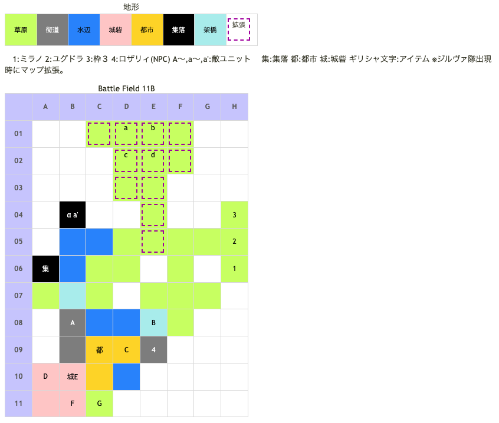

# Battle Field 11B 白薔薇領

- BF10でロズウェル撃破時のルート
- 2部構成
- 出撃枠3人
- ロザリィが友軍
- 11B-1、敵進撃から開始
- 11B-1、勝利条件達成後ロザリィ加入

## 勝利条件 

11B-1
- 味方ユニットがロザリィに隣接

11B-2
- 白薔薇館を奪還せよ！（ロザリィを白薔薇館に移動させればOK）

## 敗北条件 

11B-1、11B-2
- ユグドラorミラノorロザリィの戦死
- カードを使い切る

## マップ 

## 取得可能アイテム 

|名前|時期|-|位置|備考|
|---|---|---|---|---|
|斬鉄剣(3) or真・斬鉄剣(3)||落|E(ラッセル)|BF08で斬鉄剣を入手したか否かで変化 斬鉄剣装備時はLUK3.0、真・斬鉄剣装備時はLUK4.0|
|クマのぬいぐるみ(2)|11B-1|落|1(エミリオ)|要スティール 入手した場合BF16で装備無し|
|ブラックブランド(2)|11B-1～2|交|B04(集落)α|[Battle Field 10](BattleField10.md)で手に入る黒曜石が必要 ロザリィを除く出撃ユニット3人のT.N.V10以上で入手可能 ※メインメニューに表示されるT.N.Vの合計値はロザリィのT.N.Vを除いたT.N.Vが表示される。|
|殺意の仮面(2)|11B-2|落|d(ジルヴァ)|LUK3.0|
|ライトニングボウ(2)|11B-2|落|c(エレナ)|LUK4.0|

## 敵ユニット 

### 11B-1

- ラッセル隊 ： アイテムブレイク （Power 1200 Move 08）

|No.|名前|ユニット|Lv|士気|GEN|ATK|TEC|LUK|POW|アイテム|備考|
|---|---|---|---|---|---|---|---|---|---|---|---|
|A|帝国兵|フェンサー|5|1440|2.2|2.4|2.4|1.8|40|装備なし||
|B|帝国兵|フェンサー|5|1320|2.2|2.4|2.4|1.8|40|装備なし||
|C|帝国兵|フェンサー|5|1690|2.2|2.4|2.4|1.8|40|装備なし||
|D|帝国兵|ネクロマンサー|4|1670|1.8|2.1|3.0|3.0|40|装備なし||
|E|ラッセル|フェンサー|7|4360|2.0|3.0|4.0|4.0|120|斬鉄剣(3) or真・斬鉄剣(3)|11B-1までProtect! ゴーレムに強い(斬鉄剣装備) 士気ダメージ最大化(真・斬鉄剣装備) ステータスは真・斬鉄剣装備時|
|F|帝国兵|ネクロマンサー|4|1670|1.8|2.1|3.0|3.0|40|装備なし||
|G|帝国兵|ハンター|4|1770|2.1|1.8|3.3|2.3|40|装備なし||

- 備考
  - ここのラッセルはちょっと特殊で、11B-2開始後の最初の敵ターンが始まった時点でプロテクトが切れる。 
  - 増援直後にラッセルを倒すと、ジルヴァ隊が撤退するので注意。
  - すでにラッキーブルーム及びふりふりレースを取得していた場合、ロザリィがアイテムブレイクを受けると、所有していたはずのラッキーブルームが消失してしまう為注意。

- エミリオ隊 ： グラヴィティカオス （Power 2400 Move 09）

|No.|名前|ユニット|Lv|士気|GEN|ATK|TEC|LUK|POW|アイテム|備考|
|---|---|---|---|---|---|---|---|---|---|---|---|
|a'|エミリオ|グリフライダー|7|4400|2.2|2.6|3.4|3.4|120|クマのぬいぐるみ(2)|Protect! 2ターン目に撤退|

- 備考
  - ここのエミリオからぬいぐるみを奪取しようとすると、袋叩き確実なのでオススメしない。

### 11B-2

- ジルヴァ隊 ： ブラッディクロー （Power 1150 Move 09）

|No.|名前|ユニット|Lv|士気|GEN|ATK|TEC|LUK|POW|アイテム|備考|
|---|---|---|---|---|---|---|---|---|---|---|---|
|a|帝国兵|ヴァルキリー|4|1620|1.8|2.1|3.0|2.3|40|装備なし||
|b|帝国兵|ヴァルキリー|4|1620|1.8|2.1|3.0|2.3|40|装備なし||
|c|エレナ|アサシン|3|3140|1.8|2.4|2.5|4.2|120|ライトニングボウ(2)|雷撃攻撃力アップ(装備)|
|d|ジルヴァ|アサシン|6|4160|1.0|3.0|4.0|3.5|120|殺意の仮面(1)|常にゲージ低下(装備)|

- 備考
  - ラッセル隊の士気・配置は11B-1から引継ぎ。
  - 「士気ダメージ最大化」の効果を持ったユニットが勝利すると
  - 士気ダメージ計算時に、本来の生存数に関わらず生存ユニットが必ず+60%になる。
  - 真・斬鉄剣を盗むと「士気ダメージ最大化」の効果も消えラッセルも弱体化するが、高確率でミラノが負けるので注意。
  - ラッセルとの戦闘時はC10にロザリィを、C08にニーチェを置けば比較的楽に戦える。

## 戦闘中イベント 

11B-2
- 敵2ターン目敵増援、そのまま進撃
- ミラノとジルヴァ隣接・戦闘前後にそれぞれ会話。戦闘結果により戦闘後会話変化
- ユグドラとジルヴァ隣接・戦闘前後にそれぞれ会話。戦闘結果により戦闘後会話変化
- デュランとジルヴァ隣接・戦闘前後にそれぞれ会話。戦闘結果により戦闘後会話変化
- ニーチェとジルヴァ隣接・戦闘前後にそれぞれ会話。戦闘結果により戦闘後会話変化
- ロザリィとジルヴァ隣接・戦闘前後にそれぞれ会話。戦闘結果により戦闘後会話変化
- ジルヴァを撃破すると敵増援消滅、エレナ撤退
- ラッセルを撃破すると帝国兵グループ消滅、ジルヴァ、エレナ撤退

## 勝利後イベント 

- アースクウェイク入手(power:1650,move:10,Ace:塊)
- 未入手の場合メイクドール入手(power:1400,move:11,Ace:杖)

## MVPターン制限 

- ＋２：１６ターン以下
- ＋１：１７ターン〜
- 無し：リトライ

## 関連 

- [Chapter3](Chapter3.md)
- [Chapter2](Chapter2.md)

### 次 

- [Battle Field 12](BattleField12.md)

### 前 

- [Battle Field 10](BattleField10.md)
