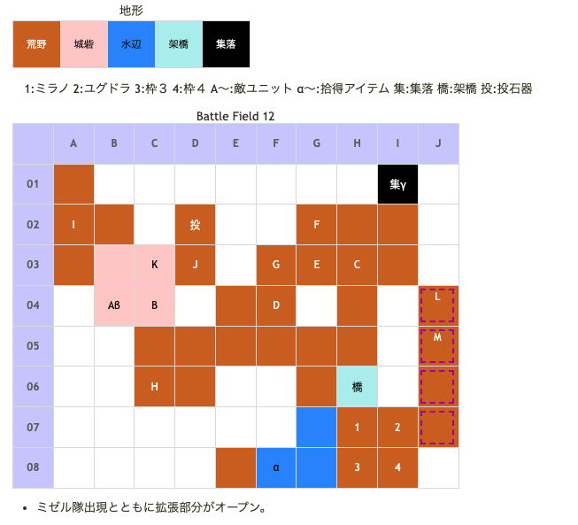

# Battle Field 12 山賊の砦

- 出撃枠4人
- 投石器1

## 勝利条件 

- オルテガの撃破

## 敗北条件 

- ユグドラorミラノの戦死
- カードを使い切る

### マップ

## 取得可能アイテム 

|名前|時期|-|位置|備考|
|---|---|---|---|---|
|ウポラ像(1)||拾|α(F08)|ニーチェのみ,効果発動で割れたウポラ象に変化|
|金塊||拾|β(B04)|[Battle Field 16](BattleField16.md)でゴールデンスピアの入手に必要|
|ブロンズシールド(1)||拾|γ(I01)|ミラノのみ|
|首領のハチマキ(2)||落|K(オルテガ)|LUK2.0|
|メダリオン||落|E(山賊) L(賞金稼ぎ)|必ず落とす|
|羽根付きサンダル(2) or丈夫な長靴(1) orレンジャーブーツ(2) orワープシューズ(2)|12|落|M(ミゼル)|LUK3.0 BF7,BF8,BF9での入手状況により所持アイテム変化 賞金稼ぎ撃破&ミゼル士気低下で逃走(アイテム入手不可)|

## 敵ユニット 

- 山賊団 ： ロックフォール （power 850　move 05）

|NO.|名前|ユニット|Lv|士気|GEN|ATK|TEC|LUK|POW|アイテム|備考|
|---|---|---|---|---|---|---|---|---|---|---|---|
|C|山賊|バンディット|5|1750|1.9|2.4|1.8|3.0|40|装備なし||
|D|山賊|バンディット|5|1750|1.9|2.4|1.8|3.0|40|装備なし||
|E|山賊|バンディット|5|1750|1.9|2.4|1.8|3.0|40|メダリオン(1)|－士気回復専用(装備)|
|F|山賊|フェンサー|5|1860|2.2|2.4|2.4|1.8|40|装備なし||
|G|山賊|フェンサー|5|1860|2.2|2.4|2.4|1.8|40|装備なし||

- 山賊団 ： ロックフォール （power 1300　move 05）

|NO.|名前|ユニット|Lv|士気|GEN|ATK|TEC|LUK|POW|アイテム|備考|
|---|---|---|---|---|---|---|---|---|---|---|---|
|A|山賊|バンディット|5|1750|1.9|2.4|1.8|3.0|40|装備なし||
|B|山賊|バンディット|5|1750|1.9|2.4|1.8|3.0|40|装備なし||
|H|山賊|フェンサー|5|1860|2.2|2.4|2.4|1.8|40|装備なし||
|I|山賊|アサシン|6|1790|1.5|2.0|3.4|3.4|40|装備なし||
|J|山賊|アサシン|6|1790|1.5|2.0|3.4|3.4|40|装備なし||
|K|オルテガ|バンディット|8|4880|3.0|3.0|1.8|2.4|120|首領のハチマキ(2)|必ずエースになれる(装備)|

- ミゼル隊 ： サンダーボルト （power 1600　move 07）

|NO.|名前|ユニット|Lv|士気|GEN|ATK|TEC|LUK|POW|アイテム|備考|
|---|---|---|---|---|---|---|---|---|---|---|---|
|L|賞金稼ぎ|バンディット|6|1690|2.0|2.5|1.8|3.0|40|メダリオン(1)|－士気回復専用(装備)|
|M|ミゼル|ハンター|7|4360|2.0|2.4|4.0|3.4|120|羽根付きサンダル(2) or丈夫な長靴(1) orレンジャーブーツ(2) orワープシューズ(2)|BF7,BF8,BF9での入手状況により 所持アイテム変化 賞金稼ぎ撃破&ミゼル士気 低下で逃走(アイテム入手不可) ステータスはワープシューズ 装備時|

- 備考
  - ミゼル隊の登場時は夜間になるので、I4を転移して来るのに注意。
  - GEN2以上あれば、オルテガ及びバンディットのロックフォールは無効化できる。

## 戦闘中イベント 

- カード選択後に戦闘チュートリアル
- 川内の南西に「ウポラ像」（ニーチェが必要）
- マップ北集落 盗賊村にミラノ配置で「ブロンズシールド」入手
- 山賊の砦左下に味方配置で「金塊」入手
- メダリオン所持の山賊を撃破すると周囲の山賊グループ消滅(Pw850のグループ)
- 自軍3ターン目終了後、マップ東から敵増援
- ミゼルと味方ユニット隣接・戦闘前後にそれぞれ会話。戦闘結果により戦闘後会話変化
- オルテガと味方ユニット隣接・戦闘前後にそれぞれ会話。戦闘結果により戦闘後会話変化
- オルテガを撃破すると山賊全て消滅、ミゼル撤退

## 勝利後イベント 

- ミゼルの士気を0にし、未所持の場合サンダーボルト入手(power:1550,move:7,Ace:弓)

## MVPターン制限 

- ＋２：２０ターン以下
- ＋１：２１ターン〜
- 無し：リトライ

## 関連 

- [Chapter2](Chapter2.md)

### 次 

- [Battle Field 13](BattleField13.md)

### 前 

- [Battle Field 11A](BattleField11A.md)
- [Battle Field 11B](BattleField11B.md)
