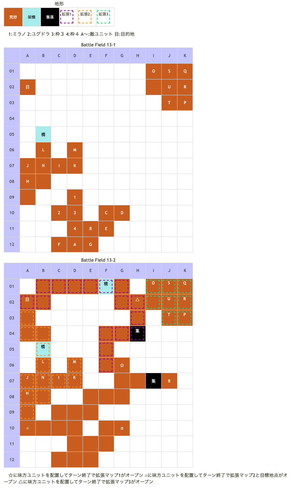

# Battle Field 13 レネシー山脈

- 2部構成
- 出撃枠4人
- 13-1、霧が出るのは24ターン終了後（25ターン目からスタート）。
- 13-2、帝国兵に隣接してしまうと勝利・敗北条件変更。
- 13-2、敵を全滅させるにはかなり無理がある。

## 勝利条件 

13-1
- 霧が出るまで迎撃に徹せよ！

13-2
- 全ユニットが特定地点へ到達

13-2、帝国兵に隣接する
- 敵の全滅

## 敗北条件 

13-1
- 味方ユニットの戦死

13-2
- カードを使い切る

13-2、帝国兵に隣接する
- 味方ユニットの戦死
- カードを使い切る

### マップ

## 取得可能アイテム 

|名前|時期|-|位置|備考|
|---|---|---|---|---|
|開かずのカバン(2)|13-2|拾|α|13-1では拾えない|
|オーガニウム|13-2|拾|β|[Battle Field 16](BattleField16.md)でオーガブレード入手に必要|
|メダリオン|13-2|落|D(山賊)|必ず落とす|
|豪快一本鬼(3)|13-2|落|N(バルドゥス)|[Battle Field 17](BattleField17.md)で入手機会有り|
|葬送剣ゾルフィ(2)|13-2|落|U(アイギナ)|[Battle Field 17](BattleField17.md)で入手機会有り|

## 敵ユニット 

### 13-1

- 山賊団 ： ロックフォール （power 1150　move 05）

|NO.|名前|ユニット|Lv|士気|GEN|ATK|TEC|LUK|POW|アイテム|備考|
|---|---|---|---|---|---|---|---|---|---|---|---|
|A|山賊|バンディット|5|1750|1.9|2.4|1.8|3.0|40|装備なし||
|B|山賊|バンディット|5|1750|1.9|2.4|1.8|3.0|40|装備なし||
|C|山賊|バンディット|6|1910|2.0|2.5|1.8|3.0|40|装備なし||
|D|山賊|バンディット|6|1910|2.0|2.5|1.8|3.0|40|メダリオン(1)|－士気回復専用(装備)|
|E|山賊|フェンサー|5|1860|2.2|2.4|2.4|1.8|40|装備なし||
|F|山賊|アサシン|6|1790|1.5|2.0|3.4|3.4|40|装備なし||
|G|山賊|アサシン|6|1790|1.5|2.0|3.4|3.4|4.0|装備なし||

- 備考
  - 初期配置で移動スペースが無い為、出撃編成で4番目にデュランやニーチェを選ぶと泣きを見る。
  - 4番目がロザリィの場合は槍ユニットがバンディットと戦うのは避けられない為、負けたくない場合はエースガード等で援護すると楽である。

### 13-2

- 帝国軍 ： エースガード （power 2850　move 04）

|NO.|名前|ユニット|Lv|士気|GEN|ATK|TEC|LUK|POW|アイテム|備考|
|---|---|---|---|---|---|---|---|---|---|---|---|
|H|帝国兵|ナイト|8|2410|2.7|2.4|2.4|1.8|40|装備なし|HIGH|
|I|帝国兵|ナイト|8|2410|2.7|2.4|2.4|1.8|40|装備なし|HIGH|
|J|帝国兵|グリフライダー|8|2370|2.4|2.4|2.4|3.1|40|装備なし|HIGH|
|K|帝国兵|グリフライダー|8|2370|2.4|2.4|2.4|3.1|40|装備なし|HIGH|
|L|帝国兵|ハンター|8|2380|2.4|2.1|3.5|2.4|40|装備なし|HIGH|
|M|帝国兵|ハンター|8|2380|2.4|2.1|3.5|2.4|40|装備なし|HIGH|
|N|バルドゥス|ガーディアンナイト|10|5860|4.0|4.0|3.0|1.9|120|豪槍一本鬼(3)|HIGH スキル使用不可(装備)|

- 帝国軍 ： レヴォリューション （power 2700　move 10）

|NO.|名前|ユニット|Lv|士気|GEN|ATK|TEC|LUK|POW|アイテム|備考|
|---|---|---|---|---|---|---|---|---|---|---|---|
|O|帝国兵|バンディット|8|2190|2.1|2.7|1.8|3.1|40|装備なし|HIGH|
|P|帝国兵|バンディット|8|2190|2.1|2.7|1.8|3.1|40|装備なし|HIGH|
|Q|帝国兵|アサシン|8|2220|1.6|2.1|3.5|3.5|40|装備なし|HIGH|
|R|帝国兵|アサシン|8|2220|1.6|2.1|3.5|3.5|40|装備なし|HIGH|
|S|帝国兵|ヴァルキリー|8|2220|2.1|2.4|3.1|2.4|40|装備なし|HIGH|
|T|帝国兵|ヴァルキリー|8|2220|2.1|2.4|3.1|2.4|40|装備なし|HIGH|
|U|アイギナ|ヴァルキリー|9|5360|2.1|3.4|5.0|2.0|120|葬送剣ゾルフィ(2)|HIGH 一騎討ちで必勝(装備)|

- 備考
  - 山賊の壊滅には何ターンかけても良い。（霧の出るターンは前後しないのでMVP+2に影響しない）
  - プロテクトや無敵は掛かっていないので倒せない事は無いが、全ユニットがターン開始時に士気全回復するステキ状態。バルドゥスとアイギナの所持アイテムは別のMAPで取れる。エミリオ同様、ここで取っても報われない。
  - マップ上の全てのアイテムを回収する際には、極力歩数の多いカードを持っていく方が良い。無駄な行動はカード切れを招く。特にロズウェルを使用の際は注意のこと。夜間はワープ移動になるので歩数を無駄にしないよう、考える必要がある。 ロズウェルに開かずのカバン（α）を回収させ、夜間転移でG9→G5→G3を跨いで直進させるとMOVが節約できる。
  - デュランはバルドゥス隊の上をまたいで行くと10歩分くらい歩数を節約できる。これを利用すると、全アイテム回収とMVP+2を両立させることが可能。
  - 敵ユニットを倒す目的の場合、敵兵と隣接した時点で自ターン強制終了→相手ターンに移行するため、カード・ユニット配置に注意。荒野＋武器相性有利のミラノであっても、リトライなしでは対バルドゥスは苦戦。敵全滅での攻略はリトライ前提。

## 戦闘中イベント 

13-1
- メダリオン所持の山賊を撃破すると山賊グループ消滅。
- 24ターン終了後に霧が発生。

13-2
- 左側の行き止まりに止まるとバルドゥス隊、上の橋から右2下1に止まるとアイギナ隊が見えるようになるが、敵にターンが回るようになる。MVP狙いの人は注意。
- 初期で動ける範囲の右上の方に味方を移動させ、ターン終了すれば、上方への道が現れる。
- 帝国兵に隣接すると発見され、攻撃されるようになる。
- 右側の行き止まりに味方配置でオーガニウム入手
- メダリオン持ちの山賊がいた場所に「開かずのカバン」
- 味方ユニットとバルドゥス隣接・戦闘前後にそれぞれ会話。戦闘結果により戦闘後会話変化
- バルドゥスを撃破すると周囲の帝国兵グループが消滅。
- アイギナを撃破すると周囲の帝国兵グループが消滅。

## 勝利後イベント 

- 2つの集落を訪れているとBF-14Iへ

## MVPターン制限 

- ＋２：３５ターン以下
- ＋１：３６ターン〜
- 無し：リトライ

## 関連 

- [Chapter 3](Chapter3.md)

### 次 

- [Battle Field 14](BattleField14.md)
- [Battle Field 14I](BattleField14I.md)

### 前 

- [Battle Field 12](BattleField12.md)
