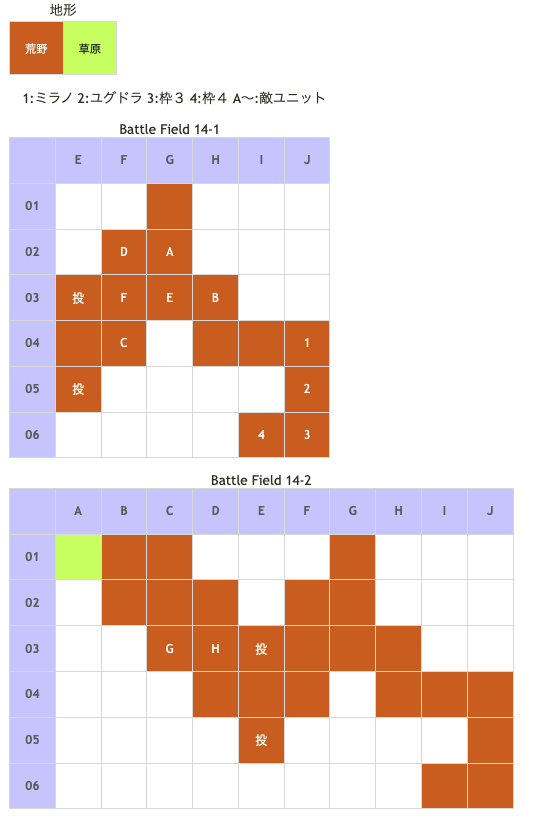

# Battle Field 14 ルナミナ峠

- 2部構成（移行でカード復活）
- 出撃枠4人
- 投石器2

## 勝利条件 

14-1
- 特定地点へ到達

14-2
- 敵の全滅

## 敗北条件 

14-1
- ユグドラorミラノの戦死
- カードを使い切る

14-2
- ユグドラorミラノの戦死
- カードを使い切る
- 敵が特定地点へ到達

### マップ 

## 取得可能アイテム 

|名前|時期|-|位置|備考|
|---|---|---|---|---|
|メダリオン|14-1 14-2 14-2|落|F(守備隊長) G(伝令) H(伝令)|必ず落とす|

## 敵ユニット 

### 14-1

- 帝国軍 ： シールドバリア （power 1200　move 06）

|NO.|名前|ユニット|Lv|士気|GEN|ATK|TEC|LUK|POW|アイテム|備考|
|---|---|---|---|---|---|---|---|---|---|---|---|
|A|衛兵|フェンサー|5|1860|2.2|2.4|2.4|1.8|40|装備なし||
|B|衛兵|フェンサー|5|1860|2.2|2.4|2.4|1.8|40|装備なし||
|C|衛兵|フェンサー|5|1860|2.2|2.4|2.4|1.8|40|装備なし||
|D|衛兵|アサシン|5|1660|1.5|1.9|3.3|3.3|40|装備なし||
|E|衛兵|アサシン|5|1660|1.5|1.9|3.3|3.3|40|装備なし||
|F|守備隊長|ナイト|7|3460|2.7|2.4|2.4|1.8|80|メダリオン(1)|－士気回復専用(装備)|

### 14-2

- 帝国軍 ： サンクチュアリ （power 900　move 08）

|NO.|名前|ユニット|Lv|士気|GEN|ATK|TEC|LUK|POW|アイテム|備考|
|---|---|---|---|---|---|---|---|---|---|---|---|
|G|伝令|ヴァルキリー|6|1950|2.0|2.3|3.0|2.4|40|メダリオン(1)|－士気回復専用(装備)|
|H|伝令|ウィッチ|6|2000|2.0|2.0|3.4|3.0|40|メダリオン(1)|－士気回復専用(装備)|

- 備考
  - 伝令は1歩ずつ逃げ、隣接しても仕掛けてこない。
  - ロザリィのAggressive攻撃は火炎属性な為ウィッチにダメージを与えられない。→を押さずに対処。

## 戦闘中イベント 

14-1
- 守備隊長撃破で衛兵グループ消滅。

## 勝利後イベント 

- 特に無し。

## MVPターン制限 

- ＋２：７ターン以下
- ＋１：８ターン〜
- 無し：リトライ

## 関連 

- [Chapter 3](Chapter3.md)

### 次 

- [Battle Field 15](BattleField15.md)

### 前 

- [Battle Field 13](BattleField13.md)
