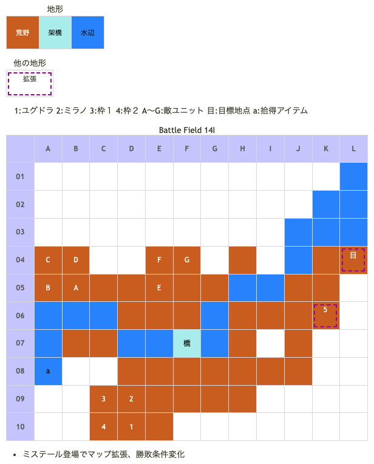

# Battle Field 14I レネシー山脈山道

- [Battle Field 13](BattleField13.md)で2つの集落を訪れていると行く事が出来る新マップ
- 全敵ユニットHigh状態
- 2回戦闘を行うと、次の王国軍ターン終了時にミステール登場、勝利・敗北条件変更 
(最短は3ターン目終了時。被ダメージや勝敗が関係してるかも)
- コンプリートガイド記載の条件は「11ターン経過or3回敗北」あてにならない
- ミステール登場後、勝利条件が目標地点に全ユニットを移動に変更
- グリフライダーが登場しているのでフレイムでグリフグリルが入手可能。MVP狙いなら次の14II-2で焼いた方がいいかも
- アイスジャベリンを装備したキャラを出撃させれば、ブリザード使用ターンに限っては敵勢のエースガードを上回る効能で、軍神バルドゥス以外は気持ちよく粉砕できる。

## 勝利条件 

- 軍神バルドゥスを撃破せよ！

ミステール登場後
- 全員、山道脱出を目指せ！

## 敗北条件 

- ユグドラorミラノが戦死すると…
- カードを使い果たすと…

ミステール登場後
- 味方が１ユニットでも戦死すると…
- カードを使い果たすと…

## マップ

## 取得可能アイテム 

|名前|時期|-|位置|備考|
|---|---|---|---|---|
|ウポラ像|14I|拾|a(A08)|ニーチェのみ。[Battle Field 12](BattleField12.md)で入手してない場合のみ|
|メダリオン(1)|14I|落|A(バルドゥス) C(帝国兵)|Protect!につきスティールのみ 必ず落とすがスティール推奨|

## 友軍ユニット 

- ミステール(ミステール) : オブリヴィアスドーン (Power:1910 Move:10 Ace:鎌)

|NO.|名前|ユニット|Lv|士気|GEN|ATK|TEC|LUK|アイテム|備考|
|---|---|---|---|---|---|---|---|---|---|---|
|5|ミステール|タクティシャン|7|4460|2.7|2.5|2.5|1.9|草刈り鎌(2)|○都市地形が得意 ○連戦ハンデなし(装備)|

## 敵ユニット 

- 帝国軍(バルドゥス隊) : エースガード (Power:1450 Move:4 Ace:All)

|No.|名前|ユニット|Lv|士気|GEN|ATK|TEC|LUK|POW|装備|備考|
|---|---|---|---|---|---|---|---|---|---|---|---|
|A|バルドゥス|ガーディアンナイト|10|5860|3.2|3.2|4.0|1.9|120|メダリオン(1)|High －士気回復専用(装備)|
|B|帝国兵|ナイト|8|2410|2.7|2.4|2.4|1.8|40|装備なし|High|
|C|帝国兵|ナイト|8|2410|2.7|2.4|2.4|1.8|40|メダリオン(1)|High －士気回復専用(装備)|
|D|帝国兵|グリフライダー|8|2370|2.4|2.4|2.4|3.1|40|装備なし|High|
|E|帝国兵|グリフライダー|8|2370|2.4|2.4|2.4|3.1|40|装備なし|High|
|F|帝国兵|ハンター|8|2380|2.4|2.1|3.5|2.4|40|装備なし|High|
|G|帝国兵|ハンター|8|2380|2.4|2.1|3.5|2.4|40|装備なし|High|

## 戦闘中イベント 

- 各ユニットとバルドゥス隣接後、戦闘後に会話
- ミステール登場と共にマップ拡張、勝敗条件変化
- 各ユニットとミステール隣接後に会話

## 勝利後イベント 

- 特になし

## MVPターン数制限 

- ＋２：１２ターン以内 
- ＋１：１３ターン以上
- 無し：リトライ

## 戦術アドバイス 

- メダリオンをスティりにいくと間違いなく+1になる
- +2を狙っても最短13ターンかかるんだが、誰か+2の取り方頼む
- 解法1(生贄を置いて逃げる)
  - カードはMOV重視で選択。犠牲にするキャラは瀕死で経験値の少ない者を選ぶ方がお得
  - 逃がす予定のキャラを2人、J,K列に移動
  - 水上戦闘できるキャラをH5に配置して待つ
  - グリフライダーかナイトが隣接してくる事があるので1回だけ交戦して勝つ
  - 犠牲にするキャラをF5～6辺りに配置してわざと倒される
  - すると7ターン終了時点でミステール登場
  - あとは残った3人で逃げるだけ。10ターンでMVP+2獲得
- 解法2(ミステールの登場を遅らせる)
  - 移動力の高いカードで全体を右に寄せといて
  - 09ﾀｰﾝ：通り道に寄ってきた敵と戦闘。終了時にミステール登場
  - 10ﾀｰﾝ：敵ターン
  - 11ﾀｰﾝ：ミステールのターン
  - 12ﾀｰﾝ：全軍退却完了
- このBFはMVP+2を狙うと極端に戦闘回数が少なくなる為、MVP+1で徹底攻略した方が良いかもしれない。
  - メダリオン×1とグリフグリルを簡単に入手
  - HIGH＆高レベルなので(負けてもいいので)戦闘を繰り返して経験値稼ぎ >> 全員1ぐらい簡単に上がる
  - カードPOW最大360稼げる
- ミステールに隣接すると目標地点に向かうとか向かわないとか。

## 関連 

- [Chapter 3](Chapter3.md)

### 次 

- [Battle Field 14II](BattleField14II.md)

### 前 

- [Battle Field 13](BattleField13.md)
