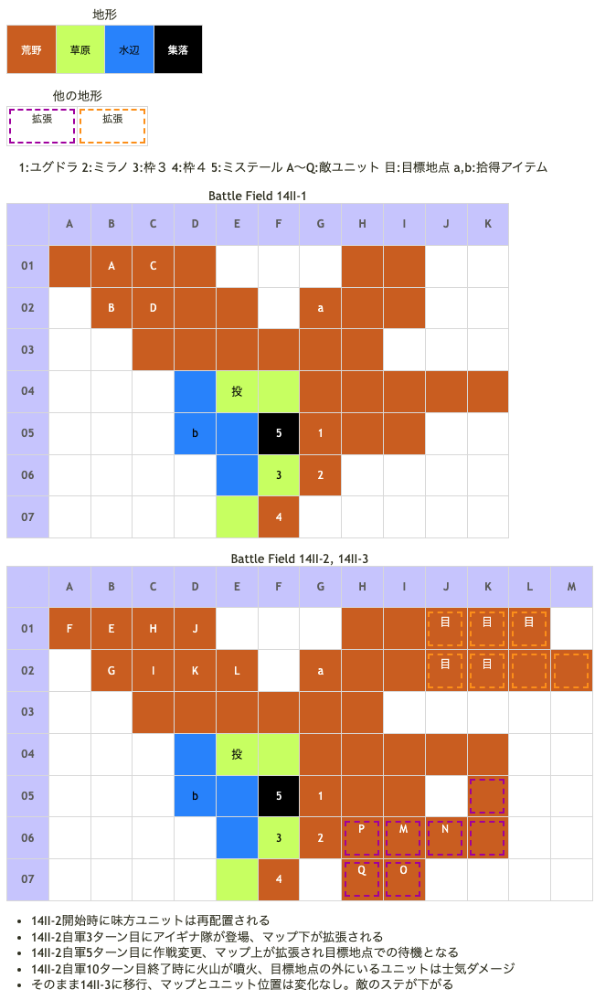

# Battle Field 14II レネシー山脈～火山地帯

- 3部構成
- 偵察部隊を撃破して14II-2へ
- 14II-2で2回あるマップ拡張（アイギナ隊増援、作戦変更）の際に1ターン取られる 
自軍３ターン目と5ターン目に選んだカードは問答無用で使用済みになるので注意
- 14II-2の自軍10ターン目終了時に火山が噴火して14II-3へ
- アイギナとバルドゥスは14II-2ではProtect!

## 勝利条件 

14II-1
- 敵の偵察部隊を撃破せよ！

14II-2
- 軍神バルドゥスを撃破せよ！

作戦変更
- 全員、目標地点で待機せよ！

14II-3
- 軍神バルドゥスを撃破せよ！

## 敗北条件 

14II-1、14II-2、14II-3
- ユグドラorミラノorミステールが戦死すると…
- カードを使い果たすと…

## マップ 

## 取得可能アイテム 

|名前|時期|-|位置|備考|
|---|---|---|---|---|
|きらきら火山灰|14II-1,-2,-3|拾|a(G02)|[Battle Field 32](BattleField32.md)でクローバーライトと交換|
|金のドゼウ|14II-1,-2,-3|拾|b(D05)|ニーチェのみ。2週目以降限定。夜限定。TNV10以上|
|メダリオン(1)|14II-1 14II-2, -3|落|A(帝国兵) F,G,H,N,O(帝国兵)|必ず落とす|

- 金のドゼウは入手条件が多い。特にTNVは前BFでHIGH敵を相手に敗北して下がっている場合があるので注意。
- バルドゥスとアイギナはこれまでに取り逃したアイテムを所持していることがある（一部未確認）。特にない場合はメダリオンを所持。

報告のあったもの
- バルドゥス
  - 帝国兵法書地ノ巻
  - 帝国兵法書人ノ巻
- アイギナ
  - フランベルジェ（←マージリングは未確認だが、こちらはLuc★3以上で入手可能）
  - マージリング
  - カチューシャ

## 敵ユニット 

### 14II-1

- 帝国軍(帝国兵隊) : シールドバリア (Power:1200 Move:6 Ace:All)

|No.|名前|ユニット|Lv|士気|GEN|ATK|TEC|LUK|POW|装備|備考|
|---|---|---|---|---|---|---|---|---|---|---|---|
|A|帝国兵|ナイト|9|3660|3.0|2.5|2.4|2.0|50|メダリオン(1)|－士気回復専用(装備)|
|B|帝国兵|ナイト|8|2410|2.7|2.4|2.4|1.8|40|装備なし||
|C|帝国兵|ハンター|8|2380|2.4|2.1|3.5|2.4|40|装備なし||
|D|帝国兵|グリフライダー|8|2370|2.4|2.4|2.4|3.1|40|装備なし||

### 14II-2

- 帝国軍(バルドゥス隊) : エースガード (Power:1450 Move:4 Ace:All)

|No.|名前|ユニット|Lv|士気|GEN|ATK|TEC|LUK|POW|装備|備考|
|---|---|---|---|---|---|---|---|---|---|---|---|
|E|バルドゥス|ガーディアンナイト|10|5860|3.2|3.2|4.0|1.9|120|メダリオン(1)|－士気回復専用(装備)|
|F|帝国兵|ナイト|8|2410|2.7|2.4|2.4|1.8|40|メダリオン(1)|－士気回復専用(装備)|
|G|帝国兵|ナイト|8|2410|2.7|2.4|2.4|1.8|40|メダリオン(1)|－士気回復専用(装備)|
|H|帝国兵|ナイト|8|2410|2.7|2.4|2.4|1.8|40|メダリオン(1)|－士気回復専用(装備)|
|I|帝国兵|グリフライダー|8|2370|2.4|2.4|2.4|3.1|40|装備なし||
|J|帝国兵|グリフライダー|8|2370|2.4|2.4|2.4|3.1|40|装備なし||
|K|帝国兵|ハンター|8|2380|2.4|2.1|3.5|2.4|40|装備なし||
|L|帝国兵|ハンター|8|2380|2.4|2.1|3.5|2.4|40|装備なし||

- 帝国軍(アイギナ隊) : レボリューション (Power:1300 Move:10 Ace:剣)

|No.|名前|ユニット|Lv|士気|Gen|Atk|Tec|Luk|Pow|装備|備考|
|---|---|---|---|---|---|---|---|---|---|---|---|
|M|アイギナ|ヴァルキリー|9|5360|2.5|3.0|4.1|3.2|120|メダリオン(1)|－士気回復専用(装備)|
|N|帝国兵|ヴァルキリー|7|1920|2.1|2.3|3.0|2.3|40|メダリオン(1)|－士気回復専用(装備)|
|O|帝国兵|ヴァルキリー|7|1920|2.1|2.3|3.0|2.3|40|メダリオン(1)|－士気回復専用(装備)|
|P|帝国兵|アサシン|7|1770|1.6|2.0|3.4|3.4|40|装備なし||
|Q|帝国兵|アサシン|7|1770|1.6|2.0|3.4|3.4|40|装備なし||

### 14II-3

- 生き残ったユニットがそのまま残る。ただし噴火のお陰でステータスがダウンしている
- 噴火の影響
  - 士気が1000減少
  - バルドゥス隊のエースガードがPower:1450からPower:950に減少
  - アイギナ隊のレボリューションがPower:1300からPower:800に減少
  - 敵ユニットの各ステータスが小星2個分低下。バルドゥスのTECは4.0から2.2まで低下している
  - 味方ユニットが巻き込まれた時は士気ダメージのみ

## 戦闘中イベント 

14II-1
- 各ユニットと偵察部隊リーダー隣接後、戦闘後に会話

14II-2
- 自軍3ターン目（捨てカード）、5ターン目（捨てカード）にイベント
- 各ユニットとバルドゥス隣接後、戦闘後に会話
- 各ユニットとアイギナ隣接後、戦闘後に会話
- 自軍10ターン目終了時に火山噴火

## 勝利後イベント 

- ミステール加入
- オブリヴィアスドーン入手 (Power:1900 Move:10 Ace:鎌)

## MVPターン数制限 

- ＋２：２７ターン以内
- ＋１：２８ターン以上
- 無し：リトライ

## 戦術アドバイス 

- 14II-2は強制的に自軍10ターンかかる。
- バルドゥス隊はアイギナ隊が出るまで動かない
- 1ターン目に下のグリフを中心に5体を撃破する
- 2ターン目に上のグリフとバルドゥスに攻撃。焼き鳥はここが狙い目
- バルドゥス隊用にミラノを残して、4ターン目はシールドバリアでアイギナ隊へ攻撃。レボを防ぎつつ雑魚には速やかに退場して頂く
- あとは経験値稼ぎでもしつつじりじりと移動すればＯＫ
- ミラノのATK上げて無双してたらこうなった。14II-2は時間があるので手堅くいっても多分大丈夫なはず……
- ニーチェは金のドゼウが取れるマスにいれば、ユニオンに入らない限り戦闘することがない。士気ダメージが気にならなければ、目標地点に行かずそこで過ごしてもいい
  - 魔槍ブラシェンドのデメリット効果による士気低下、このBFの噴火ダメージはともに士気1で下げ止まるため、開き直ってニーチェ無双というのも面白い。
- このマップでミステールはMVPを取れない仕様になっているため、単騎でクリアすると「MVPなし」となるので注意

## 関連 

- [Chapter 3](Chapter3.md)

### 次 

- [Battle Field 15](BattleField15.md)

### 前 

- [Battle Field 14I](BattleField14I.md)
