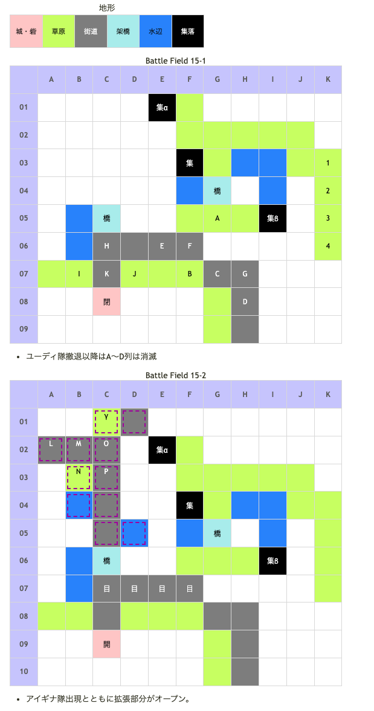

# Battle Field 15 フラム穀倉地帯

- カード9枚
- 2部構成
- 1ターン目カード選択後、戦闘チュートリアル。リンク可能に。
- 当然ながら敵もリンクをして来る。
- 15-2、勝利条件確定時に選んでいたカードがBF16の最初にも使用される。（敵ターンから開始な為） 敵カードはグラヴィティカオスなのでシールドバリアがベター。

## 勝利条件 

15-1
- インザーギの撃破

15-2
- 全ユニットが特定地点へ移動

## 敗北条件 

15-1
- ユグドラorミラノの戦死
- カードを使い切る

15-2
- 味方ユニットの戦死
- カードを使い切る

## マップ 

## 取得可能アイテム 

|名前|時期|-|位置|備考|
|---|---|---|---|---|
|麦わら帽子||拾|α(E02)|夜以外|
|ネスレの花束||拾|β(I06)|夜以外、TNV12以上 [Battle Field 16](BattleField16.md)でナナのキャンディー入手に必要。また後にしおれた花束に変化|
|金色の麦穂|15-2|拾|γ(C01)||
|歴戦のバンダナ(2)|15-1|落|G(インザーギ)|LUK3.0|
|デスブリンガー(2)|15-2|落|P(アイギナ)|LUK2.0|
|メダリオン(1)|15-1|落|C,D(フェンサー)|必ず落とす|

## 敵ユニット 

### 15-1

- インザーギ隊 ： バンシーズクライ （power 1300　move 08）

|NO.|名前|ユニット|Lv|士気|GEN|ATK|TEC|LUK|POW|アイテム|備考|
|---|---|---|---|---|---|---|---|---|---|---|---|
|A|傭兵|バンディット|6|1910|2.0|2.5|1.8|3.0|40|装備なし||
|B|傭兵|バンディット|6|1910|2.0|2.5|1.8|3.0|40|装備なし||
|C|傭兵|フェンサー|6|2020|2.3|2.5|2.4|1.8|40|メダリオン(1)|－士気回復専用(装備)|
|D|傭兵|フェンサー|6|2020|2.3|2.5|2.4|1.8|40|メダリオン(1)|－士気回復専用(装備)|
|E|傭兵|ナイト|7|2260|2.6|2.4|2.4|1.8|40|装備なし||
|F|傭兵|ナイト|7|2260|2.6|2.4|2.4|1.8|40|装備なし||
|G|インザーギ|フェンサー|8|4800|3.0|3.0|2.6|3.3|120|歴戦のバンダナ(2)|連戦ハンデ無し(装備)|

- 備考
  - MVP+2狙いの場合、高MOVカードを使用しつつ、6～7ターン目で殲滅しておきたい。MOV9未満のカードは使用する余裕が無い。
  - 密集しているため、メダリオンの回収に注意。

- ユーディ隊 ： フレイム （power 1700　move 07）

|NO.|名前|ユニット|Lv|士気|GEN|ATK|TEC|LUK|POW|アイテム|備考|
|---|---|---|---|---|---|---|---|---|---|---|---|
|H|宮廷魔術師|ウィッチ|6|2000|2.0|2.0|3.4|3.0|40|装備なし||
|I|宮廷魔術師|ウィッチ|6|2000|2.0|2.0|3.4|3.0|40|装備なし||
|J|宮廷魔術師|ウィッチ|6|2000|2.0|2.0|3.4|3.0|40|装備なし||
|K|ユーディ|ウィッチ|8|4940|3.0|1.0|3.3|4.0|120|淑女のコート(2)|クリティカル率0％(装備)|
- 備考
  - ユーディ隊とは戦闘不可。

### 15-2

- アイギナ隊 ： レヴォリューション （power 2850　move 10）

|NO.|名前|ユニット|Lv|士気|GEN|ATK|TEC|LUK|POW|アイテム|備考|
|---|---|---|---|---|---|---|---|---|---|---|---|
|L|親衛隊|ヴァルキリー|8|2220|2.1|2.4|3.1|2.4|40|装備なし|HIGH|
|M|親衛隊|ヴァルキリー|8|2220|2.1|2.4|3.1|2.4|40|装備なし|HIGH|
|N|親衛隊|ヴァルキリー|8|2220|2.1|2.4|3.1|2.4|40|装備なし|HIGH |
|O|親衛隊|ヴァルキリー|8|2220|2.1|2.4|3.1|2.4|40|装備なし|HIGH|
|P|アイギナ|ヴァルキリー|10|5880|2.0|4.0|5.0|2.7|120|デスブリンガー(2)|HIGH クリティカル率50%(装備)|

- 備考
  - 目標地点のどこかにアイギナが陣取ると、レヴォリューション+HIGHのおかげで勝利条件を達成するのが非常に困難になる。ユニットを置いて阻止。
  - アイギナはAtkも高く、アイテム効果で高確率でクリティカルを発生させる。挙句カードがレヴォリューションと、クリティカルが出ると負け確定。
  - こちらから攻撃を仕掛ける場合はクリティカルが発生しないので、盗む場合は自軍ターンで行うとよい。と言っても、自軍ターンですら盗める確率は極端に低い。
  - 運の要素をとことん排除したいなら、首領のハチマキをデュランかニーチェに装備させてユニオンメンバーにミラノを組み込むといい。
  - ミラノが仕掛ける場合、アイギナだけでも相当の士気を削られる。覚悟を決めて挑むこと。
  - 防ぐだけならエースガードもクリティカル防止になるので有効。とりあえずミラノで負け覚悟で盗むか、さっさと勝利条件を満たしてしまうのが○（デスブリンガーはラッセル専用のため使われることもおそらくないであろうと思われる）
  - MVPターン制限が12と厳しいので、最初からアイテム全回収＋アイギナ隊全滅狙いと割り切っておくと、カードの選択肢も増えるので消耗も少なく、POWも稼ぐことができる。
  - デュランがある程度育っていれば、シールドバリア、エースガード、チャリオット等を軸にした単騎突撃が可能。
  - 敵ターン開始時に全回復するため、敵ターン→自ターンで各個撃破。
  - 15-1でインザーギ隊を自軍3ターン目が回ってくる前に倒しておくと以下のようなメリットがある。
    - アイギナ隊を11ターン目までに倒せるため、終盤に相手のターンを挟まず連続で行動できる。
    - ロズウェルが加入している場合、最初の夜にE02からD01へ転移することができるため、α・γの回収から目標地点への到達までをスムーズに済ませることができ、歩数を大幅に節約できる。
  - これらのメリットによりアイテム全回収、MVP+2、最終ターンにシールドバリア使用といった条件を同時に満たすのも容易になる。さらにスティールとレヴォリューションが十分に育っていればインザーギ・アイギナ両部隊の殲滅も可能。

### MVP+2と全アイテム入手を両立した実例 

- 前提：スティール、レヴォリューション、サンクチュアリ、シールドバリアが育っている
- 選択：デュラン、ニーチェ、上記4枚+Move11のカード1枚+それ以外
- 結果：デュランがMVP（デュラン26戦Lv6→9、ニーチェ2戦、主役2名0戦）
- 注意：デュランでインザーギとアイギナを倒しても、Lukが低いためアイテムを落とさない（ニーチェで倒す）
- 備考：全戦全勝（するまで中断＆コンテニュー）、メダリオンは1つ略奪される(Turn3)
- 参考：バトル前で、スティール3136、レヴォ2467、サンクチュアリ2309、シールド2892、メイクドール1668
  - Turn1:スティール選択、デュランで橋上に陣取り1vs3を制する。斧以外倒す（他3人は1マスずつ動かす）
  - Turn3:インザーギがユニオン（リンクに非ず）に入るように戦闘（一応1vs4でやりました）
  - Turn4:レヴォリューション選択、デュラン戦闘、ニーチェで最短ルートでネスレの花束入手（チェスのナイトの動きのように、4人を正方形に配置）
  - Turn5:インザーギは次のTurnに倒れるようにする
  - Turn6:メイクドール選択、デュランをE列06へ、ニーチェがインザーギに隣接できるMoveを残して、主役2人移動、ニーチェでインザーギを倒す(15-1クリア)
  - Turn7:メイクドール選択、デュランを1番左の目的地に陣取らせる
- 次のアイギナのターンは、なぜかもう1度Turn7になる
  - Turn7(2回目):アイギナがユニオンの2番目に来るようにする。戦闘は1vs1が楽
  - Turn8:サンクチュアリ選択、麦わら帽子回収、こっちからも戦闘しかけてTurn7に戦った汎用ヴァルキリーを殲滅する
  - Turn10:スティール使用、デュランに金色の麦穂をとらせて、元の場所に戻す。1vs4を仕掛けて、アイギナ以外殲滅する。レヴォリューション使われても、Aggressiveで攻め続ければ勝てるケースが多い。
  - Turn12:シールドバリア使用、デュラン＋ニーチェで、ニーチェでアイギナを屠る。後、全員目的地に移動させる。

## 戦闘中イベント 

15-1
- 敵1ターン目、ユーディ・宮廷魔術師が退却
- マップ東集落 ラヴェンテ庭園村に配置で「ネスレの花束」入手 ※条件あり。TNV12(13?)以上で入手
- マップ北集落 フラムの農村で「麦わら帽子」入手
- ミラノとインザーギ隣接・戦闘前後にそれぞれ会話。戦闘結果により戦闘後会話変化
- ユグドラとインザーギ隣接・戦闘前後にそれぞれ会話。戦闘結果により戦闘後会話変化
- デュランとインザーギ隣接・戦闘前後にそれぞれ会話。戦闘結果により戦闘後会話変化
- ニーチェとインザーギ隣接・戦闘前後にそれぞれ会話。戦闘結果により戦闘後会話変化
- ロザリィとインザーギ隣接・戦闘前後にそれぞれ会話。戦闘結果により戦闘後会話変化
- インザーギを撃破すると帝国兵グループ消滅

15-2
- 後半開始の次ターンアイギナ隊増援。そのまま増援部隊の進撃
- アイギナ・親衛隊は毎ターン士気全回復
- マップ西側の街道をまっすぐ北上したつきあたりに「金色の麦穂」
- ミラノとアイギナ隣接・戦闘前後にそれぞれ会話。戦闘結果により戦闘後会話変化
- ユグドラとアイギナ隣接・戦闘前後にそれぞれ会話。戦闘結果により戦闘後会話変化
- デュランとアイギナ隣接・戦闘前後にそれぞれ会話。戦闘結果により戦闘後会話変化
- ニーチェとアイギナ隣接・戦闘前後にそれぞれ会話。戦闘結果により戦闘後会話変化
- ロザリィとアイギナ隣接・戦闘前後にそれぞれ会話。戦闘結果により戦闘後会話変化
- アイギナを撃破すると親衛隊グループ消滅

## 勝利後イベント 

- 特に無し

## MVPターン制限 

- ＋２：１２ターン以下
- ＋１：１３ターン〜
- 無し：リトライ

## 関連 

- [Chapter 3](Chapter3.md)

## 次 

- [Battle Field 16](BattleField16.md)

## 前 

- [Battle Field 14](BattleField14.md)
- [Battle Field 14II](BattleField14II.md)
