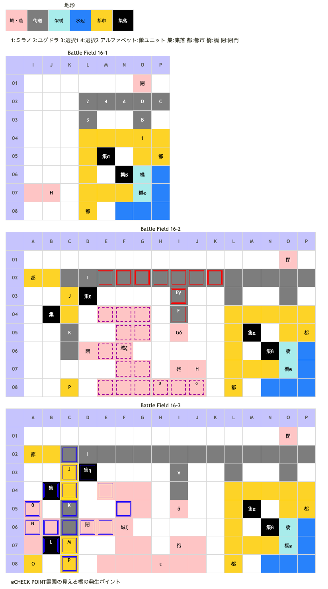

# Battle Field 16 北パルティナ

※この情報はGBA版のコピペなので注意！
- 3部構成
- 昼間固定。
- 敵の先制な為、BF15-2クリア時に使用していたカードを開始直後にも使用。 先制されるので特にデュランは注意。シールドバリア等を最後に選択するといいかも。
- キリエは操作可能だが経験値取得不可能。

## 勝利条件 

16-1
- エミリオの撃破

16-2
- 敵の全滅

16-2、キリエ登場後
- ユーディの撃破

16-3
- レオンの撃破

## 敗北条件 

16-1
- ユグドラorミラノの戦死
- カードを使い切る

16-2、16-3
- ユグドラorミラノorキリエの戦死
- カードを使い切る

### マップ 

## 取得可能アイテム 

|名前|時期|-|位置|備考|
|---|---|---|---|---|
|ゴールデンスピア(3)|16-1〜|交|α|[Battle Field 12](BattleField12.md)で手に入る金塊が必要|
|オーガブレード(1)|16-1〜|交|β|[Battle Field 13](BattleField13.md)で手に入るオーガニウムが必要|
|少し温かい不発弾|16-2〜|拾|γ|[Battle Field 41](BattleField41.md)でマドック研究所での交換に必要|
|スウィートベリー|16-2〜|拾|δ||
|キズ入り不発弾|16-2〜|拾|ε|[Battle Field 41](BattleField41.md)でマドック研究所での交換に必要|
|プリンセスドレス(3)|16-2〜|拾|ζ||
|ナナのキャンディー|16-2〜|交|η|[Battle Field 15](BattleField15.md)で手に入るネスレの花束が必要　デュランなら16-2 から回収可能 ネスレの花束と交換の為、幸運のタリスマンを取得したい場合は訪れない必要がある|
|宝の地図|16-3|拾|θ|[Battle Field 19](BattleField19.md)で魅惑のビスチェ入手に必要|
|クマのぬいぐるみ(2)|16-1|落|D(エミリオ)|LUK3.0 [Battle Field 11A](BattleField11A.md)又は[Battle Field 11B](BattleField11B.md)で 入手していると装備していない|
|淑女のコート(2)|16-2|落|H(ユーディ)|LUK4.0|
|闇のカタストロフ(1)|16-3|落|P(レオン)|LUK2.0|
|メダリオン(1)|16-2〜|落|I,J,K(重騎兵)|必ず落とす|

## 敵ユニット 

### 16-1

- エミリオ隊 ： グラヴィティカオス （power 1700　move 09）

|NO.|名前|ユニット|Lv|士気|GEN|ATK|TEC|LUK|POW|アイテム|備考|
|---|---|---|---|---|---|---|---|---|---|---|---|
|A|飛天騎兵|グリフライダー|6|2100|2.3|2.3|2.4|3.0|40|装備なし||
|B|飛天騎兵|グリフライダー|6|2100|2.3|2.3|2.4|3.0|40|装備なし||
|C|飛天騎兵|グリフライダー|6|2100|2.3|2.3|2.4|3.0|40|装備なし||
|D|エミリオ|グリフライダー|8|4760|2.3 (2.1)|2.7|3.5|3.5|120|クマのぬいぐるみ(2)|BF-11でスティール済みの場合は アイテムを所持していない|

- 備考
  - 編成時に後に選択したユニットが敵部隊と隣接する位置になる。ユニオンを考慮して選ぶこと。
  - グラヴィティカオスは呪いの付加効果有り。暗黒無効でも呪いは防げないが、GENがTECを上回っていればダメージ、呪いともに回避可能。シールドバリアでもよし。
  - アイテムを持っていないグリフライダーを、戦闘中にフレイムを一度でも使って撃破するとグリフグリル入手可能。…焼き鳥か。全BF通じて一個のみ。
  - 16-2移行時にステータス異常回復するので、勝敗以外はあまり気にしなくて良い。

### 16-2

- ユーディ隊 ： フレイム （power 1300　move 07）

|NO.|名前|ユニット|Lv|士気|GEN|ATK|TEC|LUK|POW|アイテム|備考|
|---|---|---|---|---|---|---|---|---|---|---|---|
|E|宮廷魔術師|ウィッチ|6|2000|2.0|2.0|3.4|3.0|40|装備なし||
|F|宮廷魔術師|ウィッチ|6|2000|2.0|2.0|3.4|3.0|40|装備なし||
|G|宮廷魔術師|ウィッチ|6|2000|2.0|2.0|3.4|3.0|40|装備なし||
|H|ユーディ|ウィッチ|8|4940|3.0 (2.4)|1.0 (2.1)|3.3 (3.5)|4.0 (3.5)|120|淑女のコート(2)|クリティカル率0%(装備)|

- レオン隊 ： チャリオット （power 1350　move 09）

|NO.|名前|ユニット|Lv|士気|GEN|ATK|TEC|LUK|POW|アイテム|備考|
|---|---|---|---|---|---|---|---|---|---|---|---|
|I|重騎兵|ナイト|7|3390|2.6|2.4|2.4|1.8|60|メダリオン(1)|Protect! －士気回復専用(装備)|
|J|重騎兵|ナイト|7|2260|2.6|2.4|2.4|1.8|40|メダリオン(1)|Protect! －士気回復専用(装備)|
|K|重騎兵|ナイト|7|2260|2.6|2.4|2.4|1.8|40|メダリオン(1)|Protect! －士気回復専用(装備)|
|P|レオン|ナイト|9|5480|4.0|4.0|4.0|2.7|120|闇のカタストロフ(1)|Protect! 暗黒攻撃力アップ(装備)|

- 備考
  - キリエが増援に来てもユーディを倒すまでカードが復活しないので注意。
  - ユーディ撤退までメダリオン所持の重槍兵は無敵。デュランで飛び越えてKの敵の隣(C06)に配置しておくとターン数の節約にはなる。
  - ユーディからアイテムを盗むためミラノは対岸でキリエとユニオンを組むのがいい。淑女のコートは次の登場では装備していないのでここのみ？
  - 淑女のコートを盗むと、GENは下がるがATKが上がってむしろ強くなってしまうので、盗むなら止めを刺すときに。

### 16-3

- レオン隊 ： チャリオット （Pow 1350 Mov 9）

|NO.|名前|ユニット|Lv|士気|GEN|ATK|TEC|LUK|POW|アイテム|備考|
|---|---|---|---|---|---|---|---|---|---|---|---|
|I|重騎兵|ナイト|7|3390|2.6|2.4|2.4|1.8|60|メダリオン(1)|－士気回復専用(装備)|
|J|重騎兵|ナイト|7|2260|2.6|2.4|2.4|1.8|40|メダリオン(1)|－士気回復専用(装備)|
|K|重騎兵|ナイト|7|2260|2.6|2.4|2.4|1.8|40|メダリオン(1)|－士気回復専用(装備)|
|L|帝国兵|ネクロマンサー|6|1990|2.0|2.3|3.0|3.0|40|装備なし||
|M|帝国兵|ネクロマンサー|6|1990|2.0|2.3|3.0|3.0|40|装備なし||
|N|帝国兵|ヴァルキリー|6|1950|2.0|2.3|3.0|2.4|40|装備なし||
|O|帝国兵|ヴァルキリー|6|1950|2.0|2.3|3.0|2.4|40|装備なし||
|P|レオン|ナイト|9|5480|4.0 (3.0)|4.0 (3.1)|4.0 (3.2)|2.7 (2.5)|120|闇のカタストロフ(1)|暗黒攻撃力アップ(装備)|
()内は装備無しの値

- 備考
  - 宝の地図を回収するには、BF15同様にデュラン先行で回収するか、レオン部隊を引き付ける必要がある。
  - 後者の場合、MAP左上の行き止まり側で囮役を配置しておくと、進路を空けることができる。

### 戦術の参考例 

- 全般
  - このマップはターンに若干余裕があり、下記の実践は23ターンで倒している。(MVP+2は28ターン以内)
  - ATK☆☆☆☆レオンが街道(+10%)に陣取ると、倒しづらくなる。初期位置の都市(+30%)にいてもらうほうが、結果的に戦闘が楽になる。

- 選択
  - キャラ:炎上は受けるが火炎無効のロザリィ、相性が強く都市に強いミステールが推奨。デュランがいなくても、宝の地図回収とMVP+2は両立できる。
  - カード:レオンに勝つにはサンクチュアリとシールドバリアは必須。淑女のコートを入手するにはスティール必須。ロザリィの炎上回復と士気回復にリフレッシュ推奨。（育っていなくてもよい）他に推奨は、オブリヴィアスドーン、マインドチェンジ、メイクドールなど。

- 16-1
  - Turn1:15-2でカードパワー3000以上のシールドバリアを使っていれば、エミリオ以外倒しやすい。
  - Turn2:スティールでアイテムを回収しつつ、Luk☆☆☆以上のキャラでエミリオと倒す。

- 16-2
  - Turn3,4:マインドチェンジでロザリィVSウィッチ3体、ロザリィが炎上＋砲撃
  - Turn6:このターンからロザリィ炎上ダメージ。メイクドールあたりでロザリィが残ったウィッチを葬る。ミラノは余ったMoveでTurn12までにL08につくよう目指す。
  - Turn9:シールドバリアあたりをつかって、ロザリィで砲撃範囲外で待っている重騎兵の士気を削る。
  - Turn12:リフレッシュをつかって、ロザリィの炎上と士気を回復しながら、重騎兵の士気を削る。相手のチャリオットを、倒す前に発動させると2連勝しやすい。

- 16-3
  - Turn15:中断セーブして、スティール＋キリエ＆ミラノのユニオン（スティール未使用）を組ませ、Turn16のミラノで倒せるか見る。条件を満たしていれば、ミステールとユグドラをE03,E04に進ませてからキリエとミラノでユーディと戦う。
  - Turn16:ミラノにスティールを使わせてユーディを倒す。

- 16-4
  - Turn17:ロザリィ達でTurn9から戦っていた重騎兵2体を倒す。ミステールをC04に配置する。
  - Turn18:宝の地図が欲しい場合は重要なターン。相手のユニオンが、宝の地図の進路上のキャラを全員含むように組ませる。
  - Turn19:ミステール正面の、街道重騎兵さえ倒せれば、後は倒しやすいので、カードパワーとMoveの高いカードで、宝の地図までの進路上の敵を葬り去る。後、ロザリィに宝の地図を回収させて、Moveが余っていれば残った雑魚(C07のネクロマンサーになると思われる）にロザリィを隣接させて、レオンがユニオンを組んで襲ってこないようにする。（下手なカードだとレオンに勝てないため）
  - Turn21:サンクチュアリを選び、Turn19から隣接していた雑魚を倒す。さらに、その場所にミステールを配すると、ミステールが得意とする都市で戦えるため、有利に戦える。
  - Turn23:シールドバリアを使う。ユグドラを得意地形であるB06の城砦に配して、ロザリィのリンク範囲に入れて3VS1でレオンと戦う。このターンに倒せなくても、次のターンに倒せるが、ミステールのLukが☆2つになっていない状態でとどめがミステールだと、闇のカタストロフが手に入らない。

## 戦闘中イベント 

16-1
- 中央北側の集落で「金塊」→「ゴールデンスピア」
- 中央南側の小屋で「オーガニウム」→「オーガブレイド」
- 南側の架橋※にユグドラ以外を配置でCHECK POINT霊園の見える橋 ダイヤモンドダストで凍結させた氷上をユグドラ・ミラノ・ロズウェルで歩き回ってみたが何もなし。要アイテム？のちのちへのフラグ？ちなみにNoon固定の場合氷はずっと溶けない模様。 →BF-17の会話フラグ。BF34でのルシエナとの会話イベントの内容が追加される可能性。
- ミラノとエミリオ隣接・戦闘前後にそれぞれ会話。戦闘結果により戦闘後会話変化
- ユグドラとエミリオ隣接・戦闘前後にそれぞれ会話。戦闘結果により戦闘後会話変化
- デュランとエミリオ隣接・戦闘前後にそれぞれ会話。戦闘結果により戦闘後会話変化
- ニーチェとエミリオ隣接・戦闘前後にそれぞれ会話。戦闘結果により戦闘後会話変化
- ロザリィとエミリオ隣接・戦闘前後にそれぞれ会話。戦闘結果により戦闘後会話変化

16-2
- 敵1ターン目からキリエ登場まで毎ターン砲撃ダメージ（現在士気の15%）
- 合計でのべ8人以上が砲撃を受けると、キリエが登場し、砲撃が止まる。 キリエの右の都市にユニットを置くとユニオンが組める。 ↑1人×砲撃3回でも12ターン目にキリエが登場したが、戦闘回数も関係有り？ ↑D-02にいるナイトの士気を1まで減らすとキリエが登場した。色々フラグがあるのかもしれない。
- 上の魔術師の足下に「少し温かい不発弾」
- 下の魔術師の足下に「スウィートベリー」
- キリエ初期位置から2マス西に「キズ入り不発弾」
- キリエとユーディ隣接・戦闘前後にそれぞれ会話。戦闘結果により戦闘後会話変化

16-3
- 自軍2ターン目以降、敵へ向けて毎ターン砲撃ダメージ（現在士気の15%）
- 中央の城砦に「プリンセスドレス」
- 街道横の集落で「ネスレの花束」→「ナナのキャンディー」
- MAP西端、下から四マス目に「宝の地図」
- ミラノとレオン隣接・戦闘前後にそれぞれ会話。戦闘結果により戦闘後会話変化
- ユグドラとレオン隣接・戦闘前後にそれぞれ会話。戦闘結果により戦闘後会話変化
- デュランとレオン隣接・戦闘前後にそれぞれ会話。戦闘結果により戦闘後会話変化
- ニーチェとレオン隣接・戦闘前後にそれぞれ会話。戦闘結果により戦闘後会話変化
- ロザリィとレオン隣接・戦闘前後にそれぞれ会話。戦闘結果により戦闘後会話変化
- レオンを撃破すると帝国兵グループ消滅。

## 勝利後イベント 

- グラヴィティカオス入手。(power:2150,move:9,Ace:斧)

## MVPターン制限 

- ＋２：２８ターン以下
- ＋１：２９ターン〜
- 無し：リトライ

## 関連 

- [Chapter 3](Chapter3.md)

### 次 

- [Battle Field 17](BattleField17.md)

### 前 

- [Battle Field 15](BattleField15.md)
