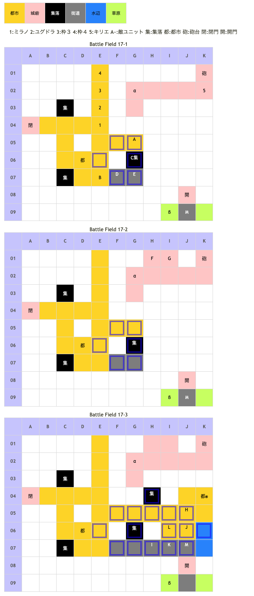

#  Battle Field 17 南パルティナ

- カード8枚。
- 3部構成。移行ごとにカード復活。
- キリエは操作可能、経験値取得不可能。
- 毎ターン自軍開始時に支援砲撃。現在士気の20%ダメージ。
- 17-1から夕方固定。17-3で一定ターン後、夜に移行。
- 17-1、バルドゥス撃破後17-2へ移行、そのまま敵進撃。
- 17-2、ジルヴァ撃破後17-3へ移行、そのまま敵進撃。

## 勝利条件 

17-1
- バルドゥスの撃破

17-2
- ジルヴァの撃破

17-3
- ガルカーサの撃破

## 敗北条件 

- ユグドラorミラノorキリエの戦死
- カードを使い切る

### マップ 

## 取得可能アイテム 

|名前|時期|-|位置|備考|
|---|---|---|---|---|
|キャッツアイ|17-1〜|拾|α(G02)||
|豪槍一本鬼(3)|17-1|落|E(バルドゥス)|GEN4.0 LUK1.0 [Battle Field 13](BattleField13.md)で取得していない場合のみ|
|虹色アーク(2)|17-2|落|F(エレナ)|GEN2.0 LUK5.0|
|ナイトメア(3)|17-2|落|G(ジルヴァ)|GEN1.0 LUK3.0|
|勇者バッジ(1)|17-3|拾|β(I09)||
|葬送剣ゾルフィ(2)|17-3|落|L(アイギナ)|GEN2.0 LUK2.0 [Battle Field 13](BattleField13.md)で取得していない場合のみ|
|アーリードライヴ(2)|17-3|落|M(ガルカーサ)|GEN3.0 LUK3.0|

## 敵ユニット 

### 17-1

- 帝国軍 ： エースガード （power 1450　move 04）

|NO.|名前|ユニット|Lv|士気|GEN|ATK|TEC|LUK|POW|アイテム|備考|
|---|---|---|---|---|---|---|---|---|---|---|---|
|A|帝国兵|グリフライダー|6|2100|2.3|2.3|2.4|3.0|40|装備なし||
|B|帝国兵|グリフライダー|6|2100|2.3|2.3|2.4|3.0|40|装備なし||
|C|帝国兵|ハンター|6|2110|2.3|2.0|3.4|2.4|40|装備なし||
|D|帝国兵|ハンター|6|2110|2.3|2.0|3.4|2.4|40|装備なし||
|E|バルドゥス|ガーディアンナイト|10|5860|4.0|4.0|3.0|1.9|120|豪槍一本鬼(3)|×スキル使用不可(装備) (BF13で取得した場合無し)|

- 帝国軍 ： ジェノサイド （power 1750　move 10）

|NO.|名前|ユニット|Lv|士気|GEN|ATK|TEC|LUK|POW|アイテム|備考|
|---|---|---|---|---|---|---|---|---|---|---|---|
|M|ガルカーサ|ドラゴンナイト|11|6320|3.3|4.0|4.0|3.2|120|アーリードライヴ(2)|○瞬間チャージ(装備)|

- 備考
  - ガルカーサはエリア外で鎮座しているだけだが、ターン数は加算される。
  - グリフライダーをグラヴィティカオスで呪いにすると士気ダメージの計算に地形効果が付くので注意。呪いの間は移動タイプが鈍足になるためと思われる。
  - 状況が限られるが、Turn1にロザリィE06、ミステールE05、ミラノE04、ユグドラF05に配置し、ロザリィに戦闘を仕掛けてバルドゥス以外を倒せると、高速＆有利に17-1が進む。
  - バルドゥスを倒すとそのままジルヴァ隊の進撃がある為、シールドバリア+ユニオンで袋叩き推奨。

### 17-2

- 帝国軍 ： ブラッディクロー （power 2550　move 09）

|NO.|名前|ユニット|Lv|士気|GEN|ATK|TEC|LUK|POW|アイテム|備考|
|---|---|---|---|---|---|---|---|---|---|---|---|
|F|エレナ|アサシン|6|4060|2.0|2.5|3.0|5.0|120|虹色アーク(2)|○相手の地形効果0%(装備)|
|G|ジルヴァ|アサシン|8|4720|1.0|2.4|4.0|3.0|120|ナイトメア(3)|○暗黒攻撃力アップ(装備)|

- 帝国軍 ： ジェノサイド （power 1750　move 10）

|NO.|名前|ユニット|Lv|士気|GEN|ATK|TEC|LUK|POW|アイテム|備考|
|---|---|---|---|---|---|---|---|---|---|---|---|
|M|ガルカーサ|ドラゴンナイト|11|6320|3.3|4.0|4.0|3.2|120|アーリードライヴ(2)|○瞬間チャージ(装備)|

- 備考
  - 17-1を終えるときにG03にキリエを配置していると最初のターンはジルヴァ隊が仕掛けてこない模様･･･と思われたがランダムらしい。
  - 17-2に限らず、エレナは王国軍に攻撃を仕掛けてこない。上の『ランダムと思われる』現象は、エレナの出現位置に近いG03にキリエを配置した場合、高確率でエレナが隣接するからであろう。（ごく稀にジルヴァが出しゃばるので注意）
  - キリエは移動タイプが飛行なので、ジルヴァ達を超えて西側へ行けばユニオンが組める。
  - ジルヴァを撃破するとそのままガルカーサ隊の進撃がある為、やはり倒す時にシールドバリアやエースガードを推奨。
  - 最初の自ターンに、スティールを使って5VS2で攻め込むと虹色アークを盗みつつ、最速で17-2をクリアできる。ただし、17-3の最初のターンに自軍にかなりの被害が出る。ゆえに、4VS2で戦った後陣形を整え、相手ターンに倒すほうが最速ターンと負けなしを両立する場合は有効。
  - エレナはLUKが高いので、キリエで一番端から十字にユニオンを組んでミラノに盗ませる。エレナは弱いので反撃時に盗むようにしないと死んでしまうことも。

### 17-3

- 帝国軍 ： ジェノサイド （power 1750　move 10）

|NO.|名前|ユニット|Lv|士気|GEN|ATK|TEC|LUK|POW|アイテム|備考|
|---|---|---|---|---|---|---|---|---|---|---|---|
|H|帝国兵|ナイト|7|2260|2.6|2.4|2.4|1.8|40|装備なし||
|I|帝国兵|ナイト|7|2260|2.6|2.4|2.4|1.8|40|装備なし||
|J|帝国兵|ウィッチ|6|2000|2.0|2.0|3.4|3.0|40|装備なし||
|K|帝国兵|ウィッチ|6|2000|2.0|2.0|3.4|3.0|40|装備なし||
|L|アイギナ|ヴァルキリー|10|5680|2.2|3.5|5.0|2.0|120|葬送剣ゾルフィ(2)|○一騎討ちで必勝(装備) (BF13で取得した場合は無し)|
|M|ガルカーサ|ドラゴンナイト|11|6320|3.3|4.0|4.0|3.2|120|アーリードライヴ(2)|○瞬間チャージ(装備)|

- 備考
  - 17-2を終える際、敵に1番近いユニットがE05あたりに配置してると、17-3の最初のターンに雑魚だけが襲ってくることがあり、少し展開が楽になる。ミラノだと槍に強く勝ちやすい。
  - アイギナがTec☆5なので突撃、反撃がかなり痛い。さらに一騎討ち必勝で超厄介。マインドチェンジやエースガードを使おう。グラヴィティカオスは弱点+呪い効果でマジオススメ。
  - ジェノサイドはガルカーサ専用だが、発動するとスキルやアグレッシブが使えない上に、こちらが負けるとGENOCIDE-KILLボーナスで100％近い士気ダメージを受ける。
  - ガルカーサを倒すにはシールドバリアやエースガードが無難。こいつも先にグラヴィティカオスで呪いにしておくとある程度の弱体化が期待できる。
  - デュランに闇のカタストロフを装備させてグラヴィティカオスを使うと、かなり有利に戦える。
  - ロザリィが居るならロザリィを、居ない場合は街道デュラン、プリンセスドレス装備のユグドラ、水辺に置いたニーチェ等なら何とかなる。
  - ロザリィは、メイクドールでも勝てる可能性がある。メイクドールで早めにガルカーサを残り1体にしておくと、ジェノサイドを発動されてもガルカーサが自軍の耐久力を削って自滅してくれるパターンに持っていきやすい。火炎無効のため、フレイムはダメージを与えられない。
  - レイジレート調整の囮としてキリエを組み込む手もあるが、戦死が敗北条件なので注意。
  - デュランのTecが育っている場合はマインドチェンジも有効。ただしLサイズなのでデュランTEC+1-ガルカーサGEN≧2にならないと効果がない。
  - ユグドラの士気はBF29で最大値まで回復しているので、消耗度合いは考えなくともよい。

## 戦闘中イベント 

17-1
- キリエのいるエリアの一番西、上のマスに「キャッツアイ」
- ミラノとバルドゥス隣接・戦闘前後にそれぞれ会話。戦闘結果により戦闘後会話変化
- ユグドラとバルドゥス隣接・戦闘前後にそれぞれ会話。戦闘結果により戦闘後会話変化
- デュランとバルドゥス隣接・戦闘前後にそれぞれ会話。戦闘結果により戦闘後会話変化
- ニーチェとバルドゥス隣接・戦闘前後にそれぞれ会話。戦闘結果により戦闘後会話変化
- ロザリィとバルドゥス隣接・戦闘前後にそれぞれ会話。戦闘結果により戦闘後会話変化
- バルドゥスを撃破すると帝国兵グループ消滅。

17-2
- キリエとジルヴァ隣接・戦闘前後にそれぞれ会話。戦闘結果により戦闘後会話変化
- キリエとエレナ隣接・戦闘前後にそれぞれ会話。戦闘結果により戦闘後会話変化
- ジルヴァを撃破するとエレナ撤退。

17-3
- マップ北東の集落で「ナナのキャンディー」→Lost
- マップ南の門の南西（左下）のマスに「勇者のバッチ」
- BF-16で条件を満たしていると、マップ北東の都市※で霊園の見える橋(BF-16)についての話を聞く事が出来る。のちのちへのフラグ(BF44でのストーリー的なフラグ)
- ミラノとガルカーサ隣接・戦闘前後にそれぞれ会話。戦闘結果により戦闘後会話変化
- ユグドラとガルカーサ隣接・戦闘前後にそれぞれ会話。戦闘結果により戦闘後会話変化
- デュランとガルカーサ隣接・戦闘前後にそれぞれ会話。戦闘結果により戦闘後会話変化
- ニーチェとガルカーサ隣接・戦闘前後にそれぞれ会話。戦闘結果により戦闘後会話変化
- ロザリィとガルカーサ隣接・戦闘前後にそれぞれ会話。戦闘結果により戦闘後会話変化
- ガルカーサを撃破すると帝国兵消滅、アイギナ撤退。

## 勝利後イベント 

- 特に無し

## MVPターン制限 

- ＋２：１７ターン以下
- ＋１：１８ターン〜
- 無し：リトライ

## 関連 

- [Chapter 3](Chapter3.md)

### 次 

- [Battle Field 18](BattleField18.md)

### 前 

- [Battle Field 16](BattleField16.md)
