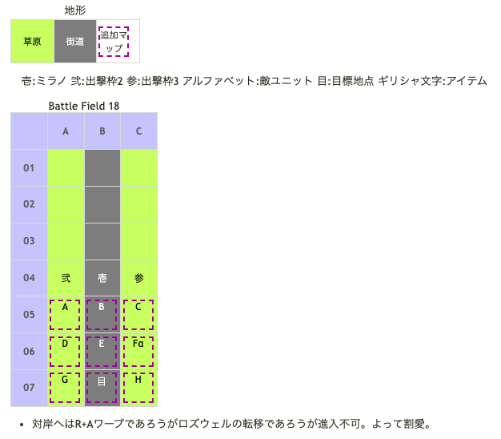

# Battle Field 18 マキナ・ブリッジ

- 3部構成。カード復活なし。
- 夜間固定。
- このマップからChapter 4終了までユグドラ離脱。
- デュラン出撃不可能。
- ユグドラ操作不可能。
- 8ターン目終了後、18-2へ。
- 18-2開始後ミラノ登場。
- ミラノ隊を動かせるようになったら、上部へ避難すること。 初期配置のまま放って置くとネシア登場直後に5連戦するハメになる。
- 18-2、ユグドラ敗北後ネシア隊登場、進撃。18-3へ。

## 勝利条件 

18-1
- ガルカーサの撃破

18-2
- ユグドラの援護（川を渡れないので、ある意味ユグドラの戦死が勝利条件）

18-3
- 全ユニットの特定地点到達

## 敗北条件 

18-1、18-2
- ユグドラの戦死

18-3
- 味方の戦死
- カードを使い切る

### マップ 

## 取得可能アイテム 

|名前|時期|-|位置|備考|
|---|---|---|---|---|
|エーテリオン(1)||盗|E(ネシア)|GEN4.0 Protect!のためスティール必須|
|映見の手鏡||拾|α|キャライラスト閲覧OK|

## 敵ユニット 

### 18-3

- ネシア隊 ： リィンカーネーション （power 2100　move 02）

|No.|名前|ユニット|Lv|士気|GEN|ATK|TEC|LUK|POW|アイテム|備考|
|---|---|---|---|---|---|---|---|---|---|---|---|
|A|帝国兵|ナイト|9|2580|3.0|2.5|2.5|1.8|40|装備なし|Protect!|
|B|帝国兵|ナイト|9|2580|3.0|2.5|2.5|1.8|40|装備なし|Protect!|
|C|帝国兵|ナイト|9|2580|3.0|2.5|2.5|1.8|40|装備なし|Protect!|
|D|帝国兵|ウィッチ|9|2390|2.1|2.1|3.5|3.2|40|装備なし|Protect!|
|E|ネシア|エインシャント|12|6640|4.0|4.0|5.0|3.0|120|エーテリオン(1)|Protect! ゲージ・レート高速蓄積(装備)|
|F|帝国兵|ウィッチ|9|2390|2.1|2.1|3.5|3.2|40|装備なし|Protect!|
|G|帝国兵|ネクロマンサー|9|2400|2.1|2.5|3.2|3.2|40|装備なし|Protect!|
|H|帝国兵|ネクロマンサー|9|2400|2.1|2.5|3.2|3.2|40|装備なし|Protect!|

- 備考
  - 18-1〜2はイベント戦なので割愛。
  - ネシアのリィンカーネーションは配下メンバーがこちらの弱点ユニットとなって全復活するというもの。 その特性故か、弱点が存在しないミステール相手には使用してこない。育っているならネシアにぶつけるようにユニオンを組むと幾分楽になる。
  - ネシアからエーテリオンを盗みたい場合はミラノ一人で戦闘する必要がある為、5連戦になる。自ターンでミラノ一人に5連戦させて、ターン終了時に三人でユニオン（二人目にミステール）を組む形にすると敵ターン時の戦闘に勝ちやすくなる。
  - ネシアはGen4.0なのでリトライせずにスティールするためにはミラノもTec4.0が必要。強すぎるミラノ以外にMVPを与えることを意識して進んできた場合は要注意。
  - 安全に終わらせたいなら、マップの後ろ側で23ターン目まで引き篭もっていればMVPは取れないが一切の戦闘をせずに済む。
  - 余談だが、ネシアのリィンカーネーションはユグドラユニオン中屈指のフリーズ率を誇る。困った人だ。PSP版は今のところフリーズ報告はないが･･･。
  - ネシアはユニット特性「ステータス異常無効」持ちだが、リィンカーネーション発動後はそれが消え、その時かけた状態異常は戦闘終了後も継続する。登場ターンにグラヴィティカオスを選択してミラノ1人×ネシア含む5人で反撃できるようにしておくと、残りのターンを有利に進めることができる。

## 戦闘中イベント 

- ユグドラは神聖無効にも関わらずヴァルキリーの神聖攻撃で倒れている。アイギナ隊出現後は時限で死ぬような処理でもされている様子。
- ネシア登場後の自軍3ターン目のカード選択後にイベントが発生してネシア隊消滅。
- 離脱ポイントの北東のマスに映見の手鏡（※DETECTには反応しない）。

## 勝利後イベント 

- 特に無し

## MVPターン制限 

- ＋２：２１ターン以下 
- ＋１：２２ターン〜 
- 無し：リトライ or ネシア隊と交戦しなかった

## 関連 

- [Chapter 4](Chapter4.md)
- [Chapter 3](Chapter3.md)

### 次 

- [Battle Field 19](BattleField19.md)

### 前 

- [Battle Field 17](BattleField17.md)
