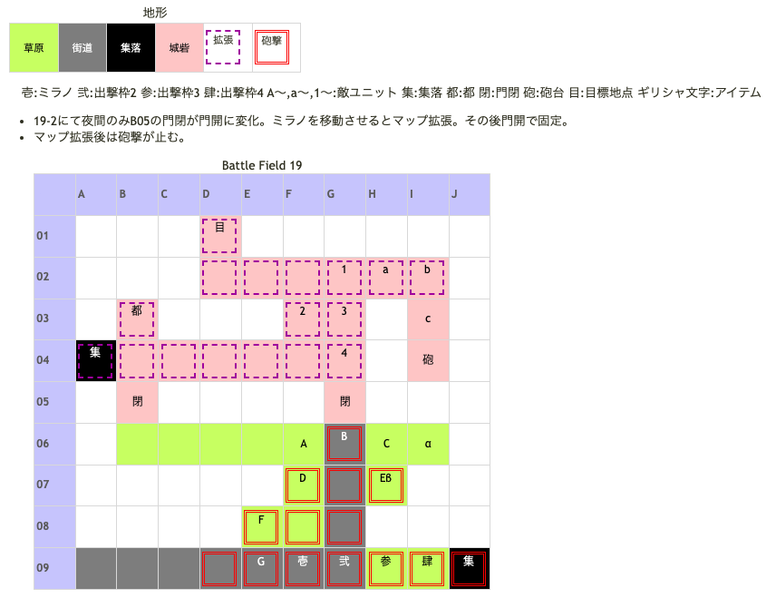

# Battle Field 19 カローナ郊外

- カード9枚
- 2部構成
- 19-1、ユーディ隊ターン開始時に夜間以外砲撃ダメージ（10%）
- 19-1、インザーギ撃破後、イベントで帝国兵の鎧を入手し19-2へ
- 19-1から19-2へ移行するときはカードが復活するが、裏門から場内侵入時はカードが復活しないので注意。
- 後半でカードを無駄にしないよう、4or6ターン目にインザーギを撃破すると○。

## 勝利条件 

19-1
- インザーギの撃破

19-2
- ミラノが特定地点へ到達

## 敗北条件 

19-1
- ミラノの戦死
- カードを使い切る

19-2
- ミラノが敵と隣接
- カードを使い切る

## マップ 

## 取得可能アイテム 

|名前|時期|-|位置|備考|
|---|---|---|---|---|
|アイアンヘルム(2)|19-1|落|B(インザーギ)|LUK3.0|
|魅惑のビスチェ||拾|α(I06)|要（宝の地図を装備したキャラ） ミラノに装備させていると帝国兵の鎧入手時に装備(宝の地図)が外れるので注意|
|焦げ臭い不発弾||拾|β(H07)|[Battle Field 41](BattleField41.md)でマドック研究所での交換に必要|
|帝国兵の鎧|19-2|||イベントで自動入手|
|ノーブルグラス(1)|19-2|落|c(ユーディ)|LUK4.0|
- 備考：ミラノが戦闘出来ない為、スティールを使うことができない。 ノーブルグラスを取るにはLuk4.0以上のキャラorクローバー消費orラッキーブルーム消費が必要。

## 敵ユニット 

### 19-1

- インザーギ隊 ： バンシーズクライ （power 1350　move 08）

|No.|名前|ユニット|Lv|士気|GEN|ATK|TEC|LUK|POW|アイテム|備考|
|---|---|---|---|---|---|---|---|---|---|---|---|
|A|帝国兵|フェンサー|7|2180|2.4|2.6|2.4|1.8|40|装備なし||
|B|インザーギ|フェンサー|9|5160|3.0|2.0|2.1|3.2|120|アイアンヘルム(2)|クリティカル回避(装備)|
|C|帝国兵|フェンサー|7|2180|2.4|2.6|2.4|1.8|40|装備なし||
|D|帝国兵|バンディット|7|2030|2.0|2.6|1.8|3.1|40|装備なし||
|E|帝国兵|バンディット|7|2030|2.0|2.6|1.8|3.1|40|装備なし||
|F|帝国兵|ナイト|8|2410|2.7|2.4|2.4|1.8|40|装備なし||
|G|帝国兵|ナイト|8|2410|2.7|2.4|2.4|1.8|40|装備なし||

- 備考
  - 敵ターン時にうまくユニオンでまとまってくれないので、各個撃破となってしまいがち。
  - MVP+2狙いの場合、遅くとも7ターン目(自軍3ターン目)には撃退する必要がある。全滅させるのが難しければ、インザーギ狙いで。

- ユーディ隊 ： フレイム （power 1800　move 07）

|No.|名前|ユニット|Lv|士気|GEN|ATK|TEC|LUK|POW|アイテム|備考|
|---|---|---|---|---|---|---|---|---|---|---|---|
|c|ユーディ|ウィッチ|9|5240|2.7|2.1|3.5|4.0|120|ノーブルグラス(1)|○パニック回避(装備)|

### 19-2

- 守備部隊 ： シールドバリア （power 1300　move 06）

|No.|名前|ユニット|Lv|士気|GEN|ATK|TEC|LUK|POW|アイテム|備考|
|---|---|---|---|---|---|---|---|---|---|---|---|
|1|衛兵|ハンター|8|2380|2.4|2.1|3.5|2.4|40|装備なし||
|2|衛兵|ヴァルキリー|8|2220|2.1|2.4|3.1|2.4|40|装備なし||
|3|衛兵|ヴァルキリー|8|2220|2.1|2.4|3.1|2.4|40|装備なし||
|4|門番長|ナイト|8|3690|3.0|2.4|2.4|1.8|80|メダリオン(1)|－士気回復専用(装備)|

- 備考
  - MVP+2を狙う場合は、開門時(夜)の自ターン→ユーディ隊(不動)→守備部隊(反撃)→自ターン(昼)の4ターン(実質的には3ターン)で排除する必要がある。
  - 開門時、ロズウェルをF6あたりから転移させて仕掛けると、壁越しユニオンが組み易い。

- ユーディ隊 ： フレイム （power 1800　move 07）

|No.|名前|ユニット|Lv|士気初期値|GEN|ATK|TEC|LUK|POW|アイテム|備考|
|---|---|---|---|---|---|---|---|---|---|---|---|
|a|宮廷魔術師|ウィッチ|7|2110|2.0|2.0|3.4|3.1|40|装備なし||
|b|宮廷魔術師|ウィッチ|7|2110|2.0|2.0|3.4|3.1|40|装備なし||
|c|ユーディ|ウィッチ|9|5240|2.7|2.1|3.5|4.0|120|ノーブルグラス(1)|○パニック回避(装備)|

- 備考
  - 迎撃思考のため、一度でも隣接しない限り動かない。
  - LUK4とはいえ、火炎+フレイムに弱いニーチェでは不利。 ロザリィまたはデュランのLUK上げ推奨。

## 戦闘中イベント 

19-1
- ミラノとインザーギ隣接・戦闘前後にそれぞれ会話。戦闘結果により戦闘後会話変化
- デュランとインザーギ隣接・戦闘前後にそれぞれ会話。戦闘結果により戦闘後会話変化
- ニーチェとインザーギ隣接・戦闘前後にそれぞれ会話。戦闘結果により戦闘後会話変化
- ロザリィとインザーギ隣接・戦闘前後にそれぞれ会話。戦闘結果により戦闘後会話変化
- インサーギを撃破すると帝国兵消滅

19-2
- イベントで帝国兵の鎧入手。装備していたアイテムは消滅するので注意。
- 夜間のみ門が開く。
- 開いた門へミラノを移動させると全員侵入可能になる。
- ミラノは装備効果の為ユニオンが組めない。
- デュランと守備隊長隣接・戦闘前後にそれぞれ会話。戦闘結果により戦闘後会話変化
- ニーチェと守備隊長隣接・戦闘前後にそれぞれ会話。戦闘結果により戦闘後会話変化
- ロザリィと守備隊長隣接・戦闘前後にそれぞれ会話。戦闘結果により戦闘後会話変化
- 守備隊長撃破で衛兵グループ消滅。

## 勝利後イベント 

- 特に無し。

## MVPターン制限 

- ＋２：１５ターン以下
- ＋１：１６ターン以上
- 無し：リトライ

## 関連 

- [Chapter 4](Chapter4.md)

### 次 

- [Battle Field 20](BattleField20.md)

### 前 

- [Battle Field 18](BattleField18.md)
