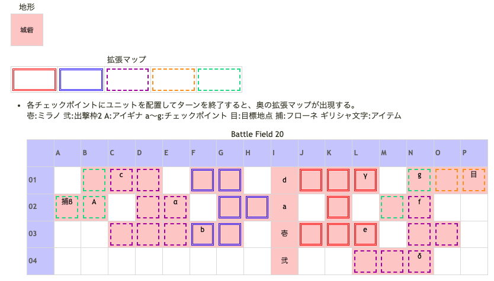

# Battle Field 20 牢塔内部

- カード10枚
- 夕方固定。
- 移動力重視で。

## 勝利条件 

- 囚われのユグドラを探し出せ！（ユグドラを見つけ出せばOK）
※実質的な勝利条件：目標地点に到達

## 敗北条件 

- ミラノの戦死
- カードを使い切る

## マップ 

## 取得可能アイテム 

|名前|時期|-|位置|備考|
|---|---|---|---|---|
|プラチナの髪飾り(3)||落|A(アイギナ)|LUK3.0|
|目隠しの布||拾|α||
|鉄の足枷||拾|β|フローネ救出後,捕らえられていたマスに移動。|
|家族への手紙||拾|γ||
|錆びた鎖||拾|δ||

## 敵ユニット 

- アイギナ ： レヴォリューション （Pow 5700 Mov 10）

|No.|名前|ユニット|Lv|士気|GEN|ATK|TEC|LUK|POW|アイテム|備考|
|---|---|---|---|---|---|---|---|---|---|---|---|
|A|アイギナ|ヴァルキリー|10|5880|3.3|3.1|4.3|3.0|120|プラチナの髪飾り(3)|暗黒属性以外無効(装備)|

- 備考
  - プラチナの髪飾りの装備効果に暗黒属性以外無効とあるが、無効化されるのは属性攻撃のみで通常攻撃は通る。
  - ニーチェとロザリィのAggressive攻撃はダメージを与えられない。→を押さずに対処。
  - 鉄の足枷＆MVP+2を狙うと必然的にカード2枚で倒す必要がある。 POW4500×2枚ぐらいの攻撃力が無いとMVP+2は困難になるので注意。図鑑データのみ集めて妥協するのが無難。
  - デュランLV11(GEN3ATK4TEC2LUK4)、POW2900程度のシールドバリア、2700程度のチャリオット（スキル使用せず）でMVP、足枷回収。ミラノは目的目前で待機。シールドバリアさえあれば、機動力9のチャリオットでお釣りがくる圧勝。チャリオットの代わりに、育っているであろうスティールでも可と思われる。
  - 鉄の足枷を入手せずMVP+2を狙う場合は5ターン（カード3枚）以内。 ミラノであれば初ターンにグラヴィティカオスで圧勝。 ロズウェルの場合は、初ターンでフレイム炎上（ただしダメージ自体は無効）という手も有り。
  - 鉄の足枷で士気回復が可能なのはロザリィのみなので、ロズウェルが加入しているのならばスルー推奨。
  - Hard ModeでMVP+2、足枷を狙う場合はまやかしの笛を使用しないとほぼ無理。

## 戦闘中イベント 

- ミラノ初期位置の1マス北（A）に配置しターン終了で西側にルート出現(便宜的に西側マップ1) 2マス北（D）に配置しターン終了で東側にルート出現(便宜的に東側マップ1)
- 東側マップ1の北東に「家族への手紙」
- 西側マップ1の南西の行き止まり（B）に配置しターン終了で西側マップ2出現
- 西側マップ2の北西の行き止まり（C）に配置しターン終了で西側マップ3出現
- 西側マップ2の北東角に「目隠しの布」
- 西側マップ3出現時、発見したユニットとアイギナの会話
- 西側マップ3出現時、発見したユニットがミラノの場合正体を見破られ帝国兵の鎧の装備解除。（ユニオン参加可能に）
- 東側マップ1の南東の行き止まり（E）に配置しターン終了で東側マップ2出現
- 東側マップ2の北の行き止まり（F）に配置しターン終了で東側マップ3出現
- 東側マップ2の南東の角に「錆びた鎖」
- 東側マップ3の北の行き止まり（G）に配置しターン終了で東側マップ4出現
- 西側マップ3にフローネ（中立ユニット）。 同時に出現するアイギナを倒すとフローネ救出イベント発生。
- アイギナ撃破後、フローネを救出したユニットと会話。
- フローネがいた場所に「鉄の足枷」

## 勝利後イベント 

- フローネを救出していると会話追加

## MVPターン制限 

- ＋２：９ターン以下
- ＋１：１０ターン以上
- 無し：リトライ

## 関連 

- [Chapter 4](Chapter4.md)

### 次 

- [BattleField21](BattleField21.md)

### 前 

- [BattleField19](BattleField19.md)
