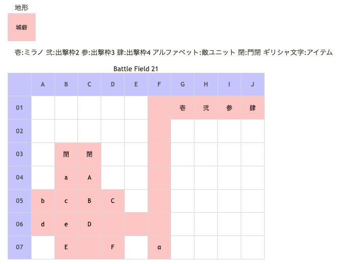

# Battle Field 21 アムトーラム広場

- カード11枚
- BF20でフローネを救出しているとラッセルを仲間に出来る。
- その場合、ラッセルに隣接すると勝利条件を満たせる。

## 勝利条件 

- インザーギ＆ラッセルの撃破

## 敗北条件 

- ミラノの戦死
- カードを使い切る

## マップ 

## 取得可能アイテム 

|名前|時期|-|位置|備考|
|---|---|---|---|---|
|アイアンヘルム(2) orクリティカライザ(1)||落|A(インザーギ)|Luk3.0 BF-19で手に入れていない場合アイアンヘルムを所持|
|妖刀夜叉(3)||落|a(ラッセル)|Luk2.0 仲間にした場合初期装備。盗んだ場合は外れている。|
|武器庫の鍵||拾|α|[Battle Field 22](BattleField22.md)でエレガントスピアとミラージュコートの入手に必要|
|命のミサンガ(3)|勝利後|||ラッセルを仲間にした時T.N.V.8以下で入手。|

## 敵ユニット 

- インザーギ隊 ： バンシーズクライ （Pow 1350 Mov 8）

|No.|名前|ユニット|Lv|士気|GEN|ATK|TEC|LUK|POW|アイテム|備考|
|---|---|---|---|---|---|---|---|---|---|---|---|
|A|インザーギ|フェンサー|9|5160|2.5|3.0|3.0|3.2|120|アイアンヘルム(2) orクリティカライザ(1)|クリティカル回避(アイアンヘルム装備) クリティカル率50%(クリティカライザ装備) ステータスはクリティカライザ 装備時のもの|
|B|傭兵|フェンサー|7|2180|2.4|2.6|2.4|1.8|40|装備なし||
|C|傭兵|ナイト|8|2410|2.9|2.4|2.4|1.8|40|装備なし||
|D|傭兵|バンディット|7|2030|2.0|2.6|1.8|3.1|40|装備なし||
|E|傭兵|ナイト|8|2410|2.9|2.4|2.4|1.8|40|装備なし||
|F|傭兵|バンディット|7|2030|2.0|2.6|1.8|3.1|40|装備なし||

- ラッセル隊 ： アイテムブレイク （Pow 1450 Mov 8）

|No.|名前|ユニット|Lv|士気|GEN|ATK|TEC|LUK|POW|アイテム|備考|
|---|---|---|---|---|---|---|---|---|---|---|---|
|a|ラッセル|フェンサー|10|5280|3.0|4.0|5.0|2.0|0|妖刀夜叉(3)|まれに猛反撃(装備)|
|b|帝国兵|ネクロマンサー|8|2270|2.1|2.4|3.1|3.1|40|装備なし||
|c|帝国兵|アサシン|8|2070|1.6|2.1|3.5|3.5|40|装備なし||
|d|帝国兵|アサシン|8|2070|1.6|2.1|3.5|3.5|40|装備なし||
|e|帝国兵|ネクロマンサー|8|2270|2.1|2.4|3.1|3.1|40|装備なし||

- 備考
  - [Battle Field 20](BattleField20.md)でフローネを救出してラッセルに隣接すると仲間になる。(その際インサーギが生存しているとイベントが発生し、インザーギが戦死する) ラッセルは仲間になった際に装備・士気が敵時のものが継続されるので削りすぎに注意。 インザーギの南の敵を倒し、スティールを選択しミラノでインザーギに攻撃しかければラッセル仲間にしつつ妖刀夜叉を奪うことも可能。（実質装備はがしにしかならないが。）
  - T.N.V.8以下にするには何度か負ける必要があるが、城砦地形なので士気ダメージは少なめ。 ただしアイテムブレイクのダメージボーナスに注意。なるべく装備は無い方が良い。
  - 連戦ハンデを利用して最後の戦闘で負けるようにすると、敵部隊を減らしつつN.V.を下げられる。
  - ラッセルからスティールしておくと攻撃力が下がるので、負けた時のダメージを軽減できる。 スティールした上で負けておけば、士気ダメージボーナスで削り過ぎるということは無い。

## 戦闘中イベント 

- ミラノとインザーギ隣接・戦闘前後にそれぞれ会話。戦闘結果により戦闘後会話変化
- デュランとインザーギ隣接・戦闘前後にそれぞれ会話。戦闘結果により戦闘後会話変化
- ニーチェとインザーギ隣接・戦闘前後にそれぞれ会話。戦闘結果により戦闘後会話変化
- ロザリィとインザーギ隣接・戦闘前後にそれぞれ会話。戦闘結果により戦闘後会話変化
- インザーギ撃破で傭兵グループ消滅。
- ミラノとラッセル隣接・戦闘前後にそれぞれ会話。戦闘結果により戦闘後会話変化
- デュランとラッセル隣接・戦闘前後にそれぞれ会話。戦闘結果により戦闘後会話変化
- ニーチェとラッセル隣接・戦闘前後にそれぞれ会話。戦闘結果により戦闘後会話変化
- ロザリィとラッセル隣接・戦闘前後にそれぞれ会話。戦闘結果により戦闘後会話変化
- ラッセルとの隣接時の会話はBF20でフローネを救出していると起こらない。
- ラッセル撃破で帝国兵グループ消滅、インザーギ撤退。
- フローネ救出時にラッセルと隣接すると帝国兵グループ消滅、インザーギが生存しているとインザーギ戦死イベント。

## 勝利後イベント 

- フローネを救出していると会話追加、ラッセルの生死で会話内容変化

## MVPターン制限 

- ＋２：１３ターン以下
- ＋１：１４ターン以上
- 無し：リトライ

## 関連 

- [Chapter 4](Chapter4.md)

### 次 

- [Battle Field 22](BattleField22.md)

### 前 

- [Battle Field 20](BattleField20.md)
