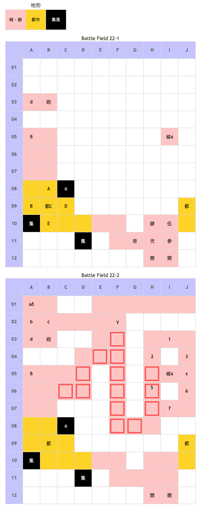

# Battle Field 22 カローナ城

- 2部構成
- 22-2、ユーディ撃破まで、ユーディ隊ターン開始時に夜間以外砲撃ダメージ（10%）

## 勝利条件 

22-1
- 特定地点へ到達

22-2
- ガルカーサの撃破

## 敗北条件 

22-1、22-2
- ミラノの戦死
- カードを使い切る

## マップ 

### 地形

## 取得可能アイテム 

|名前|時期|-|位置|備考|
|---|---|---|---|---|
|プラチナの髪飾り(3) orガントレット(1)|22-1|落|C(アイギナ)|LUK2.0 BF20でプラチナの髪飾り入手済みの場合ガントレット所持|
|ノーブルグラス(1) orソーサリーグラス(1)|22-2|落|d(ユーディ)|LUK4.0 BF19でノーブルグラス入手済みの場合ソーサリーグラス所持|
|深紅のマント(3)|22-2|落|4(ガルカーサ)|LUK3.0|
|虫カゴ||交|α|夜以外。「勇者バッジ」と交換 [Battle Field 24](BattleField24.md)でカゴの中の白い蝶入手に必要|
|エレガントスピア||拾|β|要「武器庫の鍵」|
|ミラージュコート|22-2|拾|γ|要「武器庫の鍵」|
|変形した不発弾|22-2|拾|δ|[Battle Field 41](BattleField41.md)でマドック研究所での交換に必要|
|モーニングドレス|22-2|拾|ε|昼のみ イブニングドレスと二択|
|イブニングドレス|22-2|拾|ε|夕方のみ モーニングドレスと二択|

## 敵ユニット 

### 22-1

- アイギナ隊 ： レヴォリューション （Pow 1500 Mov 10）

|NO.|名前|ユニット|Lv|士気|GEN|ATK|TEC|LUK|POW|アイテム|備考|
|---|---|---|---|---|---|---|---|---|---|---|---|
|A|帝国兵|ハンター|7|2260|2.4|2.0|3.4|2.4|40|装備なし||
|B|帝国兵|ハンター|7|2260|2.4|2.0|3.4|2.4|40|装備なし||
|C|アイギナ|ヴァルキリー|11|6100|3.5|3.1|5.0|2.5|120|プラチナの髪飾り(3) orガントレット(1)|○暗黒属性以外無効(プラチナの髪飾り) ○反撃を完全ガード(ガントレット) ステータスはガントレット装備時|
|D|帝国兵|アサシン|7|1890|1.5|2.0|3.4|3.4|40|装備なし||
|E|帝国兵|アサシン|7|1890|1.5|2.0|3.4|3.4|40|装備なし||

- 備考
  - アサシンから右3マスの部分に移動すると敵が動いて来る。ユニオンを組めないと袋叩きに遭うので気をつけよう。
  - アイギナがレヴォリューションを使って来るのでシールドバリアかサンクチュアリ推奨。
  - 都市(9B)到達時に22-2へと移行するので、アイギナ部隊撃破後に1ターン使って部隊を先に進軍させておく。
  - 1人または2人あたり非戦闘要員をスタート位置に放置しておくと、MOVを節約できる。

### 22-2

- ユーディ隊 ： フレイム （Pow 1800 Mov 7）

|NO.|名前|ユニット|Lv|士気|GEN|ATK|TEC|LUK|POW|アイテム|備考|
|---|---|---|---|---|---|---|---|---|---|---|---|
|a|宮廷魔術師|ウィッチ|8|2280|2.1|2.1|3.5|3.1|40|装備なし||
|b|宮廷魔術師|ウィッチ|8|2280|2.1|2.1|3.5|3.1|40|装備なし||
|c|宮廷魔術師|ウィッチ|8|2280|2.1|2.1|3.5|3.1|40|装備なし||
|d|ユーディ|ウィッチ|9|5240|2.5|1.0|4.0|4.0|120|ノーブルグラス(1) orソーサリーグラス(1)|○パニック回避(ノーブルグラス) ○ゲージ・レート蓄積(ソーサリーグラス) ステータスはソーサリーグラス装備時|

- ガルカーサ隊 ： ジェノサイド （Pow 1050 Mov 10）

|NO.|名前|ユニット|Lv|士気|GEN|ATK|TEC|LUK|POW|アイテム|備考|
|---|---|---|---|---|---|---|---|---|---|---|---|
|1|帝国兵|ナイト|8|2260|2.7|2.4|2.4|1.8|40|装備なし||
|2|帝国兵|ナイト|8|2260|2.7|2.4|2.4|1.8|40|装備なし||
|3|帝国兵|フェンサー|7|2180|2.4|2.6|2.4|1.8|40|装備なし||
|4|ガルカーサ|ドラゴンナイト|5|4230|3.0|2.5|3.4|3.0|120|深紅のマント(3)|○火炎攻撃は無効（装備）一応。|
|5|帝国兵|ナイト|8|2260|2.7|2.4|2.4|1.8|40|装備なし||
|6|帝国兵|フェンサー|7|2180|2.4|2.6|2.4|1.8|40|装備なし||
|7|帝国兵|ナイト|8|2260|2.7|2.4|2.4|1.8|40|装備なし||

- 備考
  - ガルカーサ部隊はナイト中心の構成となっているので、デュラン+マインドチェンジまたはミラノ突撃が有効。
  - スタート位置付近からの転移移動は、J8経由だと袋叩きにあう恐れがあるので、H9経由が無難。
  - MVP+2のターン数にはやや余裕があるので、HARDであれば、瀕死の帝国兵単騎相手にリフレッシュなんぞを。
  - アイテム入手後も武器庫の鍵は消失しないので、BF23以降の士気回復にでも。

## 戦闘中イベント 

22-1
- 初期配置から北東にある集落スラムタウンに行くとランダムにアイテムをロスト。 配置するたびにロスト。
- ミラノとアイギナ隣接・戦闘前後にそれぞれ会話。戦闘結果により戦闘後会話変化
- デュランとアイギナ隣接・戦闘前後にそれぞれ会話。戦闘結果により戦闘後会話変化
- ニーチェとアイギナ隣接・戦闘前後にそれぞれ会話。戦闘結果により戦闘後会話変化
- ロザリィとアイギナ隣接・戦闘前後にそれぞれ会話。戦闘結果により戦闘後会話変化
- アイギナを撃破すると帝国兵グループ消滅。

22-2
- ミラノとガルカーサ隣接・戦闘前後にそれぞれ会話。戦闘結果により戦闘後会話変化
- デュランとガルカーサ隣接・戦闘前後にそれぞれ会話。戦闘結果により戦闘後会話変化
- ニーチェとガルカーサ隣接・戦闘前後にそれぞれ会話。戦闘結果により戦闘後会話変化
- ロザリィとガルカーサ隣接・戦闘前後にそれぞれ会話。戦闘結果により戦闘後会話変化
- ガルカーサを撃破すると帝国兵グループ消滅、ユーディ撤退。

## 勝利後イベント 

- ラッセルが生存していればアイヴィウィップ(power:2300,move:5,Ace:All)

## MVPターン制限 

- ＋２：２９ターン以下
- ＋１：３０ターン〜
- 無し：リトライ

## 関連 

- [Chapter 4](Chapter4.md)

### 次 

- [Battle Field 23](BattleField23.md)

### 前 

- [Battle Field 21](BattleField21.md)
