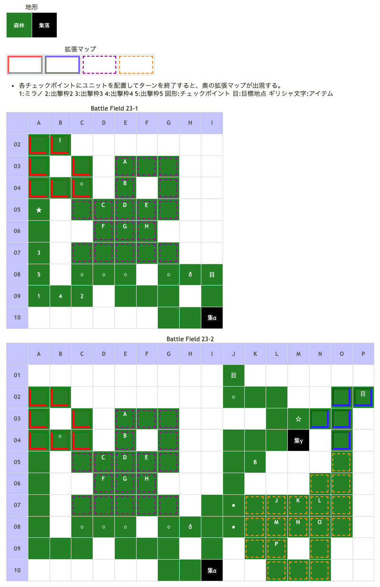

# Battle Field 23 マルドゥーク南西部

- 移動力を重視。
- 幾通りかに分岐、ルートによっては戦闘無し。
- 帝国兵に隣接しないよう中継地点まで移動させると23-2へ。
- 隣接した場合は勝利条件が敵の全滅へと変化。
- 別ルートの場合は1ユニット到達でOK。

## 勝利条件 

23-1
- 特定地点へ到達

23-2
- 全ユニットの特定地点到達

　敵に隣接後
- 敵の全滅

## 敗北条件 

23-1、23-2
- ミラノの戦死
- カードを使い切る

敵に隣接後
- 味方ユニットの戦死
- カードを使い切る

## マップ 

## 取得可能アイテム 

|名前|時期|-|位置|備考|
|---|---|---|---|---|
|夢見の帽子(2)|23-1|落|I(パメラ)|パメラはLUKは5だが、味方のLUKに関係なくアイテムをくれる。|
|エルフィンボウ(3)|23-1|換|α|[Battle Field 03](BattleField03.md)で入手したトラップと交換イベント。T.N.V17以上 ○劣勢で士気回復(クルス専用)|
|メダリオン(1)|23-1|落|F(帝国兵)|[Battle Field 23.5](BattleField23_5.md)へ行く場合は取得できない|
|ビーストファング(1)|23-2|換|γ|先程入手した、エルフィンボウとの交換 ×弓系ユニットに弱い(ミラノ専用)|
|どくまむし(1)|23-2|拾|β|夕方のみ　[Battle Field 31](BattleField31.md)でラカンの秘薬入手に必要|
|メダリオン(1)|23-2|落|J(帝国兵)|[Battle Field 23.5](BattleField23_5.md)へ行く場合は取得できない|
|アラン人形(∞)|23-1〜|拾|δ|最初の目標点の一つ左(T.N.V.5以下)|
- 夢見の帽子を取る為にパメラを出現させると、[Battle Field 24](BattleField24.md)のパメラの装備がパメラのほうきから悪魔のシッポへと変化するので、ほうきの方が欲しい人は要注意。
- スティールは発動するが、全てのアイテムはスイッチで処理されているので2つ所持ということができないので新たに貰っても結局は1つになるのではないか。
  - ロザリィからラッキーブルームを盗んだ後に仲間にしても、戦闘中はラッキーブルームを装備しているが、戦闘が終わると装備から外れている。
  - 同じアイテムを2つ同時に持てないからだと思われる。
- エルフィンボウで夜襲っていうのはどうかな？

## 敵ユニット 

### 23-1

- 帝国兵 ： アイヴィウィップ （Pow 1800 Mov 5）

|NO.|名前|ユニット|Lv|士気|GEN|ATK|TEC|LUK|POW|アイテム|備考|
|---|---|---|---|---|---|---|---|---|---|---|---|
|A|帝国兵|ネクロマンサー|9|2400|2.1|2.5|3.2|3.2|40|装備なし||
|B|帝国兵|アサシン|9|2170|1.6|2.1|3.5|3.5|40|装備なし||
|C|帝国兵|アサシン|9|2170|1.6|2.1|3.5|3.5|40|装備なし||
|D|帝国兵|ネクロマンサー|9|2400|2.1|2.5|3.2|3.2|40|装備なし||
|E|帝国兵|ナイト|9|2580|3.0|2.5|2.5|1.8|40|装備なし||
|F|帝国兵|ナイト|9|2580|3.0|2.5|2.5|1.8|40|装備なし||
|G|帝国兵|アサシン|9|2170|1.6|2.1|3.5|3.5|40|装備なし||
|H|帝国兵|ナイト|9|2580|3.0|2.5|2.5|1.8|40|メダリオン(1)|－士気回復専用(装備)|

- パメラ ： フォーチュン （Pow 6000 Mov 6）

|NO.|名前|ユニット|Lv|士気|GEN|ATK|TEC|LUK|POW|アイテム|備考|
|---|---|---|---|---|---|---|---|---|---|---|---|
|I|パメラ|ウィッチ|11|5000|1.7|2.7|5.0|5.0|120|夢見の帽子(2)|×昼間は昏睡状態(装備)|

- 備考
  - パメラはアイテム効果で昼間睡眠、瞬殺可能。
  - 交戦は自軍2ターン分のみ。
  - BF23.5へ向かうのであればMVP+2ターンも余裕があるので、カードの選択は自由。 パメラへの士気ダメージ調節で、MVPキャラも自由に選ぶことができる。
  - パメラを仲間にしたい場合（2週目以降のみ）、ニーチェをパメラに隣接させる必要がある。

### 23-2

- 帝国兵 ： バニッシュ （Pow 1800 Mov 7）

|NO.|名前|ユニット|Lv|士気|GEN|ATK|TEC|LUK|POW|アイテム|備考|
|---|---|---|---|---|---|---|---|---|---|---|---|
|J|帝国兵|フェンサー|9|2460|2.5|3.0|2.5|1.8|40|装備なし||
|K|帝国兵|ハンター|9|2540|2.5|2.1|3.5|2.5|40|装備なし||
|L|帝国兵|フェンサー|9|2460|2.5|3.0|2.5|1.8|40|メダリオン(1)|－士気回復専用(装備)|
|M|帝国兵|バンディット|9|2310|2.1|3.0|1.8|3.2|40|装備なし||
|N|帝国兵|ハンター|9|2540|2.5|2.1|3.5|2.5|40|装備なし||
|O|帝国兵|バンディット|9|2310|2.1|3.0|1.8|3.2|40|装備なし||
|P|帝国兵|バンディット|9|2310|2.1|3.0|1.8|3.2|40|装備なし||

## 戦闘中イベント 

23-1
- マップ右下の集落「トラップ→エルフィンボウ」 ※条件あり:TNV17以上
- スタート地点上部に行くとパメラ出現（ニーチェが参戦していること）。
- ミラノとパメラ隣接・戦闘前後にそれぞれ会話。戦闘結果により戦闘後会話変化
- デュランとパメラ隣接・戦闘前後にそれぞれ会話。戦闘結果により戦闘後会話変化
- ニーチェとパメラ隣接・戦闘前後にそれぞれ会話。戦闘結果により戦闘後会話変化
- ロザリィとパメラ隣接・戦闘前後にそれぞれ会話。戦闘結果により戦闘後会話変化
- ラッセルとパメラ隣接・戦闘前後にそれぞれ会話。戦闘結果により戦闘後会話変化
- 第一中継地点左2,4,5,6マスに配置すると帝国兵出現。隣接すると勝利条件変更。
- メダリオン所持ユニット撃破で帝国兵グループ消滅。

23-2
- マップ右上の集落「エルフィンボウ→ビーストファング」
- マップ右上の集落の左下（↓、←←）岩場の近く「どくまむし」（夕方限定？）
- 中継地点から右1、右1上1に配置すると帝国兵出現。隣接すると勝利条件変更。
- 目標地点から下1に配置すると帝国兵出現。隣接すると勝利条件変更。
- メダリオン所持ユニット撃破で帝国兵グループ消滅。
- 北東の集落の一つ上に移動すると別ルート発見。
- 帝国兵との戦闘に入った場合別ルートへの進入は不可能。
- 別ルート発見後、集落から右2配置すると帝国兵出現。
- 別ルートの目標地点へ行くとBattle Field 23.5へ。

## 勝利後イベント 

- パメラを撃破していた場合、フォーチュン入手(power:2600,move:6,Ace:All)
- 所持していない＆帝国兵と戦闘した場合、アイヴィウィップ入手(power:2300,move:5,Ace:All)

## MVPターン制限 

- ＋２：１３ターン以下
- ＋１：１４ターン以上
- 無し：リトライor1回も戦闘をしない。

## 関連 

- [Chapter 4](Chapter4.md)

### 次 

- [Battle Field 23.5](BattleField23_5.md)
- [Battle Field 24](BattleField24.md)

### 前 

- [Battle Field 22](BattleField22.md)
