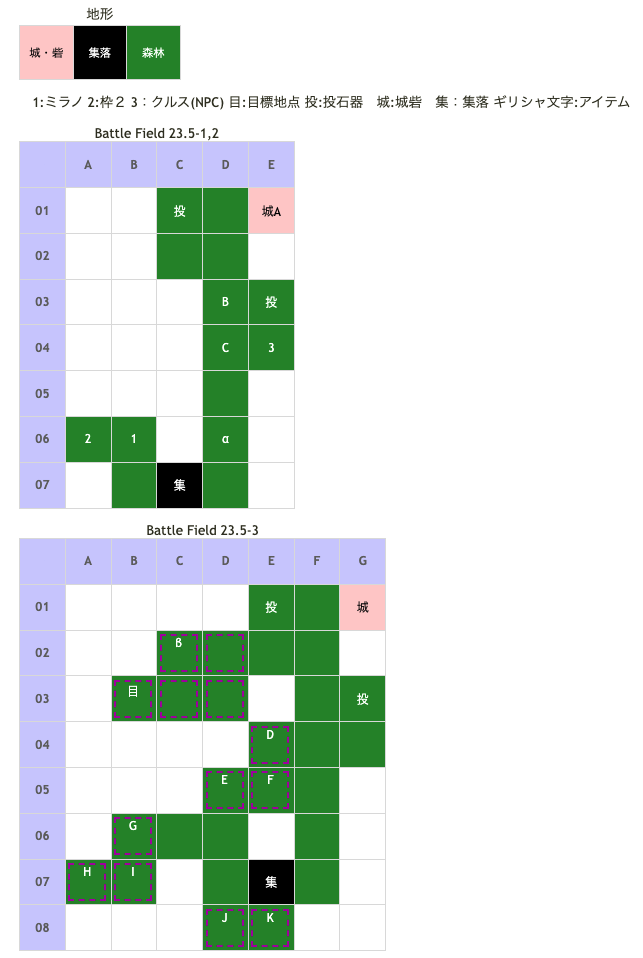

# Battle Field 23.5 レジスタンスのアジト

- 3部構成。
- 昼間固定。
- 全域地形が森林なので、デュランはオススメしない。
- 投石器2
- 敵ターンから開始。
- 23.5-1、クルスは隣接するまで友軍。
- 23.5-1、クルスがいきなり負けてくれるが、士気はほとんど減らないので気にしなくても良い。 高確率でクリティカルをうけるけど、クルスだから気にしない。
- 23.5-2、勝利条件達成後、帝国軍出現。そのまま敵進撃。 森林地形なのでナイトが弱体化しているが、ラッセルが出撃している場合は注意。

## 勝利条件 

23.5-1
- 味方ユニットがクルスへ隣接

23.5-2
- クルスが特定地点へ到達

23.5-3
- 全ユニットが特定地点へ到達

## 敗北条件 

23.5-1、23.5-2
- ミラノorクルスの戦死
- カードを使い切る

23.5-3
- 味方ユニットの戦死
- カードを使い切る

## マップ 

### 地形

## 取得可能アイテム 

|名前|時期|-|位置|備考|
|---|---|---|---|---|
|キラービーの巣|23.5-1|拾|α||
|メダリオン*2|23.5-1|落|B、C(賞金稼ぎ)*2|LUK3.0|
|羽根付きサンダル(2) or丈夫な長靴(1) orレンジャーブーツ(2) orワープシューズ(2) orクリティカライザ(1) orヒヅメシューズ(2)|23.5-2|落|A(ミゼル)|GEN2.0 LUK4.0 BF07〜09、BF12のミゼルの装備アイテム入手状況と BF21のクリティカライザを入手したかどうかでアイテムが変化 全て入手している場合ヒヅメシューズ装備|
|メダリオン|23.5-3|落|D(帝国兵)|Protect! 要スティール|
|チカラダケ|23.5-3|拾|β||

## 敵ユニット 

### 23.5-1、23.5-2

- ミゼル隊 ： サンダーボルト （Pow 2850 Mov 7）

|NO.|名前|ユニット|Lv|士気|GEN|ATK|TEC|LUK|POW|アイテム|備考|
|---|---|---|---|---|---|---|---|---|---|---|---|
|A|ミゼル|ハンター|10|5280|2.2|2.6|4.0|4.0|120|羽根付きサンダル(2) or丈夫な長靴(1) orレンジャーブーツ(2) orワープシューズ(2) orクリティカライザ(1) orヒヅメシューズ(2)|全地形効果を0% 毒沼地形を無効化 全地形効果に+10% 移動タイプが転移に クリティカル率50% 移動タイプが騎馬に ステータスは装備なし状態のもの|
|B|賞金稼ぎ|バンディット|9|2020|2.1|3.0|1.8|3.2|40|メダリオン(1)|－士気回復専用(装備)|
|C|賞金稼ぎ|アサシン|9|1930|1.6|2.1|3.5|3.5|40|メダリオン(1)|－士気回復専用(装備)|

- 備考
  - 最短戦法は、3ターン目(自軍1ターン目)にスティールで賞金稼ぎを排除し、クルスに隣接。その次のターンでミゼル撃破。
  - 女性ユニットを選択しておかないと、ミゼルに対して投石器が使用できない。
  - 23.5-2はクルスのアジト到達が条件となるので、ミゼルのサンダーボルトでマヒしないように注意。

### 23.5-3

- 帝国兵 ： アイヴィウィップ （Pow 2700 Mov 5）

|NO.|名前|ユニット|Lv|士気|GEN|ATK|TEC|LUK|POW|アイテム|備考|
|---|---|---|---|---|---|---|---|---|---|---|---|
|D|帝国兵|ナイト|9|2580|3.0|2.5|2.5|1.8|40|メダリオン(1)|Protect! －士気回復専用(装備)|
|E|帝国兵|ネクロマンサー|9|2400|2.1|2.5|3.2|3.2|40|装備なし||
|F|帝国兵|ナイト|9|2580|3.0|2.5|2.5|1.8|40|装備なし||
|G|帝国兵|アサシン|9|2170|1.6|2.1|3.5|3.5|40|装備なし||
|H|帝国兵|アサシン|9|2170|1.6|2.1|3.5|3.5|40|装備なし||
|I|帝国兵|アサシン|9|2170|1.6|2.1|3.5|3.5|40|装備なし||
|J|帝国兵|ネクロマンサー|9|2400|2.1|2.5|3.2|3.2|40|装備なし||
|K|帝国兵|ナイト|9|2580|3.0|2.5|2.5|1.8|40|装備なし||

- 備考
  - メダリオン所持のナイトはプロテクトなので、欲しい場合はスティール。
    - プロテクトユニットが何度も戦闘を仕掛けてきて鬱陶しい場合はグラビティカオスで呪ってしまうといい。
  - MVP+2狙いの場合、23.5-3の自軍ターンは最大4ターン。 使用可能なカードの最大枚数は、23.5-2終了時のカード1枚+任意4枚。
  - カード構成については、MOV11のカード(非戦闘・最終ターン移動用)とスティールさえあれば、エースガードやリフレッシュを組み込んでも構わない。
  - ミラノをF4に配置し、残り2人をD2付近に配置すると、退路距離・投石器共に確保できる。
  - クルスのアイヴィウィップ無効をうまく活用すること。

## 戦闘中イベント 

23.5-1
- クルスの隣の敵をどかして隣接するとクルス加入。23.5-2へ

23.5-2
- 小屋の北東のマスで「キラービーの巣」を入手
- クルスがアジトに到達or3?ターン後帝国兵出現。23.5-3へ
- ミゼルを反撃で撃破、次の味方ターンで23.5-3に移行した。ミゼルを倒した次の味方ターンが条件?

23.5-3
- 目標地点の北東のマスで「チカラダケ」入手

## MVPターン制限 

- ＋２：１２ターン以下
- ＋１：１３ターン以上
- 無し：リトライ

## 関連 

- [Chapter 4](Chapter4.md)

### 次 

- [Battle Field 24](BattleField24.md)

### 前 

- [Battle Field 23](BattleField23.md)
