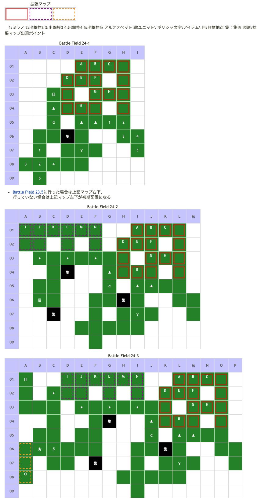

# Battle Field 24 マルドゥーク北東部

- 3部構成
- 移動マップなので移動力重視で。
- 帝国兵に隣接しないように目標地点まで移動。
- 帝国兵に隣接した場合は敵全滅に変更になり、敵進撃から開始。アイギナ隊のカードＰＯＷは高いため、反撃になるカードを選択しておくと良い。
- パメラを仲間にする場合、パメラ自身は倒しても構わないが、帝国軍と交戦すると仲間にならないので注意。

## 勝利条件 

24-1、24-2
- 特定地点へ到達

24-3
- 全ユニットの特定地点到達

帝国兵に隣接
- 敵の全滅

## 敗北条件 

24-1、24-2、24-3
- ミラノの戦死
- カードを使い切る

帝国兵に隣接
- 味方の戦死
- カードを使い切る

## マップ 

## 取得可能アイテム 

|名前|時期|-|位置|備考|
|---|---|---|---|---|
|真っ白な珍しい蝶|出撃前|||しおれた花束を所持している場合のみ。次のBFでは消えている|
|カゴの中の白い蝶||||真っ白な珍しい蝶を所持した状態で、虫カゴを装備したキャラが移動すると入手|
|世界樹の葉(1)|24-1〜|拾|α(世界樹の左)||
|世界樹の枯れ枝(2)|24-1〜|拾|β(世界樹の右上)|[Battle Field 35](BattleField35.md)でエレメントロッド入手に必要|
|エレメント|24-1〜|拾|γ(世界樹の右下)|要ダウジングロッド装備のロズウェル [Battle Field 35](BattleField35.md)でエレメントロッド入手に必要|
|メダリオン|24-1〜|落|C(帝国兵)|帝国兵と戦わない場合は、取得できない|
|血濡れのレイピア(1)|24-2〜|落|L(アイギナ)|LUK3.0 帝国兵と戦わない場合は、取得できない。 [Battle Field 28](BattleField28.md)でも回収可能だが、難易度が跳ね上がるため一長一短|
|プロテイモ(1)|24-3|拾|δ||
|悪魔のシッポ(1) or夢見の帽子(2) orパメラのほうき(2)|24-3|落|O(パメラ)|パメラはLUK☆5だが、味方のLUKに関係なくアイテムをくれる。 アイテム変化条件は以下参照。|
- パメラ出現条件はニーチェを出撃させること
  - [Battle Field 23](BattleField23.md)でパメラを撃破した場合は「悪魔のシッポ」、
  - パメラに遭遇して撃破しなかった場合は「夢見の帽子」、
  - パメラを見ていない場合は「パメラのほうき」を装備している。
  - パメラを仲間にすると「パメラのほうき」を装備している。
- ダウジングロッドは8MAP継続するので、装備するタイミングに注意。

## 敵ユニット 

### 24-1

- 帝国兵 ： アイヴィウィップ （Power 1800　Move 05）

|NO.|名前|ユニット|Lv|士気|GEN|ATK|TEC|LUK|POW|アイテム|備考|
|---|---|---|---|---|---|---|---|---|---|---|---|
|A|帝国兵|ヴァルキリー|9|2350|2.1|2.5|3.2|2.5|40|装備なし||
|B|帝国兵|ネクロマンサー|9|2400|2.1|2.5|3.2|3.2|40|装備なし||
|C|帝国兵|ナイト|9|2580|3.0|2.5|2.5|1.8|40|メダリオン(1)|－士気回復専用(装備)|
|D|帝国兵|ナイト|9|2580|3.0|2.5|2.5|1.8|40|装備なし||
|E|帝国兵|ヴァルキリー|9|2350|2.1|2.5|3.2|2.5|40|装備なし||
|F|帝国兵|ネクロマンサー|9|2400|2.1|2.5|3.2|3.2|40|装備なし||
|G|帝国兵|ヴァルキリー|9|2350|2.1|2.5|3.2|2.5|40|装備なし||
|H|帝国兵|ナイト|9|2580|3.0|2.5|2.5|1.8|40|装備なし||
  - ＧＥＮ3以下ではアイヴィウィップで厳しいダメージを受ける。集落地形やクルスを上手く使いたい
  - 全滅狙いでも、苦手地形にいるメダリオン持ちナイトをあっさり倒してしまう事があるので注意

### 24-2

- アイギナ隊 ： レヴォリューション （Power 3300　Move 10）

|NO.|名前|ユニット|Lv|士気|GEN|ATK|TEC|LUK|POW|アイテム|備考|
|---|---|---|---|---|---|---|---|---|---|---|---|
|I|帝国兵|バンディット|10|2480|2.2|3.1|1.9|3.2|40|装備なし||
|J|帝国兵|ヴァルキリー|10|2510|2.2|2.6|3.2|2.5|40|装備なし||
|K|帝国兵|ハンター|10|2710|26|2.2|4.0|2.5|40|装備なし||
|L|アイギナ|ヴァルキリー|13|6580|3.0|4.0|5.0|3.3|120|血濡れのレイピア(1)|×移動で士気低下(装備)|
|M|帝国兵|ハンター|10|2710|2.6|2.2|4.0|2.5|40|装備なし||
|N|帝国兵|バンディット|10|2480|2.2|3.1|1.9|3.2|40|装備なし||

- 備考
  - 血濡れのレイピアは[Battle Field 28](BattleField28.md)で入手可能。
  - 隣の部隊に比べてLVは若干高め。 特にPOWERが3300と馬鹿高いので、うっかり負けると思わぬ痛手に。
  - 得意地形に陣取っているハンターが手強い。特に帝国軍と交戦する際は敵進撃からとなる為、アイギナ隊の近くで隣接する場合は注意。

### 24-3

- パメラ ： フォーチュン （Power 6000　Move 06）

|NO.|名前|ユニット|Lv|士気|GEN|ATK|TEC|LUK|POW|アイテム|備考|
|---|---|---|---|---|---|---|---|---|---|---|---|
|O|パメラ|ウィッチ|11|5000|15|27|50|50|120|悪魔のシッポ(1) or夢見の帽子(2) orパメラのほうき(2)|×昼間は昏睡状態(悪魔のシッポ or夢見の帽子) ○スキル持続時間二倍(パメラのほうき) ステータスはパメラのほうき装備時|

- 備考
  - 悪魔のシッポ、夢見の帽子なら昼間に襲えば簡単に始末できる。
  - だが、パメラのほうきを狙う場合はユニット相性とバカ高いカードパワー、フォーチュン+LUK☆5が脅威となる。
  - 装備やスキルでの援護、もしくはクルスがいないと厳しい。

## 戦闘中イベント 

24-1
- [Battle Field 23.5](BattleField23_5.md)通過時のミラノ初期配置から左1,2、目標地点下1に配置すると帝国兵出現。
- 隣接すると勝利条件変更、24-2の帝国兵も出現し、敵進撃。
- メダリオン所持のナイト撃破で帝国兵グループ消滅。
- BF23.5で世界樹の話を聞いていると、マップ東の祠での話が変化
- 祠の北西のマス世界樹の根元で世界樹の葉を入手
- 祠から→↑↑ 世界樹の根元で世界樹の枯れ枝を入手

24-2
- 中継地点から左1,2,3,4,5に配置すると帝国兵出現。
- 隣接すると勝利条件変更、24-1の帝国兵も出現し、敵進撃。パメラ加入不可。

24-3
- 森の出口出現後、中継地点左2マスで「プロテイモ」 
- ニーチェが出撃している場合、イモ畑から左1に味方ユニットを配置するとパメラ出現
- パメラと味方ユニット隣接・戦闘前後にそれぞれ会話。戦闘結果により戦闘後会話変化
- 撃破するとパメラの装備アイテム入手（Luk関係無し）
- 出口から下1右3へ配置すると帝国兵出現。

## 勝利後イベント 

- 未入手の場合、アイヴィウィップ入手(power:2300,move:5,Ace:All)
- パメラを撃破し、BF23で未入手の場合フォーチュン入手(power:2600,move:6,Ace:All)

## MVPターン制限 

- ＋２：１３ターン以下
- ＋１：１４ターン以上
- 無し：リトライor1回も戦闘をしない。

## 関連 

- [Chapter 4](Chapter4.md)

### 次 

- [Battle Field 25](BattleField25.md)

### 前 

- [Battle Field 23](BattleField23.md)
- [Battle Field 23.5](BattleField23_5.md)
