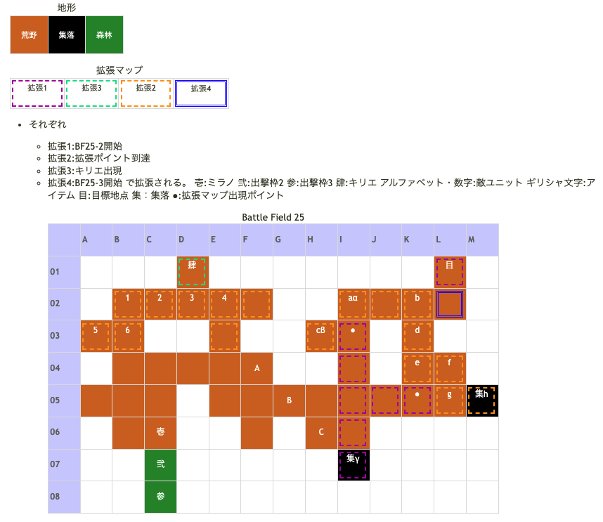

# Battle Field 25 嘆きの谷

- カード8枚
- 3部構成
- 25-2、マップ北東か東の行き止まりに達すると敵増援登場、そのまま敵進軍。

## 勝利条件 

25-1
- 敵の全滅

25-2
- 全ユニットの特定地点到達

25-2、レオン撤退後
- 味方ユニットがエレナに隣接

25-3
- 全ユニットの特定地点到達

- 備考:25-2でエレナに隣接した状態でエレナが裏切った場合、 隣接していないキャラが一歩でも動くと勝利条件を満たしたことになる。

## 敗北条件 

25-1、25-2
- ミラノの戦死
- カードを使い切る

25-2、レオン撤退後
- ミラノorエレナの戦死
- カードを使い切る

25-3
- ミラノの戦死
- カードを使い切る

## マップ 

## 取得可能アイテム 

|名前|時期|-|位置|備考|
|---|---|---|---|---|
|枯れた花束|出撃前|||しおれた花束から変化|
|メダリオン|25-1|落|(守備隊長)||
|グリフグリル(1)|25-2|落|(緋天騎兵)*3|未取得の場合、グリフライダーをフレイムのスキルを使って倒す。 以前に取得している場合は不可|
|ひらひらリボン(2)|25-2|落|(エミリオ)|LUK4.0|
|ナイトキラー(3)|25-2|落|(レオン)|GEN3.0 LUK2.0 Protect!|
|スコーピオテール(2)|25-2|落|(ジルヴァ)|LUK4.0 Protect!|
|ミーティア(3)|25-2|落|(エレナ)|LUK4.0 Protect!|
|ナイトキラー(3)|25-3|拾|α|25-2でレオンから盗んでいない場合のみ|
|ドクロ石|25-3|拾|β|持ったまま[Battle Field 31](BattleField31.md)以降に行くと、一部のイベントが起こらなくなるが、 それ以前に士気に変えるとOK|
|ミスティーコート(3)|25-2|拾|γ|夜以外。パメラのみ|
- 全ての顔キャラから装備を盗るのは無理。
  - レオンのナイトキラーは拾えるし、ここで盗んでなくてもBF27で悲槍シルヴィア持って来る。
  - エレナはここで盗んでもBF27でもミーティアを持っている。
  - ジルヴァは25-3移行でカードが復活するためスティール可能。
  - 以上を踏まえるとエミリオからアイテムを手に入れれば良い。

- レオン以外の顔キャラの装備品は取得可能。（ナイトキラーは25-3で拾える）
  - 25-2移行時にE4にミラノを配置し、K5にエミリオに勝てるキャラ（LUK4）＆スティール（PW3500以上必須）を配置しターン終了。
  - 敵ターン時にミラノでジルヴァ＆エレナからスティールし、K5に配置したキャラ（LUK4）でエミリオを撃破する。
    - ジルヴァのスコーピオテールはドロップでも良いが、エレナのミーティアはここで盗んでおかないと入手はエレナ正式加入時の初期装備という形になるため、盗む意味は十分にある。エレナの初期装備がなくなることでスコーピオテールを最大限に生かすこともできるし、ドーピングアイテムをいち早く使うこともできる。またミーティアは強力な装備なので使うタイミングを選べるようになるのも大きい。
- ひらひらリボンを盗んだ後なら、エミリオでもグリフグリルが作成可能

## 敵ユニット 

### 25-1

- 守備隊長隊 :シールドバリア（Pow 1150 Mov 06）

|No.|名前|ユニット|Lv|士気|GEN|ATK|TEC|LUK|POW|アイテム|備考|
|---|---|---|---|---|---|---|---|---|---|---|---|
|A|衛兵|バンディット|9|2310|2.1|3.0|1.8|3.2|40|装備なし||
|B|守備隊長|ナイト|9|4200|3.2|2.6|2.5|1.9|80|メダリオン(1)|－士気回復専用(装備)|
|C|衛兵|バンディット|9|2310|2.1|3.0|1.8|3.2|40|装備なし||

### 25-2

- レオン隊 :チャリオット（Pow 2200 Mov09）

|No.|名前|ユニット|Lv|士気|GEN|ATK|TEC|LUK|POW|アイテム|備考|
|---|---|---|---|---|---|---|---|---|---|---|---|
|a|重槍兵|ナイト|10|2750|3.1|2.6|2.5|1.9|40|装備なし||
|b|レオン|ナイト|13|6700|3.3|4.0|3.5|2.6|120|ナイトキラー(3)|○ナイト系に強い(装備) Protect!|
|c|重槍兵|ナイト|10|2750|3.1|2.6|2.5|1.9|40|装備なし||
|d|重槍兵|ナイト|10|2750|3.1|2.6|2.5|1.9|40|装備なし||
|e|重槍兵|ナイト|10|2750|3.1|2.6|2.5|1.9|40|装備なし||
|f|緋天騎兵|グリフライダー|10|2710|2.6|2.6|2.5|3.2|40|装備なし||
|g|エミリオ|グリフライダー|12|5860|2.3|3.2|5.0|4.2|120|ひらひらリボン(2)|○ステータス異常無効(装備)|
|h|緋天騎兵|グリフライダー|10|2710|2.6|2.6|2.5|3.2|40|装備なし||

- 備考:ここの緋天騎兵はレオン隊なのでエミリオを撃破しても撤退しない。

- ジルヴァ隊 :ブラッディクロー（Pow 2000 Mov09）

|No.|名前|ユニット|Lv|士気|GEN|ATK|TEC|LUK|POW|アイテム|備考|
|---|---|---|---|---|---|---|---|---|---|---|---|
|1|影の者|アサシン|9|2170|1.6|2.1|3.5|3.5|40|装備なし||
|2|影の者|アサシン|9|2170|1.6|2.1|3.5|3.5|40|装備なし||
|3|ジルヴァ|アサシン|11|5640|2.3|3.0|5.0|4.2|120|スコーピオテール(2)|○砂漠が得意(装備) 25-2はProtect!|
|4|エレナ|アサシン|10|5200|2.2|3.0|4.0|4.0|120|ミーティア(3)|○クリティカル率50%(装備) 25-2前半はProtect!|
|5|帝国兵|フェンサー|9|2460|2.5|3.0|2.5|1.8|40|装備なし||
|6|帝国兵|フェンサー|9|2460|2.5|3.0|2.5|1.8|40|装備なし||

- 備考：エレナが装備効果でクリティカルを頻発して来る。 25-1初期配置のバンディットから左1に配置していると増援後のターンで攻撃されるので注意。 25-3に以降するときに状態引継ぎ。エレナの士気だけは、友軍になった時に全回復する。

## 戦闘中イベント 

25-1
- 守備隊長の撃破で衛兵グループ消滅

25-2
- マップ北東か東の行き止まりに達すると伏兵出現、東にレオン隊、西にジルヴァ隊。
- 増援登場の次敵フェイズでイベント発生、レオン隊撤退、エレナは友軍に。
- エレナが友軍になった次の自軍ターンにキリエ出現。
- エレナに隣接後エレナ撤退。

25-3
- ジルヴァ撃破でジルヴァ隊消滅。

## 勝利後イベント 

- 特に無し。

## MVPターン制限 

- ＋２：２２ターン以下
- ＋１：２３ターン以上
- 無し：リトライ

## 関連 

- [Chapter 4](Chapter4.md)

### 次 

- [Battle Field 26](BattleField26.md)

### 前 

- [Battle Field 24](BattleField24.md)
