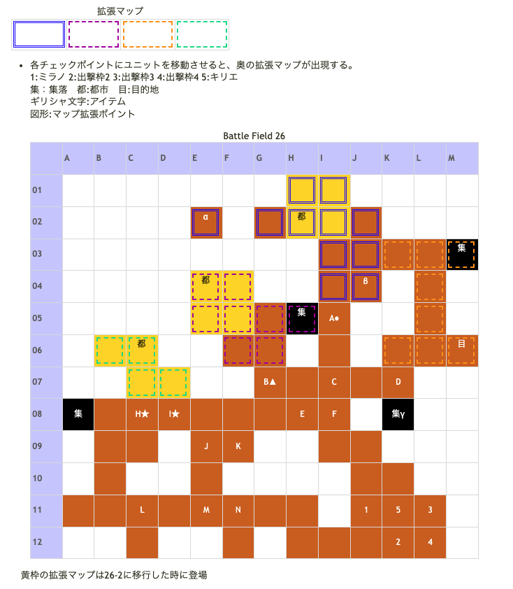

# Battle Field 26 死の大地

- カード20枚
- 2部構成
- 敵カードがマインドチェンジ。Genの低いキャラは相性が有利でも注意。
- 西部・北部・中央にそれぞれ追加マップ出現ポイントあり。
- 三つの都市全てで情報を聞くと26-2へ。

## 勝利条件 

26-1
- 3つの都市を訪れる。

26-2
- 全ユニットが特定地点へ到達

## 敗北条件 

26-1、26-2
- ミラノの戦死
- カードを使い切る

## マップ 

## 取得可能アイテム 

|名前|時期|-|位置|備考|
|---|---|---|---|---|
|ドラゴンキラー(カード)|26-1～|拾|α|道が繋がっていない為、ワープシューズ装備のロザリィか 夜間に転移移動可能なロズウェルが必要。 ロザリィで取得すると、BF38でスナイプグラスが取得不可。 どちらも取得したいのなら、BF38までロザリィを出撃させずにワープシューズを温存するしかない。|
|魂のるつぼ(3)|26-1～|拾|β||
|ドラゴンイーター(2)|26-1～|拾|γ|ミラノ限定、TNV19以下取得不可、20以上で取得可 ドラゴンファングと二択|
|ドラゴンファング(3)|26-1～|拾|γ|ミステール限定、TNV19以下取得不可、20以上で取得可 ドラゴンイーターと二択|

## 敵ユニット 

- 帝国軍1 ： マインドチェンジ （Power 1350　Move 06）

|No.|名前|ユニット|Lv|士気|GEN|ATK|TEC|LUK|POW|アイテム|備考|
|---|---|---|---|---|---|---|---|---|---|---|---|
|A|帝国兵|グリフライダー|10|2710|2.6|2.6|2.5|3.2|40|装備なし||
|B|帝国兵|アサシン|9|2170|1.6|2.1|3.5|3.5|40|装備なし||
|C|帝国兵|フェンサー|9|2460|2.5|3.0|2.5|1.8|40|装備なし||
|D|帝国兵|グリフライダー|10|2710|2.6|2.6|2.5|3.2|40|装備なし||
|E|帝国兵|フェンサー|9|2460|2.5|3.0|2.5|1.8|40|装備なし||
|F|帝国兵|アサシン|9|2170|1.6|2.1|3.5|3.5|40|メダリオン(1)|－士気回復専用(装備)|
|G|帝国兵|グリフライダー|10|2710|2.6|2.6|2.5|3.2|40|装備なし||

- 帝国軍2 ： マインドチェンジ （Power 1350　Move 06）

|No.|名前|ユニット|Lv|士気|GEN|ATK|TEC|LUK|POW|アイテム|備考|
|---|---|---|---|---|---|---|---|---|---|---|---|
|H|帝国兵|ハンター|9|2540|2.5|2.1|3.5|2.5|40|メダリオン(1)|－士気回復専用(装備)|
|I|帝国兵|バンディット|10|2480|2.2|3.1|1.9|3.2|40|装備なし||
|J|帝国兵|バンディット|10|2480|2.2|3.1|1.9|3.2|40|装備なし||
|K|帝国兵|ウィッチ|9|2390|2.1|2.1|3.5|3.2|40|装備なし||
|L|帝国兵|ウィッチ|9|2390|2.1|2.1|3.5|3.2|40|装備なし||
|M|帝国兵|バンディット|10|2480|2.2|3.1|1.9|3.2|40|装備なし||
|N|帝国兵|ハンター|9|2540|2.5|2.1|3.5|2.5|40|装備なし||

- 備考
  - 所持していない場合、焼き鳥可能。
  - 帝国軍1の部隊はアサシンが脆いので、全滅させてカードPOWERを上げたいのならば、先に帝国軍2(ハンター部隊)を叩く。 移動する際、後続がアサシン側に狙われないように注意。
  - グリフライダー、ウィッチ、バンディットの上に地形も荒野ばかりなので、デュランには向いていない。
  - 目的地に到着したユニットのNVはTNVに含まれなくなる。忘れずに回収しておくこと。

## 戦闘中イベント 

- メダリオン所持のアサシン撃破で周囲の帝国兵グループ消滅。
- メダリオン所持のハンター撃破で周囲の帝国兵グループ消滅。
- MAP北端（グリフライダーの居る場所）に配置すると追加マップ出現。
- メダリオン所持のハンターが居る場所に配置すると追加マップ出現。
- メダリオン非所持のアサシンがいる地点に配置すると追加マップ出現。
- 集落はキリエで訪れると台詞が変化。
- スタート地点上部の集落（グリフライダーの居る場所）にミラノで訪れるとドラゴンイーター。
  - TNV19以下取得不可、20以上で取得可
- 北部の都市から→→↓↓に魂のるつぼ。
- 北部の都市左3に「ドラゴンキラー」(power2800,move:8,Ace:ALL)
  - 道が繋がっていない為、ワープシューズ装備のロザリィか夜間に転移移動可能なロズウェルが必要。

## 勝利後イベント 

- 特に無し

## MVPターン制限 

- ＋２：５４ターン以下
- ＋１：５５ターン以上
- 無し：リトライ

のんびりやっても余裕で+2が取れる。むしろカード切れに気をつけなればならない。

## 関連 

- [Chapter 4](Chapter4.md)

### 次 

- [Battle Field 27](BattleField27.md)

### 前 

- [Battle Field 25](BattleField25.md)
