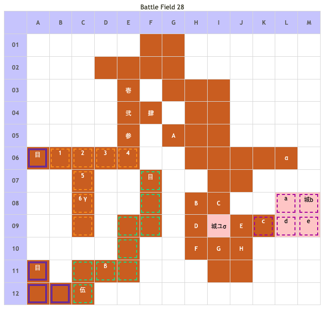

# Battle Field 28 ガレオン監獄

- カード8枚
- 3部構成
- 28-1夕方固定、28-2、28-3夜中固定。
- 28-2、勝利条件を満たすとガルカーサ隊登場、敵進撃。
  - ユグドラに隣接するターンで、持っているならドラゴンキラーを選んでおくと28-2の最初で楽が出来る。
- 28-2、エレナが特定地点へ到達するとアイギナ部隊撤退、カード復活、28-3へ移行し自軍の進撃。

## 勝利条件 

28-1
- 味方ユニットがユグドラに隣接

28-2
- 全ユニットが特定地点へ到達

28-2、エレナ登場後
- エレナが特定地点へ到達

28-3
- 全ユニットが特定地点へ到達

## 敗北条件 

28-1
- ミラノの戦死
- カードを使い切る

28-2、28-3
- 味方ユニットの戦死
- カードを使い切る

## マップ 

## 取得可能アイテム 

|名前|時期|-|位置|備考|
|---|---|---|---|---|
|メダリオン|28-1|落|C(守備隊長)||
|インフェルノ（1）|28-2|盗|b(ガルカーサ)|GEN3.0　プロテクトなのでスティール必須|
|血濡れのレイピア（1）|28-2|盗|4(アイギナ)|GEN3.0　プロテクトなのでスティール必須 [Battle Field 24](BattleField24.md)で取得した場合装備無し|
|古びたオルゴール|28-1|拾|α|サウンドモード閲覧OK|
|ロストマテリアル|28-2|拾|β|[Battle Field 32](BattleField32.md)で神圏マセラマティor珍圏マセラマティ入手に必要|
|ロープ|28-2|拾|σ|[Battle Field 29](BattleField29.md)で幻獣ヤーデのツノ入手に必要|
|朽ち果てた剣|28-3|拾|γ|[Battle Field 31](BattleField31.md)でマジカルソード入手に必要|

## 敵ユニット 

### 28-1

- 守備隊長隊 ： シールドバリア（Power 1500　Move 06）

|No.|名前|ユニット|Lv|士気|GEN|ATK|TEC|LUK|POW|アイテム|備考|
|---|---|---|---|---|---|---|---|---|---|---|---|
|A|衛兵|バンディット|11|2630|2.3|3.1|1.9|3.2|40|装備なし||
|B|衛兵|ウィッチ|9|2390|2.1|2.1|3.5|3.2|40|装備なし|Rage火炎|
|C|守備隊長|ナイト|11|4440|3.3|2.9|2.5|1.9|80|メダリオン||
|D|衛兵|ゴーレム|9|2720|3.1|3.1|1.9|1.9|40|装備なし||
|E|衛兵|ゴーレム|9|2720|3.1|3.1|1.9|1.9|40|装備なし||
|F|衛兵|ウィッチ|9|2390|2.1|2.1|3.5|3.2|40|装備なし|Rage火炎|
|G|衛兵|ゴーレム|9|2720|3.1|3.1|1.9|1.9|40|装備なし||
|H|衛兵|ウィッチ|9|2390|2.1|2.1|3.5|3.2|40|装備なし|Rage火炎|

- 備考
  - MVP狙いの場合は、1人か2人で前進する。 古びたオルゴールも回収するならば、単騎で守備隊を撃破する。
  - 奥側の敵を倒したい場合は、デュランorヒヅメシューズ装備キャラでJ10のウィッチを狙う。
  - アイテム全回収（アイギナ及びガルカーサの武器、ドラゴンステーキも含む）、MVP+2を狙う場合はミラノ以外の単騎で守備隊を撃破し、最低でも6ターン以内にユグドラと隣接する必要がある。高難易度なので注意。

### 28-2

- ガルカーサ隊 ： ジェノサイド（Power 3600　Move 10）

|No.|名前|ユニット|Lv|士気|GEN|ATK|TEC|LUK|POW|アイテム|備考|
|---|---|---|---|---|---|---|---|---|---|---|---|
|a|皇騎兵|インペリアルナイト|13|3180|3.3|3.3|3.3|1.9|80|装備なし|Rage火炎|
|b|ガルカーサ|ドラグーン|15|7680|3.0|5.0|4.0|2.0|120|インフェルノ(1)|Rage火炎 勝利で士気吸収(装備) Protect!|
|c|皇騎兵|インペリアルナイト|13|3180|3.3|3.3|3.3|1.9|80|装備なし|Rage火炎|
|d|皇騎兵|インペリアルナイト|13|3180|3.3|3.3|3.3|1.9|80|装備なし|Rage火炎|
|e|皇騎兵|インペリアルナイト|13|3180|3.3|3.3|3.3|1.9|80|装備なし|Rage火炎|

- アイギナ隊 ： レヴォリューション（Power 2300　Move 10）

|No.|名前|ユニット|Lv|士気|GEN|ATK|TEC|LUK|POW|アイテム|備考|
|---|---|---|---|---|---|---|---|---|---|---|---|
|1|帝国兵|ハンター|12|3030|3.0|2.3|4.0|2.6|40|装備なし||
|2|帝国兵|ヴァルキリー|13|2950|2.4|3.0|3.3|2.6|40|装備なし|Rage神聖|
|3|帝国兵|バンディット|12|2760|2.3|3.2|2.0|3.3|40|装備なし||
|4|アイギナ|ヴァルキリー|14|6920|3.1|4.0|5.0|3.4|120|血濡れのレイピア(1) BF24で取得した場合装備無し|Rage神聖 移動で士気低下(装備) Protect!|
|5|帝国兵|バンディット|12|2760|23|32|20|33|40|装備なし||
|6|帝国兵|ハンター|12|3030|30|23|40|26|40|装備なし||

- 備考
  - 28-2の最初の敵ターンで使ったカードのPOWERは追加されない模様。
  - ガルカーサはHIGH状態(毎ターン士気全回復+ステータス異常無効)+プロテクト。
  - 配下のインペリアルナイトをフレイムを使用した戦闘で士気0にするとドラゴンステーキ入手。…焼肉か。
  - 召喚したゴーレムやスケルトンは「敗北条件の味方ユニット」には含まれない為、囮に出来る。
  - アイギナ隊とは隣接しない限り戦闘にならないので、エレナ登場前に出来る限り近づいておくとクリアが楽になる。
  - アイギナの武器をスティールしたい場合、グラヴィティカオスで呪い状態にしてからスティールをすると、反撃にも高確率で勝てるのでおすすめ。
  - GBA版と違いアイギナ隊はアイギナ以外プロテクトは無い。
  - 道が繋がっていないので、狙われる心配の無いエレナを逃がすのは後回し。
  - 28-2以降は夜中固定なので、ロズウェルはワープ移動しかできなくなる。28-1終了時の配置によっては、エレナと同じ方の退路(A-11)からしか離脱できないので、MVP狙いorカード切れ注意。
  - どうしてもクリア出来ない場合、前のマップで手に入れたドラゴンイーターをミラノに装備させれば何とかなる。
  - BF24で血濡れのレイピアを取得していない場合、全アイテムを狙うと難易度が跳ね上がる。要注意。
  - エレナ登場ターンにアイギナからスティールしてエレナを移動させ、28-3にミラノを後続にしてスティールでガルカーサから奪うとリスクが少ない。 ガルカーサ戦の手前にインペリアルナイト戦を挟み、連戦でゲージを溜めておくと、反撃時のスティール使用でもガルカーサに勝利することが出来る。
  - 28-2の序盤にインペリアルナイトを倒し過ぎるとMOVが全てガルカーサのみに使われるため、後半はジェノサイドばかりと消耗が激しくなる。 序盤は高MOVや低POWカードで戦闘を避けつつ削りつつ、インペリアルナイト1～2騎を残しておいて、28-3あたりから一気に反撃すると良い。
  - ジェノサイド策として、まれに猛反撃や地形効果+の装備をつけておくと気休めになるかと。
  - パメラが仲間にいる場合、夜間固定を利用してコーマカルマを使用すると相当楽になる。特に、ユグドラとJ-09にパメラで隣接して28-2に移行した場合、戦闘を仕掛けてくるインペリアルナイトを昏睡させることで一方的にフタが出来る。（パメラをどかすと当然ＨＩＧＨガルカーサが追いかけてくるので、パメラを逃がすのは最後に）。
  - このステージに限らず、各部隊長ユニットには昏睡状態、石化状態は無効であるのでそこは注意。
  - ガルカーサ、アイギナ両方からスティールする場合はアイギナ→ガルカーサの順で
  - このBFのガルカーサはProtectかつHIGHと経験値稼ぎに最適なため、特にこだわりがなければ無理にMVP+2を獲りにいかずカード切れギリギリまでターンを費やして稼ぎに徹した方が後々有利。
負けた時の士気ダメージが半端ではないので安定して勝てるキャラに限られるが、キルブレードやデスブリンガーを入手・温存していれば該当キャラは十分にいるので、複数キャラを同時に育成することも可能。
  - 中でもドラゴンファングを持つミステールは最右翼。
仮にステータスカンストを目指す場合でも、必要な小星数に奇数の部分があるため、MVPボーナス減少のデメリットを吸収できる。

## 戦闘中イベント 

28-1
- マップ東端、崩れかけの祠に古びたオルゴール。
- 守備隊長撃破で部隊消滅。
- 守備隊撃破前にユグドラと隣接した場合は、28-2以降も残る。

28-2
- ユグドラのいた城塞にロープ。
- 2ターン目味方ユニット行動後、スタート地点付近にアイギナ隊出現。アイギナのみプロテクト。
- 更に2ターン後エレナ出現。目標地点に配置するとアイギナ隊消滅。
- エレナの初期配置から二つ移動したところでロストマテリアル入手。

28-3
- 目標地点の南東にある細長い行き止まりの一つ手前で朽ち果てた剣入手。

## 勝利後イベント 

- サンドストーム入手(power:2500,move:5,Ace:All)(入手するのはリザルト画面ではない)

## MVPターン制限 

- ＋２：23ターン以下
- ＋１：24ターン以上
- 無し：リトライ

## 関連 

- [Chapter 5](Chapter5.md)
- [Chapter 4](Chapter4.md)

### 次 

- [Battle Field 29](BattleField29.md)

### 前 

- [Battle Field 27](BattleField27.md)
