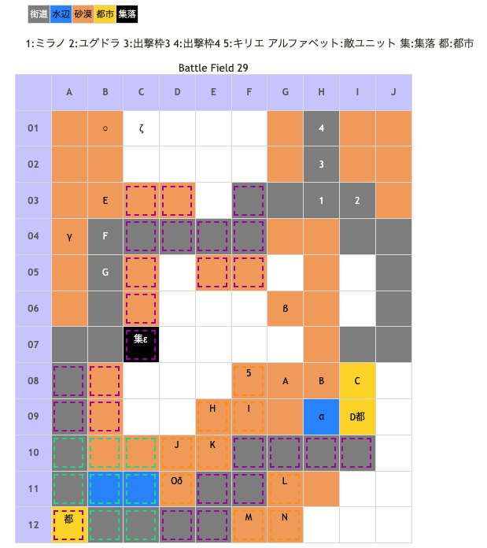

# Battle Field 29 ニルルド砂漠北部

- カード10枚
- ユグドラが復帰
- 3部構成
- 砂漠地形が多いので、スターダストを取るのにニーチェを出撃させる場合は配置に注意。
- ユグドラのレベルは全員の平均値まで上昇している。なお、Lv14以上のソードメイデン成長値は悲惨なので、クラスチェンジするまではLv13になり次第ユグドラには戦闘を控えさせた方がいい。

## 勝利条件 

29-1
- 特定地点へ到達

29-2
- 特定地点へ到達

ドルト出現後
- ドルトの撃破

29-3
- 特定地点へ到達

## 敗北条件 

29-1
- ユグドラorミラノの戦死
- カードを使い切る

29-2
- カードを使い切る

29-3
- ユグドラorミラノの戦死
- カードを使い切る

## マップ 

## 取得可能アイテム 

|名前|時期|-|位置|備考|
|---|---|---|---|---|
|スターダスト|29-1|拾|α|夜間/ニーチェのみ。先にβ取得で会話追加 [Battle Field 30](BattleField30.md)で星屑の砂時計入手に必要|
|マーメイドフィン|29-1|拾|β|α取得前で会話追加|
|メダリオン|29-1|落|A～C(賞金稼ぎ)|倒せば必ず落とす|
|羽根付きサンダル or丈夫な長靴 orレンジャーブーツ orワープシューズ orヒヅメシューズ orドラゴンブーツ|29-1|落|D(ミゼル)|LUK4.0 BF07～09、BF12、BF23.5のミゼルの装備アイテム入手状況でアイテムが変化 全て入手している場合ドラゴンブーツ装備|
|砂の薔薇|29-2|拾|γ|昼、夕のみ　[Battle Field 30](BattleField30.md)で星屑の砂時計入手に必要|
|パワーフルーツ|29-2|拾|δ||
|幻獣ヤーデのツノ|29-2|交|ε|ロープと交換 昼、夕のみ|
|破滅のハンマー|29-2|落|O(ドルト)|LUK2.0|
|フェアリーベル|29-3|交|ζ|昼に○に移動で集落出現（以降昼のみ存在/要エレミナミント/ユグドラのみ）|

## 敵ユニット 

### 29-1

- ミゼル隊 ： サンダーボルト （Power 3150 Move 07）

|No.|名前|ユニット|Lv|士気|GEN|ATK|TEC|LUK|POW|アイテム|備考|
|---|---|---|---|---|---|---|---|---|---|---|---|
|A|賞金稼ぎ|ウィッチ|11|2720|2.3|2.3|4.0|3.2|40|メダリオン|Rage火炎 －士気回復専用(装備)|
|B|賞金稼ぎ|アサシン|11|2460|1.7|2.3|4.0|4.0|40|メダリオン|Rage暗黒 －士気回復専用(装備)|
|C|賞金稼ぎ|バンディット|11|2630|2.3|3.1|1.9|3.2|40|メダリオン|－士気回復専用(装備)|
|D|ミゼル|ハンター|12|5820|2.3|3.0|4.0|4.0|120|羽根付きサンダル(2) or丈夫な長靴(1) orレンジャーブーツ(2) orワープシューズ(2) orヒヅメシューズ(2) orドラゴンブーツ(2)|○移動タイプが竜騎に(ドラゴンブーツ) 他の装備アイテムの効果は割愛 ステータスは無装備時のもの|

- ジルヴァ隊 ： ブラッディクロー （Power 2200 Move 09)

|No.|名前|ユニット|Lv|士気|GEN|ATK|TEC|LUK|POW|アイテム|備考|
|---|---|---|---|---|---|---|---|---|---|---|---|
|E|影の者|アサシン|12|2560|1.7|2.3|4.0|4.0|40|装備なし|Rage暗黒|
|F|影の者|アサシン|12|2560|1.7|2.3|4.0|4.0|40|装備なし|Rage暗黒|
|G|ジルヴァ|アサシン|13|6200|1.0|4.0|5.0|3.0|120|ジャックハンド(1)|Rage暗黒 ○一騎討ちで必勝(装備)|

- 備考
  - 隔絶されたエリアに配置されているので戦闘する事は無い。

### 29-2

- ドルト隊 ： サンドストーム （Power 1500 Move 05）

|No.|名前|ユニット|Lv|士気|GEN|ATK|TEC|LUK|POW|アイテム|備考|
|---|---|---|---|---|---|---|---|---|---|---|---|
|H|蛮族|バンディット|10|2720|2.2|3.1|1.9|3.2|40|装備なし||
|I|蛮族|グリフライダー|11|2870|2.7|2.7|2.5|3.2|40|装備なし||
|J|蛮族|バンディット|10|2720|2.2|3.1|1.9|3.2|40|装備なし||
|K|蛮族|グリフライダー|11|2870|2.7|2.7|2.5|3.2|40|装備なし||
|L|蛮族|バンディット|10|2720|2.2|3.1|1.9|3.2|40|装備なし||
|M|蛮族|バンディット|10|2720|2.2|3.1|1.9|3.2|40|装備なし||
|N|蛮族|グリフライダー|11|2870|2.7|2.7|2.5|3.2|40|装備なし||
|O|ドルト|バンディット|12|6140|3.2|4.0|1.3|2.6|120|破滅のハンマー(1)|オブジェクト破壊可(装備) キリエ登場までProtect!|

- 備考
  - 焼き鳥可能。
  - サンドストームは地形攻撃なので、街道等にいれば撃たれることはない。ニーチェ使いも安心。
  - ただし全員斧なので、やっぱり下がらせておいた方が無難。
  - ソードメイデンを活用できる数少ないBF。ユグドラのNVやMVPを稼ぐのならばここで。
  - 11ターン目までにドルト部隊を撃破すれば、ユグドラを前面に押し出していても蜃気楼の町まで十分間に合う。

## 戦闘中イベント 

29-1
- 1ターン目カード選択後に戦闘チュートリアル。
- G06 わずかな岩陰に「マーメイドフィン」
- H09 オアシスに「スターダスト」(夜間のみ、水中にあるので要ニーチェ)
- ミゼル撃破で賞金稼ぎグループ消滅。

29-2
- 街道の南西端(D12)に配置でドルト蛮族団出現。そのまま敵進撃に。
- ドルト出現の次自軍ターンにキリエ増援
- ドルト撃破で蛮族グループ消滅
- A04 バハラの荘園跡に｢砂の薔薇｣(日中と夕方のみ)
- D11 オアシスで「パワーフルーツ」
- C07の集落で 「ロープ」→「幻獣ヤーデのツノ」

29-3
- B01配置でC01に蜃気楼の町発見（日中のみ）。 町を発見後、エレミナミントを所持している場合、ユグドラをC01に配置すると沐浴イベント（日中のみ）。 沐浴後、フェアリーベル入手。エレミナミントは消費される

## 勝利後イベント 

- 特になし

## MVPターン制限 

- ＋２：20ターン以下
- ＋１：21ターン～
- 無し：リトライ

## GBA版からの変更点 

## 関連 

- [Chapter 5](Chapter5.md)
- [Chapter 4](Chapter4.md)

### 次 

- [Battle Field 30](BattleField30.md)

### 前 

- [Battle Field 28](BattleField28.md)
