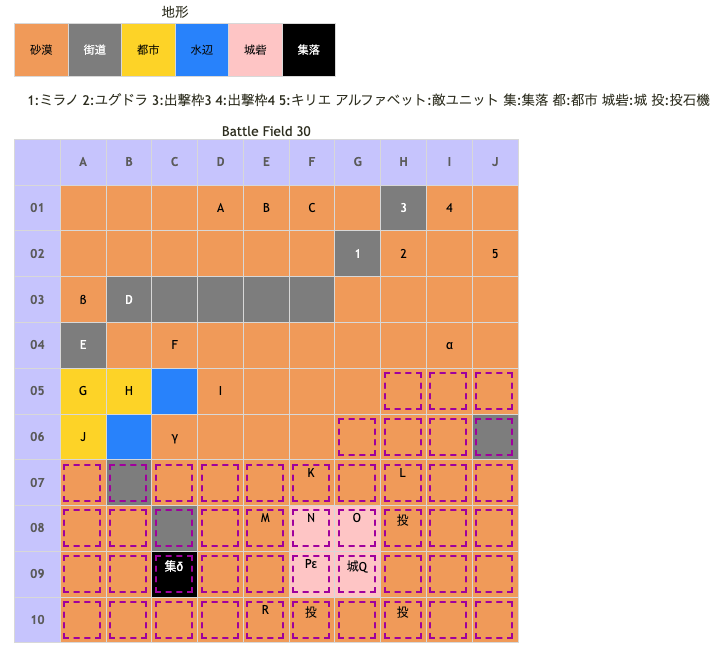

# Battle Field 30 ニルルド砂漠南部

- カード12枚
- 2部構成
- 30-2へ行くには30-1勝利条件達成時にTNVが20以上必要
- BF33までにユグドラのLUKを3まで上昇させておかない場合、アイテム全回収が成し遂げられない事がある。このBF30で拾う事の出来る「メプルの果実」を上手く活用したい。

## 勝利条件 

30-1
- 特定地点へ到達

30-2
- ドルトの撃破

## 敗北条件 

30-1
- ユグドラorミラノorキリエの戦死
- カードを使い切る

30-2
- ユグドラorミラノorキリエの戦死
- カードを使い切る

## マップ 

## 取得可能アイテム 

|名前|時期|-|位置|備考|
|---|---|---|---|---|
|白山羊のチーズ|30-1|変|開始前|「白山羊のミルク」所持|
|巨獣ロコンの骨|30-1|拾|α|[Battle Field 31](BattleField31.md)で「ラカンの秘薬」入手に必要|
|ユミナの日記|30-1|拾|β|[Battle Field 31](BattleField31.md)で「メルヘン偽翼」入手に必要|
|メプルの果実|30-1|拾|γ||
|星屑の砂時計|30-2|交|δ|｢スターダスト｣｢砂の薔薇｣と交換 朝、夕のみ [Battle Field 32](BattleField32.md)で「神圏マセラマティ」or「珍圏マセラマティ」入手に必要|
|太陽のオーブ|30-2|拾|ε||
|くるみパン|30-1|落|A(エミリオ)|GEN☆2 ([Battle Field 31](BattleField31.md)でも取得可能)|
|メダリオン|30-1|落|G(蛮族)|倒せば必ず落とす|
|ゴーレムスーツ|30-2|落|N(守り神)|LUK1.0|
|ド派手なターバン|30-2|落|Q(ドルト)|LUK3.0|

## 敵ユニット 

### 30-1

- エミリオ隊 ： グラヴィティカオス （Power 3450 Move 09）

|No.|名前|ユニット|Lv|士気|GEN|ATK|TEC|LUK|POW|アイテム|備考|
|---|---|---|---|---|---|---|---|---|---|---|---|
|A|エミリオ|グリフライダー|14|6440|2.4|3.4|4.1|4.1|120|くるみパン(1)||
|B|緋天騎兵|グリフライダー|13|3150|3.0|3.0|2.6|3.3|40|装備なし||
|C|緋天騎兵|グリフライダー|13|3150|3.0|3.0|2.6|3.3|40|装備なし||

- 蛮族団 ： サンドストーム （Power 1450 Move 05）

|No.|名前|ユニット|Lv|士気|GEN|ATK|TEC|LUK|POW|アイテム|備考|
|---|---|---|---|---|---|---|---|---|---|---|---|
|D|蛮族|バンディッド|10|2480|2.2|3.1|1.9|3.2|40|装備なし||
|E|蛮族|アサシン|10|2350|1.7|2.2|4.0|4.0|40|装備なし|Rage暗黒|
|F|蛮族|バンディッド|10|2480|2.2|3.1|1.9|3.2|40|装備なし||
|G|蛮族|バンディッド|10|2480|2.2|3.1|1.9|3.2|40|メダリオン|－士気回復専用(装備)|
|H|蛮族|アサシン|10|2350|1.7|2.2|4.0|4.0|40||Rage暗黒|
|I|蛮族|バンディッド|10|2480|2.2|3.1|1.9|3.2|40|装備なし||
|J|蛮族|アサシン|10|2350|1.7|2.2|4.0|4.0|40|装備なし||

- 備考
  - エミリオがA01に移動するとエミリオ隊は敵2ターン目で画面端に移動して撤退。
  - A01にキリエを素早く配置する事でマップに留める事が可能。
  - 隣接しても戦闘を仕掛けてこないが蛮族のユニオンには参加。
  - E1またはD2にキリエを移動させ、4対3でグラヴィティカオスまたはスティールあたりを仕掛ければ瞬殺可能。

### 30-2

- ドルト盗賊団 ： サンドストーム （Power 1650 Move 05）

|No.|名前|ユニット|Lv|士気|GEN|ATK|TEC|LUK|POW|アイテム|備考|
|---|---|---|---|---|---|---|---|---|---|---|---|
|K|蛮族|バンディット|11|2630|2.3|3.1|1.9|3.2|40|装備なし||
|L|蛮族|グリフライダー|11|2870|2.7|2.7|2.5|3.2|40|装備なし||
|M|蛮族|バンディット|11|2630|2.3|3.1|1.9|3.2|40|装備なし||
|N|守り神|ゴーレム|12|4470|4.0|4.0|1.0|1.9|80|ゴーレムスーツ(1)|生存中は他のユニットがHIGHに|
|O|蛮族|アサシン|10|2350|17|2.2|4.0|4.0|40|装備なし|Rage暗黒|
|P|蛮族|アサシン|10|2350|17|2.2|4.0|4.0|40|装備なし|Rage暗黒|
|Q|ドルト|バンディット|13|6460|4.0|3.5|1.9|3.0|120|ド派手なターバン(2)|○退却ペナルティなし|
|R|蛮族|グリフライダー|11|2870|2.7|2.7|2.5|3.2|40|装備なし||

- 備考
  - 焼き鳥可能。
  - 敵ターン時に投石器を使われるので、デュランやキリエは注意。
  - 自ターン時にバンディットから1マスまで近づくと、敵ターンで投石器込みの5連戦になる。接近するターンはシールドバリア推奨。
  - 敵ターン時にドルトがユニオンリーダーになると投石器を3つ使われる。事前にドルトを呪いにしておき、サンクチュアリが無難。
  - ブロンズシールドが残ってるなら装備を。以降で投石器のあるMAPはBF40とBF44だが、BF30程の脅威は無い。
  - BF29で入手した破滅のハンマーで投石器破壊可能。ただし砂漠の移動に手間がかかるので、メリットは無いかもしれない。
  - 投石器を防ぐには、基本的にドルトをユニオンに加えないようにすること。リンクまでなら可。

## 戦闘中イベント 

30-1
- メダリオン所持の蛮族撃破で蛮族グループ消滅。

30-2
- 守り神と隣接で会話あり。
- ドルト撃破で蛮族グループ消滅。

## 勝利後イベント 

- 特に無し

## MVPターン制限 

- ＋２：３２ターン以下
- ＋１：３３ターン
- 無し：リトライ

## GBA版からの変更点 

- エミリオのProtect!が消えた

## 関連 

- [Chapter 5](Chapter5.md)

### 次 

- [Battle Field 31](BattleField31.md)

### 前 

- [Battle Field 29](BattleField29.md)
