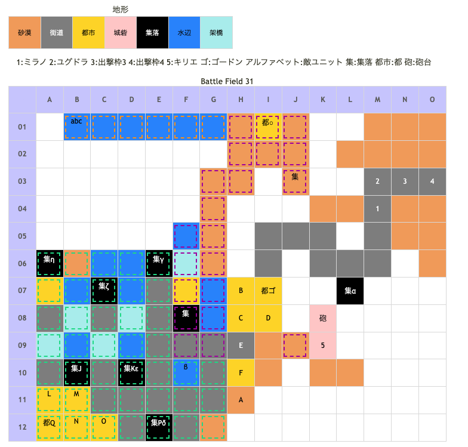

# Battle Field 31 宗教都市群ロンバルディア

- カード14枚
- 3部構成
- 31-1は昼間固定、31-2は夕方固定。 31-3は普通に時が流れる。
- 31-1、自軍ターン開始時に砲撃ダメージ（10%）
- 31-1、砲撃の枠のため分かりにくいかもしれないが、ゴードンを超えて移動する事が出来る。
- 31-1、勝利条件達成後、ゴードンが操作可能に。ゴードンのHIGH状態は解除。
- 31～、ドクロ石を所持していると一部イベントが発生しない（アイテムが手に入らない）

## 勝利条件 

31-1
- ジルヴァの撃破

31-2
- ゴードンが特定地点へ到達 （ゴードンを北にある都市○に移動させればOK）

31-3
- マルディムの撃破

## 敗北条件 

31-1
- ユグドラorミラノorキリエorゴードンの戦死
- カードを使い切る

31-2
- ユグドラorミラノorキリエorゴードンの戦死
- エミリオが教皇ヨハイムを発見
- カードを使い切る

31-3
- ユグドラorミラノorキリエorゴードンの戦死
- カードを使い切る

## マップ 

## 取得可能アイテム 

|名前|時期|-|位置|備考|
|---|---|---|---|---|
|※注意※|31|-|-|きらきら金貨以外（集落での入手）はドクロ石があると取得不可 ;開始前に報酬等で消費すればOK|
|幸運のタリスマン|31-1|交|α|「カゴの中の白い蝶」と交換|
|きらきら金貨|31-3|拾|β|要ニーチェ　[Battle Field 40](BattleField40.md)で「邪眼」or「ボロ布」入手に必要|
|七星宝剣|31-3|拾|γ|TNV23以上|
|メルヘン偽翼|31-3|交|δ|「ユミナの日記」と交換|
|マジカルソード|31-3|交|ε|TNV18以上。夜間のみ。「朽ち果てた剣＋マナストーン」と交換|
|ラカンの秘薬|31-3|交|ζ|TNV18以上。「どくまむし＋巨獣ロコンの骨」と交換|
|黄昏のヴェール|31-3|拾|η|TNV15以上。夕方/女性のみ　※ダークセイバーと二択|
|ダークセイバー|31-3|交|η|TNV14以下。夜間のみ。「ダークマター」と交換　※黄昏のヴェールと二択|
|ジャックハンド|31-1|落|A(ジルヴァ)|LUK3.0|
|くるみパン|31-2|落|a(エミリオ)|LUK4.0|
|ジュエルロッド|31-3|落|Q(マルディム)|LUK4.0|
|メダリオン|31-3|落|O(ヴァルキリー) P(ヴァルキリー)|必ず落とす|

## 敵ユニット 

### 31-1

- ジルヴァ隊 ： ブラッディクロー （Pow 2200 Mov 9）

|No.|名前|ユニット|Lv|士気|GEN|ATK|TEC|LUK|POW|アイテム|備考|
|---|---|---|---|---|---|---|---|---|---|---|---|
|A|ジルヴァ|アサシン|13|6200|1.0|4.0|5.0|3.0|120|ジャックハンド(1)|Rage暗黒 一騎討ちで必勝|
|B|影の者|アサシン|12|1260|1.7|2.3|4.0|4.0|40|装備なし|Rage暗黒|
|C|影の者|アサシン|12|1320|1.7|2.3|4.0|4.0|40|装備なし|Rage暗黒|
|D|帝国兵|バンディッド|11|2250|2.3|3.1|1.9|3.2|40|装備なし||
|E|帝国兵|バンディッド|11|2630|2.3|3.1|1.9|3.2|40|装備なし||
|F|帝国兵|バンディッド|11|2630|2.3|3.1|1.9|3.2|40|装備なし||

- 備考
  - ゴードンのユニオンに巻き込まれたくなければキリエは1マス下がらせる。
  - 対ジルヴァ隊は普通にプレーしているとゴードンのエースガードで大部分をこなすことになりPOWや経験値の損失が大きいが、敵があまり前に出てこない行動パターンをとった場合はヒヅメシューズを装備したミラノ+スティールで一気に殲滅して稼ぎ＆ターン節約が可能。
  - 次のBFも地形的に狭い部分がそこそこあるので、敵の動きに左右されることなくアイギナにちょっかいを出すなどヒヅメシューズの出番がないこともない。

### 31-2

- マルディム隊 ： ポイズンブレス （Pow 1650 Mov 10）

|No.|名前|ユニット|Lv|士気|GEN|ATK|TEC|LUK|POW|アイテム|備考|
|---|---|---|---|---|---|---|---|---|---|---|---|
|Q|マルディム|ネクロマンサー|13|6600|4.0|2.0|2.6|4.0|120|ジュエルロッド(2)|Rage暗黒 雷撃攻撃力アップ(装備)|

- エミリオ隊 ： グラヴィティカオス （Pow 3450 Mov 9）

|No.|名前|ユニット|Lv|士気|GEN|ATK|TEC|LUK|POW|アイテム|備考|
|---|---|---|---|---|---|---|---|---|---|---|---|
|a|エミリオ|グリフライダー|14|6440|2.4|3.4|4.1|4.1|120|くるみパン(1) (BF30で取得した場合無し)|31-2の敗北条件が 追加されるまでProtect!|
|b|緋天騎兵|グリフライダー|12|3050|3.0|3.0|2.6|3.3|40|装備なし||
|c|緋天騎兵|グリフライダー|12|3050|3.0|3.0|2.6|3.3|40|装備なし||

- 備考
  - 次の3部で砂漠まみれの道を引き返すことになるので､面倒なら教会に向かうのはキリエ+ゴードンだけでOK、むしろ推奨
  - グリフライダーはグラヴィティカオスで呪い状態になると地形の効果を受けるようになる。
  - 砂漠上の緋天騎兵には有効であるが、都市上のエミリオは士気を減らしにくくなってしまうので注意。
  - 全てキリエで撃破すると、MVPを取ってしまう可能性があるので注意。
  - ゴードンで攻めるならばブリザード推奨。I2から仕掛ければK4のユニオンも可能。

### 31-3

- マルディム隊 ： ポイズンブレス （Pow 1650 Mov 10）

|No.|名前|ユニット|Lv|士気|GEN|ATK|TEC|LUK|POW|アイテム|備考|
|---|---|---|---|---|---|---|---|---|---|---|---|
|J|メリアント|アサシン|11|2460|1.7|2.3|4.0|4.0|40|装備なし|Rage暗黒|
|K|メリアント|アサシン|11|2460|1.7|2.3|4.0|4.0|40|装備なし|Rage暗黒|
|L|メリアント|スケルトン|11|2720|2.3|2.3|3.2|4.0|40|装備なし||
|M|メリアント|スケルトン|11|2720|2.3|2.3|3.2|4.0|40|装備なし||
|N|メリアント|スケルトン|11|2720|2.3|2.3|3.2|4.0|40|装備なし||
|O|メリアント|ヴァルキリー|11|2670|2.3|2.7|3.2|2.5|40|メダリオン|Rage神聖|
|P|メリアント|ヴァルキリー|11|2670|2.3|2.7|3.2|2.5|40|メダリオン|Rage神聖|
|Q|マルディム|ネクロマンサー|13|6600|4.0|2.0|2.6|4.0|120|ジュエルロッド(2)|Rage暗黒 雷撃攻撃力アップ(装備)|

- 備考
  - スケルトンのLUKが☆4と意外と高いが、昼間だと瞬殺可能。
  - マルディム隊は近寄ると打って出てくる。マルディム自身も移動するので注意。
  - 逆に距離をとれば動き出さないので、最初のターン(夕方)は戦闘を見送る。 ブラッディクロー使用可能な夜間、またはスケルトンが無力な昼間のターンで一気に仕掛ける。
  - スケルトンに対しては、ステータス異常無効orGEN4以上のユニットが当たるようにする。

## 戦闘中イベント 

31-1
- 自軍ユニットがゴードンと隣接すると会話発生
- 自軍ユニットがジルヴァと隣接すると会話発生
- ジルヴァ撃破で周囲のユニット消滅

31-2
- 勝利条件 ゴードンを古びた教会(○)に移動させる に変更
- 次敵ターンマップ北西（a）よりエミリオ出現 教会のあるパネル(○)へ移動
- エミリオ登場次ターンエミリオ出現位置からグリフライダーの増援
- 2体目の増援が来ると､勝利条件 教会の解放(ゴードンが到達)に変更
- 増援２体が揃って勝利条件変更でエミリオのプロテクト解除
- 敗北条件に エミリオが教皇を発見する 追加 ※カードが切れるまで待っても発見しなかった
- 教会右下の山岳のふもと? 廃墟 夜間のみ集落出現

31-3
- マップ南西にマルディムの部隊出現
- マルディムと味方ユニット隣接で会話あり
- マルディム撃破でメリアントグループ消滅

## 勝利後イベント 

- 未入手の場合メイクドール入手(power:1400,move:11,Ace:杖)

## MVPターン制限 

- ＋２：46ターン以下
- ＋１：47ターン～
- 無し：リトライ

## 関連 

- [Chapter 5](Chapter5.md)

### 次 

- [Battle Field 32](BattleField32.md)

### 前 

- [Battle Field 30](BattleField30.md)
