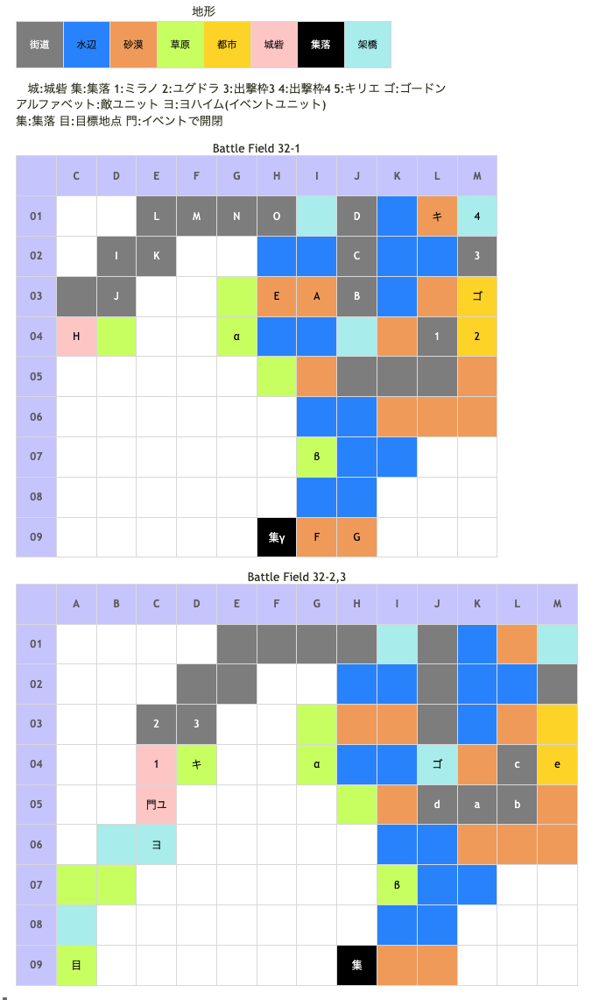

# Battle Field 32 聖メリアータ教会領

- カード14枚
- 3部構成
- 32-1、昼間固定
- 32-2、夕方固定
  - ガルカーサ隊出現（アイギナ含む）、ユグドラ離脱、味方配置再設定。（召喚したゴーレムは消滅）
  - 敵ターンから開始
  - ゴードンがやられると戦死する。戦死しなかったら仲間になるかというとそうでもない。
- 32-3、夜間固定
- このBF以降、砂漠地形は登場しない。無理にスコーピオテールを生かすならばここで。

## 勝利条件 

32-1
- ユベロンの撃破

32-2
- 教会の防衛

32-3
- ガルカーサの撃破

## 敗北条件 

32-1
- ユグドラorミラノorキリエorゴードンの戦死
- カードを使い切る

32-2
- ミラノorキリエの戦死
- 敵が教会に侵入
- カードを使い切る

32-3
- ミラノorキリエの戦死
- カードを使い切る

## マップ 

## 取得可能アイテム 

|名前|時期|-|位置|備考|
|---|---|---|---|---|
|カリンカの赤い実|32-1?|拾|α||
|バナナンの実|32-1?|拾|β||
|■■■■■■■■|32-1|交|γ|TNV25必要。「星屑の砂時計＋ロストマテリアル」と交換。ドクロ石未所持のみ ;後に神圏マセラマティか珍圏マセラマティへ変化 ;もらった時点で分岐が決まっている|
|クローバーライト|32-1|交|γ|「四つ葉のクローバー＋きらきら火山灰と交換。ドクロ石未所持のみ|
|ジュエルロッドor錬金のモノクル|32-1|落|A(マルディム)|LUK4.0 [Battle Field 31](BattleField31.md)で手に入れていない場合ジュエルロッドを所持|
|メダリオン|32-1|落|J、K(司教)|LUK3.0|
|風ヲ切裂ク蒼ノ爪|32-1|落|I(アマレウス)|LUK4.0|
|聖書|32-1|落|H(ユベロン)|LUK5.0|
|バーニングサン|32-2?|落|d(ガルカーサ)|LUK3.0 32-2ではプロテクト+HIGH。32-3でプロテクト+HIGH解除|
|禁忌のロザリオ|32-2?|落|e(アイギナ)|LUK1.0 32-2ではプロテクト+HIGH。32-3でプロテクト+HIGH解除|

## 敵ユニット 

### 32-1

- マルディム隊 ： ポイズンブレス （Pow 1650 Mov 10）

|No.|名前|ユニット|Lv|士気|GEN|ATK|TEC|LUK|POW|アイテム|備考|
|---|---|---|---|---|---|---|---|---|---|---|---|
|A|マルディム|ネクロマンサー|13|6600|3.3|3.0|3.0|4.0|120|ジュエルロッド(2) or錬金のモノクル(1)|Rage暗黒 雷撃攻撃力アップ(ジュエルロッド装備) 獲得経験値+3(錬金のモノクル装備) ;ステータスは錬金のモノクル装備時|
|B|メリアント|ヴァルキリー|11|2670|2.3|2.7|3.2|2.5|40|装備なし|Rage神聖|
|C|メリアント|ヴァルキリー|11|2670|2.3|2.7|3.2|2.5|40|装備なし|Rage神聖|
|D|メリアント|スケルトン|11|2720|2.3|2.3|3.2|4.0|40|装備なし||
|E|メリアント|スケルトン|11|2720|2.3|2.3|3.2|4.0|40|装備なし||
|F|メリアント|グリフライダー|12|3050|3.0|3.0|2.6|3.3|40|装備なし||
|G|メリアント|グリフライダー|12|3050|3.0|3.0|2.6|3.3|40|装備なし||

- ユベロン隊 ： メデューサアイ （Pow 1800 Mov 9）

|No.|名前|ユニット|Lv|士気|GEN|ATK|TEC|LUK|POW|アイテム|備考|
|---|---|---|---|---|---|---|---|---|---|---|---|
|H|ユベロン|ネクロマンサー|13|6200|4.0|2.0|1.9|5.0|120|聖書(2)|Rage暗黒 神聖攻撃は無効(装備)|
|I|アマレウス|アサシン|14|6380|2.4|4.0|5.0|4.1|120|風ヲ切裂ク蒼ノ爪(2)|Rage暗黒 連戦ハンデなし(装備)|
|J|司教|ネクロマンサー|12|4270|2.3|3.0|3.3|3.3|80|メダリオン(1)|Rage暗黒 －士気回復専用(装備)|
|K|司教|ネクロマンサー|12|4270|2.3|3.0|3.3|3.3|80|メダリオン(1)|Rage暗黒 －士気回復専用(装備)|
|L|メリアント|ナイト|12|3030|3.2|3.0|2.6|1.9|40|装備なし||
|M|メリアント|スケルトン|11|2720|2.3|2.3|3.2|4.0|40|装備なし||
|N|メリアント|スケルトン|11|2720|2.3|2.3|3.2|4.0|40|装備なし||
|O|メリアント|スケルトン|11|2720|2.3|2.3|3.2|4.0|40|装備なし||

- 備考
  - 昼間固定な為、ある意味スケルトンが障害物。
  - 次の昼が来ないので、ダイヤモンドダストを使うと永久に歩ける。
  - アマレウスのTECが☆5。カードがメデューサアイなのでGENの低いユニットは注意。
  - 石化している時にアースクェイクを使うと石化ユニットが戦死する。
  - ユベロンを始末するときにブリザード、マインドチェンジ、チャリオット、ドラゴンキラー、エースガード等を選んでおくと32-2がほんの少し楽になる。気休め程度なので特に気にしなくてもOK
  - 32-2以降、ユグドラのNVはTNVに含まれなくなるので、なるべく32-1のうちにアイテムを交換しておく。
  - スケルトンの始末で手間はかかるが、使用カード10枚程度ならMVP+2の許容範囲内。

### 32-2

- ガルカーサ隊 ： ジェノサイド （Pow 2500 Mov 10）

|No.|名前|ユニット|Lv|士気|GEN|ATK|TEC|LUK|POW|アイテム|備考|
|---|---|---|---|---|---|---|---|---|---|---|---|
|a|皇騎兵|インペリアルナイト|14|3030|3.4|3.4|3.4|1.9|80|装備なし|Rage火炎|
|b|皇騎兵|インペリアルナイト|14|3030|3.4|3.4|3.4|1.9|80|装備なし|Rage火炎|
|c|皇騎兵|インペリアルナイト|14|3030|3.4|3.4|3.4|1.9|80|装備なし|Rage火炎|
|d|ガルカーサ|ドラグーン|16|8000|4.2|5.0|4.0|3.4|120|バーニングサン(3)|Rage火炎 昼間が得意(装備) Protect!+HIGH|
|e|アイギナ|ヴァルキリー|15|7460|4.0|3.5|6.0|1.0|120|禁忌のロザリオ(1)|Rage神聖 少しずつ士気低下(装備) Protect!+HIGH|

- 備考
  - 細い道に誘い込んで一匹ずつ相手すると楽
  - ロザリィやグラヴィティカオスの呪い使うと更に楽
  - HIGH状態の2人にはステータス異常が無効なので注意
  - ガルカーサはHIGH状態なので能力値がカンストしているミラノでもジェノサイド使用がほぼ確定されてしまう。なるべくユニオンを組まずに対決役のみで当たろう。
  - 後のマップに登場するインペリアルナイトは全員メダリオン所持なので、ドラゴンステーキを取っていない場合はこのマップで入手しておくのが無難。
  - ガルカーサに対してマインドチェンジを成功させるには、TEC5以上必要。ゴードンにはまず無理。
  - スティールでバーニングサンを奪っておくと、やや勝率が上がる。
  - ゴードンが死んでもいいなら、32-1での初期配置場所の近くに動かすと、囮役になってくれる。ただ、持って敵３ターン目まで...　(戦死後の敵の移動も含めると４，５ターンぐらい)
  - ゴードンをM03→L01と動かしていくとアイギナが単独で仕掛けてくることがある模様（仕様が変わったのかあんまりなくなったが…）32-3までこの状態で耐えると便利だが、他のキャラが近づきすぎるとドラゴン連中だけこちらに向かってくるので注意。

### 32-3

- ガルカーサ隊 ： ジェノサイド （Pow 2500 Mov 10）

|No.|名前|ユニット|Lv|士気|GEN|ATK|TEC|LUK|POW|アイテム|備考|
|---|---|---|---|---|---|---|---|---|---|---|---|
|a|皇騎兵|インペリアルナイト|14|3030|3.4|3.4|3.4|1.9|80|装備なし|Rage火炎|
|b|皇騎兵|インペリアルナイト|14|3030|3.4|3.4|3.4|1.9|80|装備なし|Rage火炎|
|c|皇騎兵|インペリアルナイト|14|3030|3.4|3.4|3.4|1.9|80|装備なし|Rage火炎|
|d|ガルカーサ|ドラグーン|16|8000|4.2|5.0|4.0|3.4|120|バーニングサン(3)|Rage火炎 昼間が得意(装備)|
|e|アイギナ|ヴァルキリー|15|7460|4.0|3.5|6.0|1.0|120|禁忌のロザリオ(1)|Rage神聖 少しずつ士気低下(装備)|

- 備考
  - 32-2の状態を引継ぐ（カードは復活）
  - 夜なのでエレナ＋ブラッディクローが強い
  - ブラッディクローの発動条件（自TEC☆≧敵GEN☆で成功）に注意
  - HIGH状態が解除されるのでグラヴィティカオスでガルカーサに呪いを与えておくと難易度がグッと下がる。
  - ゴードンのAggressive攻撃は神聖なのでアイギナには効果が無い。
  - アイギナのロザリオを取ろうとするならデュランやロズウェルなど敵キャラを突破できるキャラがほぼ必須になる。（ユニオンに組み込まれているなら別）
  - いつも通りジェノサイド前にHEAD1人にしていると自滅する事がある。

## 戦闘中イベント 

32-1
- マルディムと味方ユニット隣接・戦闘前後にそれぞれ会話。戦闘結果により戦闘後会話変化
- マルディムを撃破すると周囲の部隊消滅
- マップ南の孤島 バナナン島でバナナンの実入手
- マップ南集落 聖アラカンサの屋敷 ドクロ石未所持で星屑の砂時計＋ロストマテリアル→■■■■■■■■ 後に神圏マセラマティか珍圏マセラマティへ変化。
- マップ中央 架橋から3つ西 果樹園でカリンカの赤い実入手
- 細い通路で敵と隣接したキャラがメデューサアイで石化すると厄介。
  - デュラン・キリエ・ゴードン以外は敵を乗り越えて移動出来ない。
  - 石化無効のミラノ・ゴードンやGENの高いユニットを送るように。
- アマレウスと味方ユニット隣接・戦闘前後にそれぞれ会話。戦闘結果により戦闘後会話変化
- ユベロンと味方ユニット隣接・戦闘前後にそれぞれ会話。戦闘結果により戦闘後会話変化
- ユベロン撃破でメリアントグループ消滅、アマレウスが生存しているとアマレウス戦死イベント
- マルディムを撃破せずにユベロンを撃破すると、マルディム撤退イベント。この際、アマレウスが生存しても戦死イベントは発生しない。

32-2
- ユグドラ離脱、味方配置再設定(召喚したゴーレム、スケルトンは消滅)、夕方固定に変化。
- 敵ターンから開始。
- 敵軍2ターン目終了後、イベント発生。ヨハイム及びユグドラ出現。
- 以降、ヨハイム及びユグドラは毎ターン1歩ずつ目標地点へ移動。
- アイギナと味方ユニット隣接・戦闘前後にそれぞれ会話。戦闘結果により戦闘後会話変化
- ガルカーサと味方ユニット隣接・戦闘前後にそれぞれ会話。戦闘結果により戦闘後会話変化
- ヨハイムが目標地点に到達すると32-3へ移行。

32-3
- カード復活、夜間固定に変化。ガルカーサ及びアイギナのプロテクト+HIGH解除。
- ガルカーサ撃破で皇騎兵グループ消滅、アイギナ撤退

## 勝利後イベント 

メデューサアイ入手(power:2550,move:9,Ace:弓)

## MVPターン数制限 

- ＋２：46ターン以下
- ＋１：47～99ターン
- 無し：リトライ

## 関連 

### 次 

- [Chapter 6](Chapter6.md)

- [Battle Field 33](BattleField33.md)

### 前 

- [Chapter 5](Chapter5.md)

- [Battle Field 31](BattleField31.md)
