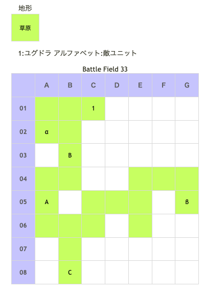

# Battle Field 33 聖地ベルヘイム

- カード12枚
- 夜間固定
- ユグドラのみ出撃、HIGH状態。

## 勝利条件 

- ロズウェルの撃破（ロザリィ加入時）
- ロザリィの撃破（ロズウェル加入時）

## 敗北条件 

- ユグドラの戦死
- カードを使い切る

## マップ 

## 取得可能アイテム 

|名前|時期|-|位置|備考|
|---|---|---|---|---|
|オリハルコン||拾|α(鉱石が突き出た草地)|[Battle Field 35](BattleField35.md)で「エクスカリバー」入手に必要|
|禁断の果実||拾|β(ほのかに光る樹)||
|黒薔薇のクレスト||落|C(ロズウェル)|LUK4.0 ユグドラのLUKを鍛えておく必要あり|
|白薔薇のクレスト||落|C(ロザリィ)|LUK3.0 ユグドラのLUKを鍛えておく必要あり|

## 敵ユニット 

#### ロザリィ加入時 

- ロズウェル隊 ： ネクロゲート （Pow 3500 Mov 11）

|No.|名前|ユニット|Lv|士気|GEN|ATK|TEC|LUK|POW|アイテム|備考|
|---|---|---|---|---|---|---|---|---|---|---|---|
|A|シモベ|スケルトン|12|2830|2.3|2.3|3.3|4.0|40|装備なし||
|B|シモベ|スケルトン|12|2830|2.3|2.3|3.3|4.0|40|装備なし||
|C|ロズウェル|ネクロマンサー|14|7220|1.0|3.5|3.0|4.0|120|黒薔薇のクレスト|Rage暗黒 暗黒攻撃力アップ(装備)|

#### ロズウェル加入時 

- ロザリィ隊 ： メイクドール （Pow 3500 Mov 11）

|No.|名前|ユニット|Lv|士気初期値|GEN|ATK|TEC|LUK|POW|アイテム|備考|
|---|---|---|---|---|---|---|---|---|---|---|---|
|A|ゴーレ８号|ゴーレム|12|2980|3.2|3.2|1.9|1.9|40|||
|B|レーム９号|ゴーレム|12|2980|3.2|3.2|1.9|1.9|40|||
|C|ロザリィ|ウィッチ|14|6900|1.4|2.0|5.0|3.0|120|白薔薇のクレスト|Rage火炎 神聖攻撃力アップ(装備)|

- 備考
  - クレストの入手にはLUKがある程度必要になる、LUKの強化か四葉のクローバー幸運のタリスマン使えば入手は可能（次ステージでティアラ装備のため消滅するので注意）
  - 装備でLUKUPさせる分を引いてもLUK2.0必要だが、素LUKでは1.8～1.9なので、ここまでのBFでMVPを振っておく必要がある。 特にロズウェル相手の場合は、LUKドーピング必須。
  - ロザリィ、ロズウェルはそれぞれメイクドール、ネクロゲートを使用してくるが召還はされない（召還によるダメージは有）
  - ユグドラが育っていない場合カード切れの危機もあるのでその場合はアイテムを使っていこう（ロズウェルなら闇夜のローブ・ロザリィなら真紅のマントあたりが良）
  - ロザリィ相手ならばマインドチェンジ、ロズウェル相手ならばバニッシュが効果大。
  - LUK3以上あれば、ロザリィ相手で血濡れのレイピアが有効。 毎ターン士気が回復するので、士気低下を無効化できる。 (禁忌のロザリオではLUKが下がるのでアイテムが入手できない)
  - MVP+2の振り方は、クラスチェンジ後のステータスを考慮すること。

## 戦闘中イベント 

- 特に無し

## 勝利後イベント 

- 未入手の場合ネクロゲート入手(power:1400,move:11,Ace:杖)
- 未入手の場合メイクドール入手(power:1400,move:11,Ace:杖)

## MVPターン数制限 

- ＋２：10ターン以下
- ＋１：11～99ターン
- 無し：リトライ

## 関連 

### 次 

- [Chapter 6](Chapter6.md)

- [Battle Field 34](BattleField34.md)

### 前 

- [Chapter 5](Chapter5.md)

- [Battle Field 32](BattleField32.md)
