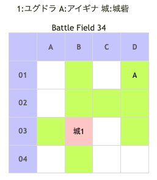

# Battle Field 34 ナハトの祭壇

- ほぼイベント戦闘
- 士気ダメージ計算が滅茶苦茶。合計が-10％にも関らずありえない士気ダメージを受ける。逆も然り、ジハード使用でルシエナにありえない士気ダメージが入る。
- オープニングイベントでジハード入手、ユグドラの装備が奇跡のティアラへ変更
- ユグドラがラ・ピュセルにクラスチェンジ。
  - MVPやTO EATアイテムで上げていた分を持ち越して、能力値がラピュセルのものに移行する。詳しくは、[ステータス成長](GrowthChart.md)参照。
  - 全体的に強化されるが、特にTECは初期パラ―メーターで7も上がるので、序盤の上げすぎに注意（もう遅いが）。
- 1戦目はルシエナ無敵なのですること無し。2戦目にジハード使用でクリア

## 勝利条件 

- アイギナの撃破

## 敗北条件 

- ユグドラの戦死

## マップ 

## 取得可能アイテム 

|名前|時期|-|位置|備考|
|---|---|---|---|---|
|リヴェンジャー||落|A(アイギナ)||

## 敵ユニット 

- アイギナ ： レヴォリューション （Pow 7500 Mov 10）

|NO.|名前|ユニット |Lv|士気|GEN|ATK|TEC|LUK|POW|アイテム|備考|
|---|---|---|---|---|---|---|---|---|---|---|---|
|A|アイギナ|ヴァルキリー|16|7780|3.0|4.2|6.0|1.0|120|リヴェンジャー(2)|同ダメージで反撃(装備) HIGH ジハード以外でダメージを受けない|

## 戦闘中イベント 

- BF16で霊園イベントをこなしていると戦闘直前に台詞追加。記憶あやふやな昔のデータで検証したので要再検証？
 ア「･･･何故、お前だけが認められた?私たちは認められなかったどころか、生きることさえ･･･」
 ユ「な、何の話をしているの？」
 ア「私たちが生き延びためにどれだけ苦しんで来たか･･･それを、お前は知るまいッ！」
 ユ「何を言っているの･･･!?」
 ア「何も知らないお前だけが恵まれた道を歩むなんて･･･その剣と冠…それをお前に渡す訳にはいかない！」
 ･･･が追加分。

## 勝利後イベント 

- 特に無し

## MVPターン数制限 

- ＋２：2ターン
- ＋１：3ターン
- 無し：リトライ

## 関連 

### 次 

- [Chapter 7](Chapter7.md)

- [Battle Field 35](BattleField35.md)

### 前 

- [Chapter 6](Chapter6.md)

- [Battle Field 33](BattleField33.md)
