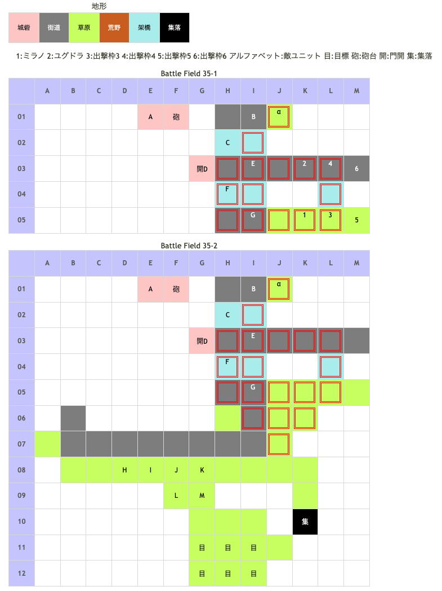

# Battle Field 35 カノッサ街道

- カード16枚
- 2部構成だがカード復活無し
- 夜間除く敵毎ターンに砲撃ダメージ(10%)
- 35-1、敵は全ユニットプロテクト。
  - 撤退イベントの発生条件が「7回負けること」なので被害緩和を考えつつ戦う。
  - ロズウェル+ネクロゲートorロザリィ+メイクドールでスケルトンorゴーレムを召還して被害を最小限に押さえるといいかも。
  - デュランのGENが☆4以上の場合、敵の雑魚騎兵を倒してヘッドのみの状態で負ければ、補正で相殺できる為ほとんど士気が減らない。
  - デュランをH01へ配置すると砲撃を避けつつ士気ダメージ減少可能。
  - バンシーズクライ発動中に負けると能力差に大きなマイナス補正がかかるので、士気減少を抑えることができる。
  - ガーディアンナイトはLUK☆1（バルドゥスは☆2）。フォーチュン発動中敗北でもバンシーズクライと同様の効果がある。
  - リフレッシュメントも効果的。5vs5ならダメージは一人一回ずつで済むため、回復量の方が上回る。
  - 速やかに35-1を終わらせたい場合は初回自軍ターンでクルスを突っ込ませる。返しのターンで撤退はするが一人で移行条件を稼いでくれる(他キャラを巻き込まないよう注意)。正面突破っていうのはどうかな？
  - カードPOWを稼げるので35-2で余裕があれば狙ってみよう。（カード復活もないし、砲撃があるので35-1の間はオススメしない）
- 7回敗戦すると自軍撤退イベント発生、35-2へ

## 勝利条件 

35-1
- バルドゥスを撃破し、特定地点へ到達

35-2
- 特定地点へ到達

## 敗北条件 

35-1
- ユグドラorミラノの戦死
- カードを使い切る

35-2
- 味方ユニットの戦死
- カードを使い切る

## マップ 

## 取得可能アイテム 

|名前|時期|-|位置|備考|
|---|---|---|---|---|
|発芽プロテイモ|35|変|開始前|「プロテイモ」所持|
|泥つきの不発弾|35-1~|拾|α|[[Battle Field 41](BattleField41.md)でマドック研究所での交換に必要 取得には、デュラン or ヒヅメシューズ装備のユニットが必須|
|エクスカリバー|35-2|交|集|夜以外、これまでノーリトライの場合のみ ユグドラorラッセルで訪れて｢オリハルコン｣と交換 ※条件を満たしていてもランダムで留守|
|エレメントロッド|35-2|交|集|夜以外、これまでノーリトライの場合のみ ロズウェルで訪れて｢エレメント+世界樹の枯れ枝｣と交換 ※条件を満たしていてもランダムで留守|
|マルスの大盾|35-1~|盗|D(バルドゥス)|GEN6.0 プロテクトのためスティール必須 （BF36でも取得可能だが遠回り）|
|メダリオン×５|35-1~|盗|B(ガーディアンナイト) C(ガーディアンナイト) E(ガーディアンナイト) F(ガーディアンナイト) G(ガーディアンナイト)|GEN4.0 プロテクトのためスティール必須|
|メダリオン|35-2|落|J(ハンター)||

## 敵ユニット 

### 35-1

- ユーディ隊 ： フレイム （Power 2400　Move 07）

|No.|名前|ユニット|Lv|士気|GEN|ATK|TEC|LUK|POW|アイテム|備考|
|---|---|---|---|---|---|---|---|---|---|---|---|
|A|ユーディ|ウィッチ|15|7140|3.2|3.0|5.0|4.2|120|フォーミュラー(1)|Rage火炎 ゲージMAXになる(装備) Protect!|

- 備考
  - アースクウェイクでバルドゥス隊のCかFのガーディアンナイトを水没させればユーディとも戦える。
  - だが、手間がかかるのでおすすめしない。ユーディのアイテムは[Battle Field 38](BattleField38.md)でも入手可能。

- バルドゥス隊 ： エースガード （Power 1550　Move 04）

|No.|名前|ユニット|Lv|士気初期値|GEN|ATK|TEC|LUK|POW|アイテム|備考|
|---|---|---|---|---|---|---|---|---|---|---|---|
|B|鋼鉄騎兵|ガーディアンナイト|15|5490|5.0|3.2|3.4|1.9|80|メダリオン|Protect! －士気回復専用(装備)|
|C|鋼鉄騎兵|ガーディアンナイト|15|5490|5.0|3.2|3.4|1.9|80|メダリオン|Protect! －士気回復専用(装備)|
|D|バルドゥス|ガーディアンナイト|17|8180|6.0|4.3|3.0|2.4|120|マルスの大盾(1)|Protect! ○突撃を完全ガード|
|E|鋼鉄騎兵|ガーディアンナイト|15|5490|5.0|3.2|3.4|1.9|80|メダリオン|Protect! －士気回復専用(装備)|
|F|鋼鉄騎兵|ガーディアンナイト|15|5490|5.0|3.2|3.4|1.9|80|メダリオン|Protect! －士気回復専用(装備)|
|G|鋼鉄騎兵|ガーディアンナイト|15|5490|5.0|3.2|3.4|1.9|80|メダリオン|Protect! －士気回復専用(装備)|

- 備考
  - バルドゥスのアイテムは次のBFでも入手可能だが、次BFでミラノを別の場所へ移動させなければならない為、ここで盗んでおくのが無難。バルドゥスはGen☆6。ミラノがTec☆6じゃないとマルスの大盾は盗めないので注意。
  - 上でも書いたが、CとFのガーディアンナイトは橋の上にいるのでアースクウェイクを使えば水没させることができる。
  - BF36でも陣形は変わらないが、メダリオンは復活する。士気補給に備えるのなら連戦スティール。
  - BF35～36でジハードを連発するならば、連戦ハンデ無しor瞬間チャージ装備で。
  - バルドゥス隊から得られる経験値はほとんど無い代わりにカードPOWERは高く、プロテクト限界まで削ればPOW500以上稼げる。

### 35-2

- 伏兵隊 ： マインドチェンジ （Power 1650　Move 06）

|No.|名前|ユニット|Lv|士気|GEN|ATK|TEC|LUK|POW|アイテム|備考|
|---|---|---|---|---|---|---|---|---|---|---|---|
|H|伏兵|ウンディーネ|13|3150|3.0|3.0|3.3|2.6|40|装備なし|Rage冷気|
|I|伏兵|ハンター|13|3150|3.0|2.4|4.1|2.6|40|装備なし||
|J|伏兵|ハンター|13|3150|3.0|2.4|4.1|2.6|40|メダリオン|－士気回復専用(装備)|
|K|伏兵|バンディット|13|2910|2.4|3.3|1.9|3.3|40|装備なし||
|L|伏兵|ウンディーネ|13|3150|3.0|3.0|3.3|2.6|40|装備なし|Rage冷気|
|M|伏兵|バンディット|13|2910|2.4|3.3|1.9|3.3|40|装備なし||

## 戦闘中イベント 

35-1
- 7戦の敗北で35-2に移行イベント発生

35-2
- メダリオン所持のハンター撃破で伏兵グループ消滅
- 南東の集落 メーテの武器工房
  - ユグドラ・ラッセル ｢オリハルコン｣ → ｢エクスカリバー｣
  - ロズウェル ｢エレメント｣+｢世界樹の枯れ枝｣ → 「エレメントロッド」 ロザリィでは交換アイテムが足りないため入手できない
  - ミラノ・デュラン・ニーチェ・クルス・エレナで訪問してもアイテム交換のイベントは発生しない

## 勝利後イベント 

- 特に無し

## MVPターン数制限 

- ＋２：48ターン以下
- ＋１：49～99ターン
- 無し：リトライ

## 関連 

### 次 

- [Chapter 7](Chapter7.md)

- [Battle Field 36](BattleField36.md)

### 前 

- [Chapter 6](Chapter6.md)

- [Battle Field 34](BattleField34.md)
