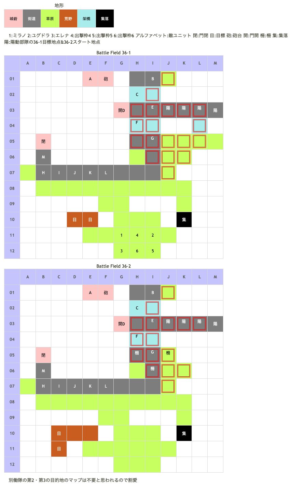

# Battle Field 36 要塞南門前～迂回山道

- カード10枚
- 2部構成
- 夜間以外毎敵ターン時に砲撃ダメージ(10%)
- 36-2、正門前（J03）に配置するユニットは砲撃とプロテクトユニットの猛攻で士気が削られるので注意。
  - GBAと違い無敵はないものの槍に有利なユニットが杖、鎌ユニットだけなのでユグドラが敗北する可能性が高い、ユグドラをユニオンに組み込まない、士気回復のリフレッシュメントを入れておくなどしておくと楽。
  - BF35と同様、デュランをH01に配置すると砲撃ダメージを避けつつ士気ダメージを抑える事が可能。
  - 撤退者を出さずに耐え切りたいというなら磔刑役にミラージュコートやブレイブリングナナのキャンディ等を装備させればやりすごせるはず。
  - ロザリィがいる場合、ゴーレム召喚→鋼鉄騎兵Gにアースクウェイク→柵破壊→ドラゴンブーツ装備者を柵の外に移動、といった行動で空きマスを作ることも一応可能(柵は壊しても夜が明けると復活するので注意)。
  - 上記と同じで架橋地形上の敵にアースクエイクを使用する事で水死させる事が可能。
  - 撤退が嫌な場合の磔刑役はデュランかロズウェル。撤退許容の場合の磔刑役はクルスがオススメ。
  - バルドゥス隊と戦ってもLvに関わらず、得られる経験値がほとんど無い。
- 36-2、ミラノとエレナは夜間のみ移動可
- 36-1を夜にクリアすると耐えるターン数の節約になる、なるべくなら夜に終わらせるのがベター
- MVP+2を取得する為には、カード3枚（合計9ターン）でBF36-1を終わらせなければならない。その為には味方ユニット3人を撤退させる必要がある。 MVP+2を取得したい場合は以下の方法を取る。
  - ユグドラにヒヅメシューズかドラゴンブーツを装備、いけにえを3人用意する（このとき士気が1000位が良い、それ以下だとより良い）。カードはＭＯＶの高いものを選ぶ。  
まずＭＯＶの高いカード（というかスティール・ジハード・ネクロゲートかメイクドールの３枚）を使い、守備隊長グループのヴァルキリーにいけにえの3人がやられ撤退する。  
ユグドラ・ミラノ・エレナの3人はそれぞれ目標地点に到達。ユグドラは引きこもってやり過ごす。  
士気に余裕があればバルドゥス隊と闘ってもよい。といってもユグドラの士気がマックスでも死ぬ可能性はある。  
また、いけにえ３人を前のBFの砲台で士気を削っておくといい。

## 勝利条件 

36-1
- 特定地点へ到達
  - ミラノ＆エレナを山道、その他味方ユニットを門前へ

36-2
- ミラノ＆エレナが特定地点へ到達

## 敗北条件 

36-1
- ユグドラorミラノorエレナの戦死
- カードを使い切る

## マップ 

## 取得可能アイテム 

|名前|時期|-|位置|備考|
|---|---|---|---|---|
|■■■セ■■■■|開始前|変||「■■■■■■■■」所持時 後に「神圏マセラマティ」or「珍圏マセラマティ」へと変化|

## 敵ユニット 

- バルドゥス隊 ： エースガード （Power 1550　Move 04）

|No.|名前|ユニット|Lv|士気初期値|GEN|ATK|TEC|LUK|POW|アイテム|備考|
|---|---|---|---|---|---|---|---|---|---|---|---|
|B|鋼鉄騎兵|ガーディアンナイト|15|5490|5.0|3.2|3.4|1.9|80|メダリオン|プロテクト|
|C|鋼鉄騎兵|ガーディアンナイト|15|5490|5.0|3.2|3.4|1.9|80|メダリオン|プロテクト|
|D|バルドゥス|ガーディアンナイト|17|8180|5.1|4.3|4.3|2.0|120|マルスの大盾(BF35で取得した場合装備無し)ステータスは装備なしの値|プロテクト|
|E|鋼鉄騎兵|ガーディアンナイト|15|5490|5.0|3.2|3.4|1.9|80|メダリオン|プロテクト|
|F|鋼鉄騎兵|ガーディアンナイト|15|5490|5.0|3.2|3.4|1.9|80|メダリオン|プロテクト|
|G|鋼鉄騎兵|ガーディアンナイト|15|5490|5.0|3.2|3.4|1.9|80|メダリオン|プロテクト|

- ユーディ隊 ： フレイム （Power 2400　Move 07）

|No.|名前|ユニット|Lv|士気初期値|GEN|ATK|TEC|LUK|POW|アイテム|備考|
|---|---|---|---|---|---|---|---|---|---|---|---|
|A|ユーディ|ウィッチ|15|7140|3.2|3.0|5.0|4.2|120|フォーミュラー(1)|Rage火炎 ゲージMAXになる(装備) プロテクト|

- 守備隊 ： シールドバリア （Power 1800　Move 06）

|No.|名前|ユニット|Lv|士気初期値|GEN|ATK|TEC|LUK|POW|アイテム|備考|
|---|---|---|---|---|---|---|---|---|---|---|---|
|H|衛兵|ヴァルキリー|14|3070|2.4|3.1|3.4|2.6|40||Rage神聖|
|I|衛兵|ヴァルキリー|14|3070|2.4|3.1|3.4|2.6|40||Rage神聖|
|J|衛兵|ヴァルキリー|14|3070|2.4|3.1|3.4|2.6|40||Rage神聖|
|K|衛兵|ヴァルキリー|14|3070|2.4|3.1|3.4|2.6|40||Rage神聖|
|L|衛兵|ヴァルキリー|14|3070|2.4|3.1|3.4|2.6|40||Rage神聖|
|M|守備隊長|ナイト|15|5410|4.1|3.2|2.7|1.9|80|メダリオン|プロテクト|

- 備考
  - バルドゥス隊はプロテクト状態で撃破することは不可能、常に戦闘を強いられるので注意。GBA版とは違い無敵はないのでステータスを上回っていれば砲撃ダメージだけで済ませる事も。
  - MVPが欲しいユニットは守備隊のヴァルキリーを倒すのが手っ取り早い。
  - リフレッシュやエースガード推奨。マインドチェンジを成功させるにはTEC6必要。
  - 属性強化装備と属性スキルの組み合わせも有効。中盤以降は士気を削りきってPOWの尽きた敵ユニットと延々連戦することになるので、サンダーボルトなど育成優先度の低いカードも気兼ねなく投入できる。
  - 自ら攻撃することはあまりないと思うが、こちらから戦闘を仕掛けたターンに36-2へ移行すると、次の自ターンは攻撃できないバグ(？)がある。その次の自ターンからは攻撃可。

## 戦闘中イベント 

36-1
- 集落のパネルに進入しても何も起こらない
- 衛兵は隣接しない限り攻撃してこない

36-2
- 2人を目標地点に配置してターンを終了すると新たに目標地点が出現
- さらに目標地点が1パネル出現し、2人が到達すると終了

## 勝利後イベント 

- 特に無し

## MVPターン数制限 

- ＋２：34ターン以下
- ＋１：35ターン～
- 無し：リトライor戦闘で勝利していない

## 関連 

- [Chapter 7](Chapter7.md)

### 次 

- [Battle Field 37](BattleField37.md)

### 前 

- [Battle Field 35](BattleField35.md)
