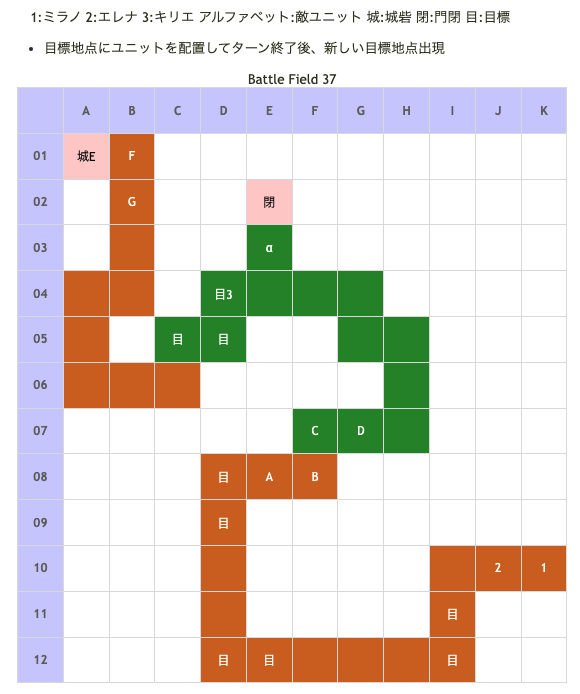

# Battle Field 37 迂回山道～水門

- 2部構成
- 夜間固定
- ミラノ・エレナのみ
- 37-1、敵2ターン終了後、城砦付近に味方増援としてキリエ登場。
- 37-1、ジルヴァ撃破で37-2へ（キリエ未登場の場合、登場）

## 勝利条件 

37-1
- 目標地点へ到達

3回目の目標地点に到達するとジルヴァ隊出現。勝利条件変更
- ジルヴァの撃破

ジルヴァ撃破後
- 目標地点へ到達

37-2
- エレナ離脱後、5ターン以内に水門へ到達 

## 敗北条件 

共通
- カードを使い切る

37-1
- ミラノorエレナの戦死
- 敵が城砦へ到達

キリエ登場後
- ミラノorエレナorキリエの戦死

37-2
- ミラノorキリエが戦死

エレナ離脱後
- 5ターン経過

## マップ 

## 取得可能アイテム 

|名前|時期|-|位置|備考|
|---|---|---|---|---|
|■■■セ■■テ■|開始前|変||「■■■セ■■■■」所持時 後に「神圏マセラマティ」or「珍圏マセラマティ」へと変化|
|カルネージクロー|37-1|落|A(ジルヴァ)|Luk★5|
|山葡萄|37-1〜|拾|α||
|メダリオン|37-2|落|E(水門兵)|Luk★1|

## 敵ユニット 

- ジルヴァ隊 ： ブラッディクロー （Power 2400　Move 09）

|No.|名前|ユニット|Lv|士気初期値|GEN|ATK|TEC|LUK|POW|アイテム|備考|
|---|---|---|---|---|---|---|---|---|---|---|---|
|A|ジルヴァ|アサシン|15|8080|2.5|4.0 (3.2)|5.0 (4.2)|5.0|120|カルネージクロー(1)|Rage暗黒 常にRage以上(装備)|
|B|影の者|アサシン|13|2740|1.8|2.4|4.1|4.1|40||Rage暗黒|
|C|影の者|アサシン|13|2740|1.8|2.4|4.1|4.1|40||Rage暗黒|
|D|影の者|アサシン|13|2740|1.8|2.4|4.1|4.1|40||Rage暗黒|
()内は装備無しの値

- 備考
  - 敵は一目散に城砦を目指して移動するため自分から攻撃してこない。（進路を塞いだ場合は攻撃してくる）
  - 各ユニット2マスずつ移動。ユニット数が減っても、例えばジルヴァだけになっても9マス一気に移動したりという事は無い。
  - ジルヴァは装備効果によりゲージがRage開始なのでブラッディクローに注意。ジルヴァTec☆5、影の者Tec☆4
  - 「呪い」「鈍足」「麻痺」等移動歩数を変えるステータス異常に陥った場合、ジルヴァ隊は移動しなくなる。ただし、陥っていないユニットだけが動くことにもなるため、ユニオンでまとめて始末したい場合は注意。
  - 上記を利用し、ジルヴァのみに呪いを掛け、置いてきぼりにさせることで短いターンで撃破し易くなる。（ただし、ジルヴァが動かなくなるため目標地点が遠くなる）
  - 余談だが、ジルヴァからスティールするなりして入手出来るカルネージクローの効果は常時Aggressive。このアイテムはBF48まで温存しておくと良い。
  - BF48で戦うことの出来るマリエッタは弓に弱い杖系ユニットである上に、敵のターンでは攻撃を仕掛けてこない、ほぼ全てのスキルを無効化するなどの特徴を持つ。
  - よって、このアイテムをエレナに装備させた場合、戦闘時にこちらが倒されるまで常に最大火力で攻撃し続けることが可能になる。
  - ×タイプのスキルも無効化されるので、スキルが使えないという短所も目立たなくなるなど、まるでこの戦いの為に用意されたかの様な装備品なのである。

- 水門兵隊 ： シールドバリア （Power 1750　Move 06）

|No.|名前|ユニット|Lv|士気初期値|GEN|ATK|TEC|LUK|POW|アイテム|備考|
|---|---|---|---|---|---|---|---|---|---|---|---|
|E|水門兵|ナイト|14|5160|4.0|3.1|2.6|1.9|80|メダリオン|居る場所が勝利条件の地点|
|F|衛兵|ウンディーネ|13|3150|3.0|3.0|3.3|2.6|40||Rage冷気|
|G|衛兵|ウンディーネ|13|3150|3.0|3.0|3.3|2.6|40||Rage冷気|

## 戦闘中イベント 

37-1
- ジルヴァ撃破で影の者消滅

37-2
- 味方ユニットと衛兵隣接で会話
- 水門兵撃破で衛兵消滅

## 勝利後イベント 

- 特に無し

## MVPターン数制限 

- ＋２：13ターン以下
- ＋１：14～99ターン
- 無し：リトライ

## 関連 

- [Chapter 7](Chapter7.md)

### 次 

- [Battle Field 38](BattleField38.md)

### 前 

- [Battle Field 36](BattleField36.md)
