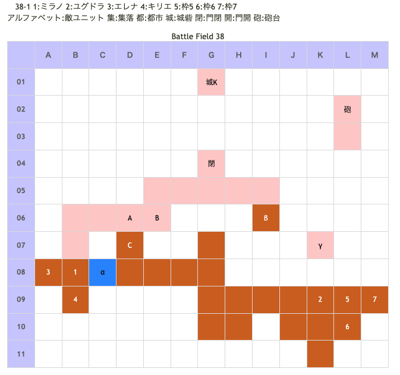
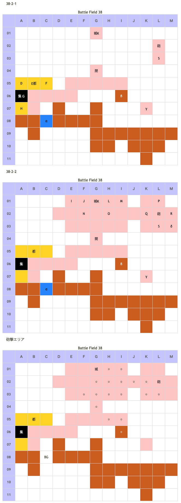

# Battle Field 38 イシュナート要塞内

- 2部構成
- 出撃ユニット ユグドラ・ミラノ・エレナ・キリエ+3人
- カード17枚

## 勝利条件 

38-1
- ミラノ別働隊、ユグドラ本隊と合流せよ！(全員を味方と隣接させればOK)

38-2
- すべての敵を撃破せよ！

## 敗北条件 

38-1
- ユグドラorミラノorキリエが戦死する カードを使い果たす

38-2
- ユグドラorミラノorキリエが戦死する カードを使い果たす

## マップ 

## 取得可能アイテム 

|名前|時期|-|位置|備考|
|---|---|---|---|---|
|■■■セ■マテ■|開始前|変||「■■■セ■■テ■」所持時 後に「神圏マセラマティ」or「珍圏マセラマティ」へと変化|
|ドゼウ|38-1〜|拾|α|夜間限定/ニーチェのみ　「ビンの中のドゼウ」入手後、PSP版では再入手不可 （GBA版では、BF38で「ドゼウ」が二つ取得出来た）|
|ビンの中のドゼウ|38-1〜|||「ドゼウ」入手後、「ガラスのビン」を装備したキャラ（誰でも良い）が移動で入手 [Battle Field 41](BattleField41.md)で「干からびたトカゲ」入手に必要|
|湿った不発弾|38-1〜|拾|β|[Battle Field 41](BattleField41.md)でマドック研究所での交換に必要|
|スナイプグラス|38-1〜|拾|γ|ロズウェルor「ワープシューズ」装備のロザリィが必要|
|ビーズの腕輪|38-2-1|落|E(エミリオ)|Luk★5|
|グランドクロス|38-2-2|落|K(バルドゥス)|Luk★2|
|フォーミュラー|38-2-2|落|S(ユーディ)|Luk★4|
|穴の開いた不発弾|38-2-2|拾|δ|[Battle Field 41](BattleField41.md)でマドック研究所での交換に必要|

## 敵ユニット 

### 38-1

- 帝国兵隊 ： グラヴィティカオス （Power 1900　Move 09）

|No.|名前|ユニット|Lv|士気初期値|GEN|ATK|TEC|LUK|POW|アイテム|備考|
|---|---|---|---|---|---|---|---|---|---|---|---|
|A|帝国兵|ヴァルキリー|13|1620|2.4|3.0|3.3|2.6|40||Rage神聖|
|B|帝国兵|ヴァルキリー|13|1540|2.4|3.0|3.3|2.6|40||Rage神聖|
|C|帝国兵|ヴァルキリー|13|1580|2.4|3.0|3.3|2.6|40||Rage神聖|
- ここのヴァルキリーはグラヴィティカオスを発動する。「呪い」は本格的な戦闘となる38-2移行時には解除されるものの、一応注意。

### 38-2

- 緋天騎兵隊 ： グラヴィティカオス （Power 1900　Move 09）

|No.|名前|ユニット|Lv|士気初期値|GEN|ATK|TEC|LUK|POW|アイテム|備考|
|---|---|---|---|---|---|---|---|---|---|---|---|
|D|緋天騎兵|グリフライダー|14|3320|3.1|3.1|2.6|3.4|40|||
|E|エミリオ|グリフライダー|16|7120|2.2 (2.6)|4.0|5.0 (4.2)|5.0 (4.2)|120|ビーズの腕輪|パニック回避(装備)|
|F|緋天騎兵|グリフライダー|14|3320|3.1|3.1|2.6|3.4|40|||
|G|緋天騎兵|グリフライダー|14|3320|3.1|3.1|2.6|3.4|40|||
|H|緋天騎兵|グリフライダー|14|3320|3.1|3.1|2.6|3.4|40|||

- バルドゥス隊 ： エースガード （Power 2600　Move 04）

|No.|名前|ユニット|Lv|士気初期値|GEN|ATK|TEC|LUK|POW|アイテム|備考|
|---|---|---|---|---|---|---|---|---|---|---|---|
|I|帝国兵|ゴーレム|15|2210|3.5|3.5|1.9|1.9|40|||
|J|帝国兵|ウンディーネ|14|3320|3.1|3.1|3.4|2.6|40||Rage冷気|
|K|バルドゥス|ガーディアンナイト|17|8180|5.0 (4.3)|5.0 (4.3)|4.3|2.0|120|グランドクロス|全属性無効(装備)|
|L|帝国兵|ウンディーネ|14|3320|3.1|3.1|3.4|2.6|40||Rage冷気|
|M|帝国兵|ゴーレム|14|2140|3.5|3.5|1.9|1.9|40|||
|N|帝国兵|フェンサー|13|2460|3.0|3.3|2.6|1.9|40||Rage雷撃|
|O|帝国兵|フェンサー|13|2510|3.0|3.3|2.6|1.9|40||Rage雷撃|

- ユーディ隊 ： フレイム （Power 2400　Move 07）

|No.|名前|ユニット|Lv|士気初期値|GEN|ATK|TEC|LUK|POW|アイテム|備考|
|---|---|---|---|---|---|---|---|---|---|---|---|
|P|宮廷魔術師|ウィッチ|13|2710|2.4|2.4|4.1|3.3|40||Rage火炎|
|Q|宮廷魔術師|ウィッチ|13|2550|2.4|2.4|4.1|3.3|40||Rage火炎|
|R|宮廷魔術師|ウィッチ|13|2640|2.4|2.4|4.1|3.3|40||Rage火炎|
|S|ユーディ|ウィッチ|15|7140|3.2|3.0 (2.5)|5.0 (4.2)|4.2|120|フォーミュラー|Rage火炎 ゲージMAXになる(装備)|
()内は装備無しの値

- 38-2、39は城砦に居座る強敵が多い。「虹色アーク」を所持している場合、エレナに装備させると手っ取り早い。

## 戦闘中イベント 

38-1
- 全ユニット隣接で緋天騎兵隊出現、砲台下にユーディ出現38-2へ移行

38-2
- 夜間以外毎敵ターン時に砲撃ダメージ(10%)
- エミリオ撃破で緋天騎兵消滅
- 都市(B05)制圧で門(G04)が開く、バルドゥス隊＆ユーディ隊出現
- バルドゥス撃破でバルドゥス隊消滅
- ユーディ撃破でユーディ隊消滅

## 勝利後イベント 

## MVPターン数制限 

- ＋２：40ターン以下
- ＋１：41〜99ターン
- 無し：リトライ

## 関連 

- [Chapter 7](Chapter7.md)

### 次 

- [Battle Field 39](BattleField39.md)

### 前 

- [Battle Field 37](BattleField37.md)
