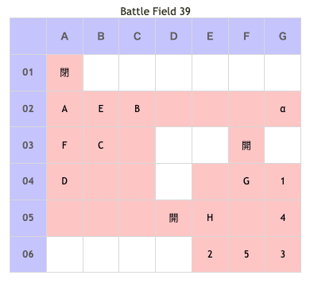

# Battle Field 39 ブロンキアへの大門

- 出撃ユニット ユグドラ・ミラノ・キリエ+2人
- カード12枚

## 勝利条件 

- 軍神バルドゥスを撃破せよ！

## 敗北条件 

- ユグドラorミラノorキリエが戦死する
- カードを使い果たす

## マップ 

## 取得可能アイテム 

|名前|時期|-|位置|備考|
|---|---|---|---|---|
|死んだドゼウ|開始前|変||「ドゼウ」所持時|
|■圏■セ■マテ■|開始前|変||「■■■セ■マテ■」所持時 後に「神圏マセラマティ」or「珍圏マセラマティ」へと変化|
|アイテム図鑑||拾|α||
|名馬ワードナ||落|A(バルドゥス)|Gen★6 Luk★2|

## 敵ユニット 

- バルドゥス隊 ： エースガード （Power 4050　Move 04）

|No.|名前|ユニット|Lv|士気初期値|GEN|ATK|TEC|LUK|POW|アイテム|備考|
|---|---|---|---|---|---|---|---|---|---|---|---|
|A|バルドゥス|ガーディアンナイト|18|6400|60 (50)|60 (50)|50 (43)|20|120|名馬ワードナ|HIGH 必ずエースになれる(装備)|
|B|帝国兵|フェンサー|14|3220|31|34|26|19|40||Rage雷撃|
|C|帝国兵|フェンサー|14|3220|31|34|26|19|40||Rage雷撃|
|D|帝国兵|フェンサー|14|3220|31|34|26|19|40||Rage雷撃|
|E|帝国兵|ゴーレム|15|3460|35|35|19|19|40|||
|F|帝国兵|ゴーレム|15|3460|35|35|19|19|40|||

- ユーディ ： フレイム （Power 1800　Move 07）

|No.|名前|ユニット|Lv|士気初期値|GEN|ATK|TEC|LUK|POW|アイテム|備考|
|---|---|---|---|---|---|---|---|---|---|---|---|
|G|ユーディ|ウィッチ|15|280|32|25|42|42|120||Rage火炎 戦闘不可|

- エミリオ ： グラヴィティカオス （Power 1900　Move 09）

|No.|名前|ユニット|Lv|士気初期値|GEN|ATK|TEC|LUK|POW|アイテム|備考|
|---|---|---|---|---|---|---|---|---|---|---|---|
|H|エミリオ|グリフライダー|16|320|26|40|42|42|120||戦闘不可|

()内は装備無しの値

- 備考
  - ユーディとエミリオはすぐに撤退。ゴーレムはその時に召喚される。
  - バルドゥスは毎ターン士気回復+ステータス異常無効。加えて全部城砦なのでどこでも士気ダメージ-40％。
  - とんでもなく強いのでアイテムを盗んでから総攻撃がいいかも。ただしエースガード発動以降のユニットはスキル援護無しでの撃破は難しい。
  - 名馬ワードナを盗むとGEN・ATC・TECがそれぞれ★一つ減って大幅に弱体化してくれる。デュランがTEC6ならマインドチェンジも有効になる。
  - バルドゥスはGen☆6。ミラノがTec☆6じゃないと盗めないので注意。
  - バルドゥスは高ATK低LUKなので、フォーチュンがかなり役に立つ。

## 戦闘中イベント 

- 開始直後ユーディ・エミリオ離脱

## 勝利後イベント 

- キリエが戦線離脱
- 報酬ではなくイベントで マントラップ入手(power:3200,move:5,Ace:ALL)

## MVPターン数制限 

- ＋２：14ターン以下
- ＋１：15～99ターン
- 無し：リトライ

## 関連 

- [Chapter 7](Chapter7.md)

### 次 

- [Battle Field 40](BattleField40.md)

### 前 

- [Battle Field 38](BattleField38.md)
