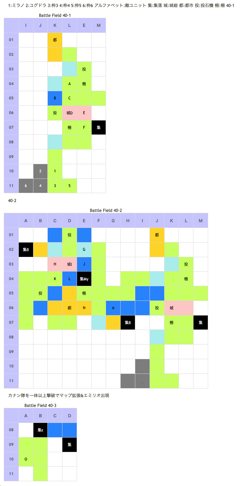

# Battle Field 40 バルドーの丘

- 2部構成
- 出撃ユニット ユグドラ・ミラノ+4人
- カード8枚

## 勝利条件 

40-1
- ロナリス砦を攻略せよ！(味方を｢ロナリス砦｣に移動させればOK)

40-2
- ジェノマ砦を攻略せよ！(味方を｢ジェノマ砦｣に移動させればOK) 

## 敗北条件 

- ユグドラorミラノが戦死する カードを使い果たす

## マップ 

## 取得可能アイテム 

|名前|時期|-|位置|備考|
|---|---|---|---|---|
|腐ったドゼウ|開始前|変||「死んだドゼウ」所持時|
|■圏マセ■マテ■|開始前|変||「■圏■セ■マテ■」所持時 後に「神圏マセラマティ」or「珍圏マセラマティ」へと変化|
|希望のロザリオ|40-1|落|D(モニカ)|Luk★3|
|エンゲージリング|40-2|拾|α|ニーチェのみ|
|絹織りの頭巾|40-2|交|β|「エンゲージリング」と交換|
|蒼リンゴ|40-2|拾|γ||
|ライオンハート|40-2|落|I(カナン)|Luk★3|
|ナマクラソード|40-2|交|δ|手持ちの武器系アイテムとランダムで交換|
|邪眼|40-2|交|ε|「きらきら金貨」と交換 TNV14以上　※「ボロ布」と二択 [Battle Field 41](BattleField41.md)で「悪霊の呪符」入手に必要|
|ボロ布|40-2|交|ε|「きらきら金貨」と交換 TNV13以下　※「邪眼」と二択|
|黒ネコの耳飾り|40-2|落|O(エミリオ)|Luk★4|

## 敵ユニット 

### 40-1

- モニカ隊 ： サンクチュアリ （Power 1100　Move 08）

|No.|名前|ユニット|Lv|士気初期値|GEN|ATK|TEC|LUK|POW|アイテム|備考|
|---|---|---|---|---|---|---|---|---|---|---|---|
|A|民兵|ハンター|6|2110|23|20|34|24|40|||
|B|民兵|ウンディーネ|8|2370|24|24|31|24|40||Rage冷気|
|C|民兵|バンディット|7|2030|20|26|18|31|40|||
|D|モニカ|ヴァルキリー|9|5100|30 (25)|25|34 (32)|30 (25)|120|希望のロザリオ|Rage神聖 ときどきゲージMAX(装備) 居る場所が勝利条件の地点|
|E|民兵|ヴァルキリー|8|2220|21|24|31|24|40||Rage神聖|
|F|民兵|ナイト|8|2410|27|24|24|18|40|||

- カナン隊 ： バニッシュ （Power 1150　Move 07）

|No.|名前|ユニット|Lv|士気初期値|GEN|ATK|TEC|LUK|POW|アイテム|備考|
|---|---|---|---|---|---|---|---|---|---|---|---|
|I|カナン|フェンサー|10|5660|40 (31)|35 (31)|19|32|120|ライオンハート|Rage雷撃 連戦ハンデなし(装備)|

### 40-2

- カナン隊 ： バニッシュ （Power 1150　Move 07）

|No.|名前|ユニット|Lv|士気初期値|GEN|ATK|TEC|LUK|POW|アイテム|備考|
|---|---|---|---|---|---|---|---|---|---|---|---|
|G|民兵|バンディット|6|1910|20|25|18|30|40|||
|H|民兵|フェンサー|7|2180|24|26|24|18|40||Rage雷撃|
|I|カナン|フェンサー|10|5660|40 (31)|35 (31)|19|32|120|ライオンハート|Rage雷撃 連戦ハンデなし(装備) 居る場所が勝利条件の地点|
|J|民兵|ウンディーネ|7|2270|24|24|31|24|40||Rage冷気|
|K|民兵|ハンター|8|2380|24|21|35|24|40|||
|L|民兵|ウンディーネ|6|2100|23|23|30|24|40||Rage冷気|
|M|民兵|ナイト|7|2260|26|24|24|18|40|||
|N|民兵|ナイト|8|2410|27|24|24|18|40|||

カナンの部隊を1人以上撃破後、敵ターン マップ南西にエミリオ出現

- エミリオ ： グラヴィティカオス （Power 5800　Move 09）

|No.|名前|ユニット|Lv|士気初期値|GEN|ATK|TEC|LUK|POW|アイテム|備考|
|---|---|---|---|---|---|---|---|---|---|---|---|
|O|エミリオ|グリフライダー|17|7380|30 (26)|41|50 (43)|43|120|黒ネコの耳飾り|HIGH 夜間移動で士気回復(装備)|

()内は装備無しの値

- 備考
  - カード枚数が少ないので、アイテムを回収するならばMOVをやや高めに用意しておく。
  - ミラノに破滅のハンマーを装備させて柵を破壊すると、後続の移動が楽になる。 氷結無しで橋上に移動確定すると、即ゲームオーバーとなるので注意。
  - 水辺を越えられるドラゴンブーツや、次のBFで必要となるメルヘン偽翼も可。
  - ちなみに、柵はこのBFで終了。
  - エミリオ以外の敵はLVが低いので、MVPのキャラ調整は比較的容易。
  - エミリオの能力自体はそれ程強くないものの、POWER5800という極端な威力があるため、1回の敗北+呪いで即撤退させられる恐れがある。

## 戦闘中イベント 

40-1
- モニカと隣接すると会話あり
- 占領後、西側のマップ拡張。カナン隊の民兵7人出現

40-2
- カナンの部隊を1人以上撃破後の敵ターン マップ南西拡張。エミリオ出現。
- カナンと隣接すると会話あり
- エミリオと隣接すると会話あり

## 勝利後イベント 

- 特になし

## MVPターン数制限 

- ＋２：30ターン以下
- ＋１：31～99ターン
- 無し：リトライ

## 関連 

- [Chapter 7](Chapter7.md)

### 次 

- [Battle Field 41](BattleField41.md)

### 前 

- [Battle Field 39](BattleField39.md)
