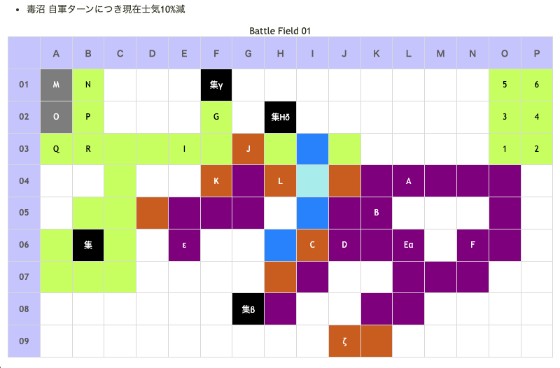

# Battle Field 41 ドロミノス湿地帯

- 出撃ユニット ユグドラ・ミラノ+4人
- カード : 30枚
- 1ターン目カード選択後に戦闘チュートリアル。チュートリアル無効でも発生。 
-  このゲーム唯一の毒沼MAP よって、マントラップが「地形攻撃可能」の装備無しで使えるのはここだけ。 「丈夫な長靴」の効果があるのもここだけ。
-  普通にやっているとアイテム回収前にエミリオが突っ込んできて勝利条件を満たしてしまう事があるので 回収役にメルヘン偽翼推奨
- ハンターが部隊長の部隊だけ移動しないので、アイテム全回収するときは先に倒さないように

## 勝利条件 

すべての敵を撃破せよ！

## 敗北条件 

ユグドラorミラノが戦死する カードを使い果たす

## マップ 

## 取得可能アイテム 

|名前|時期|-|位置|備考|
|---|---|---|---|---|
|■圏マセ■マティ|開始前|変||「■圏マセ■マテ■」所持時 後に「神圏マセラマティ」or「珍圏マセラマティ」へと変化|
|シャーマンマスク||拾|α||
|ハイパードリル||交|β|不発弾７個と交換、夜のみ BF47で「ファンネリア」入手に必要|
|ギロチンカッター||交|β|不発弾５〜６個と交換、夜のみ|
|ガトリングボウ||交|β|不発弾３〜４個と交換、夜のみ|
|ナイトスコープ||交|β|不発弾１〜２個と交換、夜のみ|
|タマゴのカラ||拾|γ||
|干からびたトカゲ||交|δ|「ビンの中のドゼウ」と交換、夜以外|
|フレースヴェルク||拾|ε||
|悪霊の呪符||拾|ζ|要「邪眼」装備|
|メダリオン×2||落|C・G(義勇兵)||
|黒ネコの耳飾りorブラックマリア||落|R（エミリオ）|Luk★5 BF40で「黒ネコの耳飾り」を入手している場合「ブラックマリア」所持|

## 敵ユニット 

- 義勇兵隊 ： ポイズンブレス （Power 1450　Move 10）

|No.|名前|ユニット|Lv|士気初期値|GEN|ATK|TEC|LUK|POW|アイテム|備考|
|---|---|---|---|---|---|---|---|---|---|---|---|
|A|義勇兵|バンディット|11|2630|23|31|19|32|40|||
|B|義勇兵|バンディット|10|2480|22|31|19|32|40|||
|C|義勇兵|ネクロマンサー|12|2850|23|30|33|33|40|メダリオン|Rage暗黒|
|D|義勇兵|ネクロマンサー|11|2740|23|29|33|33|40||Rage暗黒|
|E|義勇兵|スケルトン|11|2720|23|23|32|40|40|||
|F|義勇兵|スケルトン|10|2560|22|22|32|40|40|||

- 義勇兵隊 ： マントラップ （Power 1450　Move 05）

|No.|名前|ユニット|Lv|士気初期値|GEN|ATK|TEC|LUK|POW|アイテム|備考|
|---|---|---|---|---|---|---|---|---|---|---|---|
|G|義勇兵|ハンター|12|3030|30|23|40|26|40|メダリオン||
|H|義勇兵|ウンディーネ|10|2710|26|26|32|25|40||Rage冷気|
|I|義勇兵|ハンター|11|2870|27|23|40|25|40|||
|J|義勇兵|フェンサー|10|2630|26|31|25|19|40||Rage雷撃|
|K|義勇兵|ウンディーネ|11|2870|27|27|32|25|40||Rage冷気|
|L|義勇兵|フェンサー|11|2780|27|31|25|19|40||Rage雷撃|

- エミリオ隊 ： グラヴィティカオス （Power 3900　Move 09）

|No.|名前|ユニット|Lv|士気初期値|GEN|ATK|TEC|LUK|POW|アイテム|備考|
|---|---|---|---|---|---|---|---|---|---|---|---|
|M|緋天騎兵|グリフライダー|16|3650|33|33|27|34|40|||
|N|緋天騎兵|グリフライダー|16|3650|33|33|27|34|40|||
|O|緋天騎兵|グリフライダー|16|3650|33|33|27|34|40|||
|P|緋天騎兵|グリフライダー|16|3650|33|33|27|34|40|||
|Q|緋天騎兵|グリフライダー|16|3650|33|33|27|34|40|||
|R|エミリオ|グリフライダー|17|4780|30|41|50|50|120|黒ネコの耳飾りorブラックマリア|夜間移動で士気回復(黒ネコの耳飾り装備) 反撃を完全ガード(ブラックマリア装備)|

## 戦闘中イベント 

- エミリオと隣接で会話
- メダリオン所持の部隊長撃破でそれぞれの義勇兵隊消滅
- エミリオ撃破でエミリオ隊消滅

## 勝利後イベント 

- 特になし

## MVPターン数制限 

- ＋２：50ターン以下
- ＋１：51～99ターン
- 無し：リトライ

## 関連 

### 次 

- [Chapter 8](Chapter8.md)
- [Battle Field 42](BattleField42.md)

### 前 

- [Chapter 7](Chapter7.md)
- [Battle Field 40](BattleField40.md)
