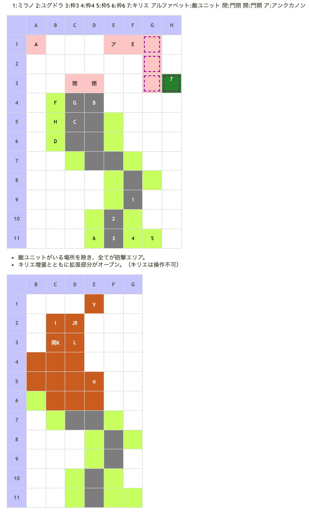

# Battle Field 42 凱旋門

- 出撃ユニット ユグドラ・ミラノ+4人
- カード9枚
- 魔砲 現在士気40%減
- このBFではカードが回復しないので要注意

## 勝利条件 

- 凱旋門を突破せよ！(門前のすべての敵を倒し、凱旋門を開けばOK)

## 敗北条件 

- ユグドラorミラノが戦死する カードを使い果たす

## マップ 

## 取得可能アイテム 

|名前|時期|-|位置|備考|
|---|---|---|---|---|
|■圏マセラマティ|開始前|変||「■圏マセ■マティ」所持時 後に「神圏マセラマティ」or「珍圏マセラマティ」へと変化|
|メダリオン×4|42-1 42-2|落|B・C・D(皇騎兵) K(門番長)||
|グリフォンの羽根|42-2|拾|α||
|アンクの欠片|42-2|拾|β||
|サザンクロス|42-2|落|γ|ここまでノーリトライのときのみ (BF終了後に回収)|

## 敵ユニット 

### 42-1

- ガルカーサ隊 ： ジェノサイド （Power 4200　Move 10）

|No.|名前|ユニット|Lv|士気初期値|GEN|ATK|TEC|LUK|POW|アイテム|備考|
|---|---|---|---|---|---|---|---|---|---|---|---|
|A|ガルカーサ|ドラグーン|19|9040|51|60|42|30|120|イフリートレゾン|Rage火炎 HIGH 戦闘不可|
|B|皇騎兵|インペリアルナイト|17|5890|41|41|35|20|80|メダリオン|Rage火炎 HIGH|
|C|皇騎兵|インペリアルナイト|17|5890|41|41|35|20|80|メダリオン|Rage火炎 HIGH|
|D|皇騎兵|インペリアルナイト|17|5890|41|41|35|20|80|メダリオン|Rage火炎 HIGH|

- 備考
  - アンクカノンの士気ダメージ量が大きいので、敗北する余裕はあまり無い。
  - インペリアルナイトはイベントで消滅するため、メダリオンが要るならば42-1中に倒しておくこと。

- ユーディ隊 ： フレイム （Power 3750　Move 07）

|No.|名前|ユニット|Lv|士気初期値|GEN|ATK|TEC|LUK|POW|アイテム|備考|
|---|---|---|---|---|---|---|---|---|---|---|---|
|E|ユーディ|ウィッチ|16|7460|40|30|50|50|120|サザンクロス|Rage火炎 戦闘不可|
|F|宮廷魔術師|ウィッチ|15|3280|25|25|42|34|40||Rage火炎 プロテクト|
|G|守護像|ゴーレム|16|5430|40|40|19|19|80|||
|H|守護像|ゴーレム|16|5430|40|40|19|19|80|||

### 42-2

- 門番長隊 ： シールドバリア （Power 2500　Move 06）

|No.|名前|ユニット|Lv|士気初期値|GEN|ATK|TEC|LUK|POW|アイテム|備考|
|---|---|---|---|---|---|---|---|---|---|---|---|
|I|衛兵|ヴァルキリー|15|2810|25|32|34|27|40||Rage神聖|
|J|衛兵|ヴァルキリー|15|2830|25|32|34|27|40||Rage神聖|
|K|門番長|ナイト|16|5300|42|33|27|19|80|メダリオン||
|L|衛兵|ナイト|15|3240|35|32|27|19|40|||

- 備考
  - 42-2はHIGH状態で士気が毎ターン全回復するので、それ程苦労はしない。

## 戦闘中イベント 

42-1
- 以下のA～Dの条件のうち、ABCあるいはABDの三条件を全て満たすとキリエ増援。
  - A 「アンクカノンを二回以上受けている」
  - B 「味方ユニットの士気合計が全体士気の半分以下」
  - C 「守護像H（宮廷魔術師下のゴーレム）が生存」
  - D 「守護像Hが死亡、一体以上の味方ユニットが敵ユニットに隣接している」
- キリエ増援が起こるのは基本的に7ターン目（夜、自軍3ターン目）終了時。 (ターン経過は、ガルカーサ隊→ユーディ隊→キリエ→自軍の順)
  - このとき守護像Hを撃破しており、接敵していないと味方の士気がどれだけ低くてもキリエは来ない。
  - 敵に隣接した状態でターン終了するまでイベントが進まないという状況に注意。カード切れの危険がある。
- キリエ増援から一定ターンでイベント
- イベント後、42-1の全ての敵・魔砲・キリエがMAP上から消える。42-2に移行。

42-2
- 自軍全ユニットHIGH状態に変化。 (カードは継続)
- 城砦付近にナイト・ヴァルキリー2人ずつ出現
- 勝利条件 凱旋門兵を撃破せよ！ 変更
- ここまでノーリトライ時、γにサザンクロス出現(BF終了時に回収)

## 勝利後イベント 

- 特になし

## GBA版からの変更点

- 42-2で自軍全ユニットHIGH状態になるようになった。

## MVPターン数制限 

- ＋２：26ターン以下
- ＋１：27ターン以上
- 無し：リトライ

## 関連 

### 次 

- [Chapter 8](Chapter8.md)

- [Battle Field 43](BattleField43.md)

### 前 

- [Chapter 7](Chapter7.md)

- [Battle Field 41](BattleField41.md)
