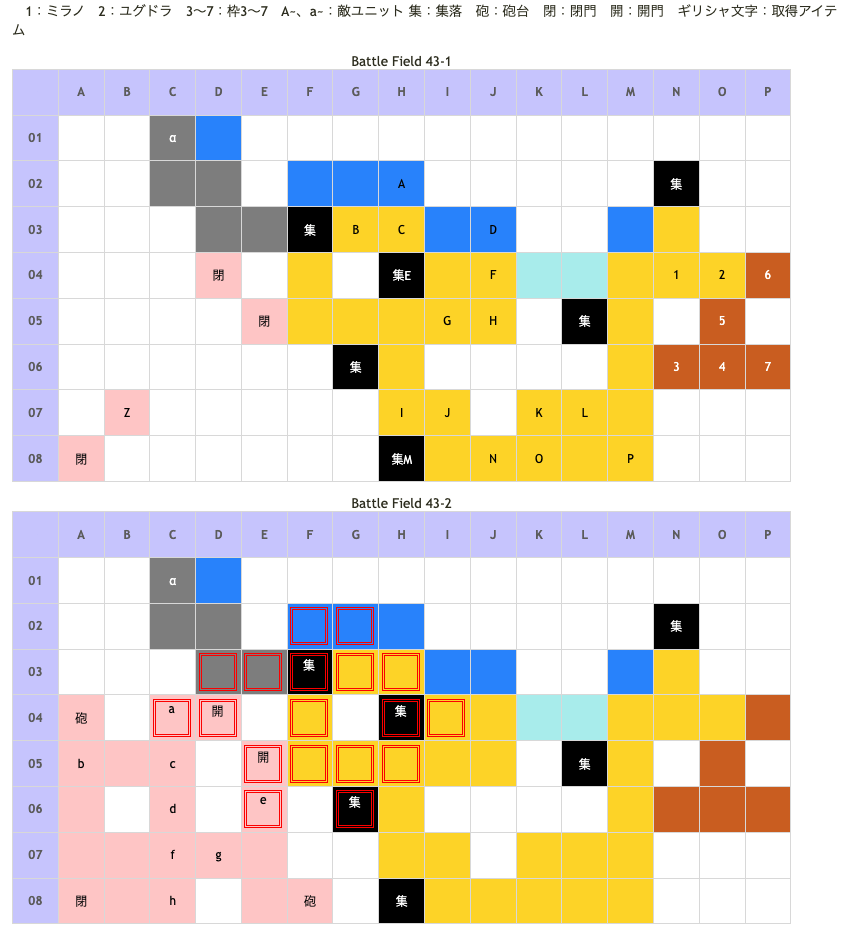

# Battle Field 43 帝都フレアヴェルク

- 出撃ユニット ユグドラ・ミラノ+5人
- カード10枚
- 2部構成
- 43-2、敵軍ターン開始時に砲撃ダメージ

## 勝利条件 

- アイギナ及びルシエナの撃破
  - （43-1で片方。43-2でもう片方を撃破する）

## 敗北条件 

- ユグドラorミラノが戦死
- カードを使い切る

## マップ 

## 取得可能アイテム 

|名前|時期|-|位置|備考|
|---|---|---|---|---|
|神圏マセラマティor珍圏マセラマティ|開始前|変||「■圏マセラマティ」所持時 分岐は入手時点で決定済み|
|ブルースティング|43-1〜|落|H(ルシエナ)|LUK☆2|
|レッドクリムゾン|43-1〜|落|K(アイギナ)|LUK☆4|
|はぐれドラゴン|43-1〜|拾|α||

## 敵ユニット 

### 43-1

- ルシエナ隊 ： レヴォリューション （Power 2300　Move 10）

|No.|名前|ユニット|Lv|士気初期値|GEN|ATK|TEC|LUK|POW|アイテム|備考|
|---|---|---|---|---|---|---|---|---|---|---|---|
|A|帝国兵|ウンディーネ|15|3490|32|32|34|27|40||Rage冷気|
|B|帝国兵|アサシン|15|2970|19|25|42|42|40||Rage暗黒|
|C|帝国兵|アサシン|15|2970|19|25|42|42|40||Rage暗黒|
|D|帝国兵|ウンディーネ|15|3490|32|32|34|27|40||Rage冷気|
|E|帝国兵|ナイト|15|3510|35|32|27|19|40|||
|F|帝国兵|ナイト|15|3510|35|32|27|19|40|||
|G|帝国兵|ナイト|15|3510|35|32|27|19|40|||
|H|ルシエナ|ヴァルキリー|17|8120|30 (41)|50 (41)|60 (51)|25 (27)|120|ブルースティング|Rage神聖 冷気攻撃力アップ(装備)|

- アイギナ隊 ： レヴォリューション （Power 2300　Move 10）

|No.|名前|ユニット|Lv|士気初期値|GEN|ATK|TEC|LUK|POW|アイテム|備考|
|---|---|---|---|---|---|---|---|---|---|---|---|
|I|帝国兵|アサシン|15|2970|19|25|42|42|40||Rage暗黒|
|J|帝国兵|ウンディーネ|15|3490|32|32|34|27|40||Rage冷気|
|K|アイギナ|ヴァルキリー|17|7940|40 (34)|50 (41)|40 (51)|40 (35)|120|レッドクリムゾン|Rage神聖 火炎攻撃力アップ(装備)|
|L|帝国兵|ナイト|15|3510|35|32|27|19|40|||
|M|帝国兵|アサシン|15|2970|19|25|42|42|40||Rage暗黒|
|N|帝国兵|ナイト|15|3510|35|32|27|19|40|||
|O|帝国兵|ウンディーネ|15|3490|32|32|34|27|40||Rage冷気|
|P|帝国兵|ナイト|15|3510|35|32|27|19|40|||

- ガルカーサ隊 ： ジェノサイド （Power 2800　Move 10）

|No.|名前|ユニット|Lv|士気初期値|GEN|ATK|TEC|LUK|POW|アイテム|備考|
|---|---|---|---|---|---|---|---|---|---|---|---|
|Z|ガルカーサ|ドラグーン|19|9040|51|60|42|30|120|イフリートレゾン|Rage火炎 戦闘不可|

- 備考
  - ルシエナの部隊は架橋の手前にユニットを配置すると攻めてくるため、アイギナから倒したければ近づかないこと。
  - アイギナ、もしくはルシエナを倒すと43-2へ。

### 43-2

#### 43-1でアイギナを撃破した場合

- ルシエナ隊 ： レヴォリューション （Power 2600　Move 10）

|No.|名前|ユニット|Lv|士気初期値|GEN|ATK|TEC|LUK|POW|アイテム|備考|
|---|---|---|---|---|---|---|---|---|---|---|---|
|a|帝国兵|ウンディーネ|16|3650|33|33|34|27|40||Rage冷気|
|b|帝国兵|ネクロマンサー|15|3290|25|32|34|34|40||Rage暗黒|
|c|帝国兵|ウンディーネ|16|3650|33|33|34|27|40||Rage冷気|
|d|ルシエナ|ヴァルキリー|17|8120|30 (41)|50 (41)|60 (51)|25 (27)|120|ブルースティング|Rage神聖 冷気攻撃力アップ(装備) HIGH|
|e|帝国兵|フェンサー|15|3390|32|35|27|19|40||Rage雷撃|
|f|帝国兵|ネクロマンサー|15|3290|25|32|34|34|40||Rage暗黒|
|g|帝国兵|フェンサー|15|3390|32|35|27|19|40||Rage雷撃|
|h|帝国兵|ウンディーネ|16|3650|33|33|34|27|40||Rage冷気|

#### 43-1でルシエナを撃破した場合

- アイギナ隊 ： レヴォリューション （Power 2600　Move 10）

|No.|名前|ユニット|Lv|士気初期値|GEN|ATK|TEC|LUK|POW|アイテム|備考|
|---|---|---|---|---|---|---|---|---|---|---|---|
|a|帝国兵|アサシン|16|3130|19|26|42|42|40||Rage暗黒|
|b|帝国兵|バンディット|15|3190|25|35|19|34|40|||
|c|帝国兵|アサシン|16|3130|19|26|42|42|40||Rage暗黒|
|d|アイギナ|ヴァルキリー|17|7940|40 (34)|50 (41)|40 (51)|40 (35)|120|レッドクリムゾン|Rage神聖 火炎攻撃力アップ(装備)　HIGH|
|e|帝国兵|フェンサー|15|3390|32|35|27|19|40||Rage雷撃|
|f|帝国兵|バンディット|15|3190|25|35|19|34|40|||
|g|帝国兵|フェンサー|15|3390|32|35|27|19|40||Rage雷撃|
|h|帝国兵|アサシン|16|3130|19|26|42|42|40||Rage暗黒|

- 備考
  - アイギナ及びルシエナはHIGHな上、ほぼ間違いなく城砦での戦闘になるので強力なカードとユニットで押し切る。
  - アイギナorルシエナ城砦撤退後はデュラン＆チャリオットが最も楽だが、MVPも間違いなく持っていかれる。育てていない場合はLUKの低さにも注意。
  - 騎馬特攻しない場合、相手のユニオン参加も多く、一気に崩すのは難しい。その間に砲撃がじわじわ響く。
  - ここまでくると相手のカードpowも総じて高めなので、ここで士気を減らすのは避けたい。
  - 出来れば「ヒヅメシューズ」「ドラゴンブーツ」やロズウェルのワープで城内から崩したい。
  - 上記の戦術よりも簡単な方法として、北門周辺（E3辺りがベストか）にユニットを配置し、アイギナorルシエナを誘き出す方法がオススメ。
  - 最初はアサシン達が城を出て迎撃してくるが、これを倒せば次は大将が城外に出てくるので一気に畳み掛ける。
  - さらに北門周辺には街道・水辺など、槍ユニットに有利な地形が揃っているので、ディランやニーチェをメインにしたユニオンを組めばまず負ける事はないだろう。
  - ただし、BF44はEPからスタートなのでトドメに使うカードはそれを考慮して選ぶこと。
  - アイテムを盗んだ場合、アイギナはGENが下がるので若干倒しやすくなるが、ルシエナは逆に上がるので倒しにくくなる。
  - とは言え、スティールで突っ込んだ場合はどちらが相手にせよミラノは負ける可能性大なのでオススメしない。
  - ちなみにこのBF以降昼間はない。昼間専用スキル、装備はここで出番が終わると言ってもよい。

## 勝利後イベント 

- 特に無し

## MVPターン数制限 

- ＋２：45ターン以下
- ＋１：46ターン以上
- 無し：リトライ

## 関連 

- [Chapter 8](Chapter8.md)

### 次 

- [Battle Field 44](BattleField44.md)

### 前 

- [Battle Field 42](BattleField42.md)
