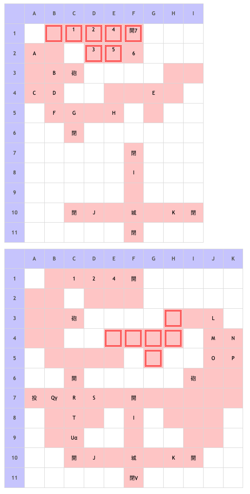

# Battle Field 44 ブロンキア城

- 出撃ユニット ユグドラ・ミラノ+5人
- カード11枚
- 3部構成
- １，２部は夕方固定、３部は夜固定

## 勝利条件 

44-1
- 焔帝ガルカーサを撃破せよ！

44-2
- 戦乙女アイギナ（ルシエナ）を撃破せよ！

44-3
- 焔帝ガルカーサを撃破せよ！

## 敗北条件 

44-1、44-2、44-3
- ユグドラorミラノが戦死する
- カードを使い果たす 

## マップ 

## 取得可能アイテム 

|名前|時期|-|位置|備考|
|---|---|---|---|---|
|イフリートレゾン(2)|44-1〜|落|BorUorV(ガルカーサ)|LUK☆3|
|エンドオブエイジ(1)|44-2|落|L(アイギナ)|LUK☆2　BF43で生存させた方が出てくるのでミストルティンと二択|
|ミストルティン(1)|44-2|落|L(ルシエナ)|LUK☆3　BF43で生存させた方が出てくるのでエンドオブエイジと二択|
|サラマンドラ(1)|44-2〜|盗|UorV(ガルカーサ)|GEN☆?　スティールのみ BF44-1及びBF44-2終了時までにイフリートレゾンを取得していた場合|
|メサラの石版|44-2〜|拾|γ||

## 敵ユニット 

### 44-1

- ガルカーサ隊 ： ジェノサイド （power 2800　move 10）

|No.|名前|ユニット|Lv|士気初期値|GEN|ATK|TEC|LUK|POW|アイテム|備考|
|---|---|---|---|---|---|---|---|---|---|---|---|
|A|帝国兵|フェンサー|16|3550|33|40|27|19|40||Rage雷撃|
|B|ガルカーサ|ドラグーン|19|9040|51|60 (51)|42 (40)|30 (40)|120|イフリートレゾン(2)|Rage火炎 火炎攻撃力アップ(装備) LUK☆3|
|C|帝国兵|アサシン|16|3130|19|26|42|42|40||Rage暗黒|
|D|帝国兵|スケルトン|16|3440|26|26|34|42|40|||
|E|帝国兵|ナイト|16|3670|40|33|27|19|40|||
|F|帝国兵|ネクロマンサー|16|3450|26|33|34|34|40||Rage暗黒|
|G|帝国兵|バンディット|16|3350|26|40|19|34|40|||
|H|帝国兵|ウンディーネ|16|3650|33|33|34|27|40||Rage冷気|
()内は装備無しの値

- 備考
  - 毎ターン敵砲撃
  - 敵ターンから始まる上に、ガルカーサが単騎突撃してくる場合や、ユニオンを組んで突撃してくる。ミラノは間違いなく戦闘する羽目になるので、BF43クリア時にグラヴィティカオスのカードを使用してのクリアを推奨。(ガルカーサにも呪いが有効なので、戦況が有利になる)
  - 敵の動き方によっては、ガルカーサが単騎突撃やユニオンに含まれることがあるので、初期配置のメンバーは考慮して選ぶこと
  - MAP拡張前で見えなくとも、A7の投石器はユニオンに組み込まれる。

### 44-2

- 親衛隊 ： レヴォリューション （power 4050　move 10）

|No.|名前|ユニット|Lv|士気初期値|GEN|ATK|TEC|LUK|POW|アイテム|備考|
|---|---|---|---|---|---|---|---|---|---|---|---|
|L|アイギナ|ヴァルキリー|18|8160|40 (34)|50 (42)|60 (51)|20 (35)|120|エンドオブエイジ(1)|Rage神聖 BF43-1でルシエナ撃破時 LUK☆2　Pow50%アップ(装備)|
|L|ルシエナ|ヴァルキリー|18|8440|30 (42)|50 (42)|60 (51)|30 (27)|120|ミストルティン(1)|Rage神聖 BF43-1でアイギナ撃破時 LUK☆3　勝利で士気吸収(装備)|
|M|親衛隊|ヴァルキリー|17|2500|26|34|35|27|40||Rage神聖|
|N|親衛隊|ヴァルキリー|17|2500|26|34|35|27|40||Rage神聖|
|O|親衛隊|ヴァルキリー|17|2500|26|34|35|27|40||Rage神聖|
|P|親衛隊|ヴァルキリー|17|2500|26|34|35|27|40||Rage神聖|

()内は装備無しの値

- ガルカーサ隊 ： ジェノサイド （power 2800　move 10）

|No.|名前|ユニット|Lv|士気初期値|GEN|ATK|TEC|LUK|POW|アイテム|備考|
|---|---|---|---|---|---|---|---|---|---|---|---|
|Q|皇騎兵|インペリアルナイト|18|6130|42|42|35|20|80|メダリオン||
|R|皇騎兵|インペリアルナイト|18|6130|42|42|35|20|80|メダリオン||
|S|皇騎兵|インペリアルナイト|18|6130|42|42|35|20|80|メダリオン||
|T|皇騎兵|インペリアルナイト|18|6130|42|42|35|20|80|メダリオン||
|U|ガルカーサ|ドラグーン|19|9040|60 (51)|60 (51)|30 (40)|40|120|イフリートレゾン(2)orサラマンドラ(1)|Rage火炎 火炎攻撃力アップ(イフリートレゾン装備)or 同ダメージで反撃(サラマンドラ装備) LUK☆3 プロテクト パラメータはサラマンドラ装備時|

()内は装備無しの値

- アイギナ(ルシエナ)と交戦後出現

- 近衛兵隊 ： シールドバリア（power 1550　move 06）※ ※ガルカーサ増援部隊（ジェノサイド（power2800 move10））出現と同時に、ガルカーサ隊へ編入

|No.|名前|ユニット|Lv|士気初期値|GEN|ATK|TEC|LUK|POW|アイテム|備考|
|---|---|---|---|---|---|---|---|---|---|---|---|
|I|近衛兵|ガーディアンナイト|17|6000|43|34|35|20|80|メダリオン||
|J|近衛兵|ガーディアンナイト|17|6000|43|34|35|20|80|||
|K|近衛兵|ガーディアンナイト|17|6000|43|34|35|20|80|||

- 備考
  - 毎ターン敵砲撃

### 44-3

- ガルカーサ隊 ： ジェノサイド （power 2800　move 10）

|No.|名前|ユニット|Lv|士気初期値|GEN|ATK|TEC|LUK|POW|アイテム|備考|
|---|---|---|---|---|---|---|---|---|---|---|---|
|V|ガルカーサ|ブロンガナイト|20|6540|14 (10)|60 (51)|40 (51)|51|120|イフリートレゾン(2)orサラマンドラ(1)|HIGH Rage火炎 火炎攻撃力アップ(イフリートレゾン装備)or 同ダメージで反撃(サラマンドラ装備) 倒してもアイテムが手に入らない パラメータはサラマンドラ装備時|

- 備考
  - 毎ターン灼熱ダメージ（マップ全体）10%
  - **オブリヴィアスドーンのスキルを使用するとフリーズする為注意。**
  - 予めガルカーサの士気を削った上で、隣接位置(F9かG10あたり)に自軍ユニットを配置し、到達・覚醒ターンの戦闘で倒すと、灼熱ダメージを受けることなくPOWを稼ぐことが出来る。

## 戦闘中イベント 

44-1
- ガルカーサを撃破するとアイギナ（ルシエナ）・ヴァルキリー部隊増援 ← BF43で倒していなかった方

44-2
- アイギナ（ルシエナ）交戦後にガルカーサ・インペリアルナイト部隊増援 44-2移行したターンにデュランで単騎突撃しましたが増援来ませんでした(ルシエナ時)ヴァルキリーを3体以上撃破すると増援が来るようです。もしくは士気ダメージ合計かもしれませんが
- ガルカーサ（サラマンドラ）+プロテクト
- 投石器から1マス東 隠し書庫 メサラの石版 ガルカーサ増援部隊とともに出現する場所にあるのでアイギナ（ルシエナ）を早く倒しすぎないよう注意
- アイギナ（ルシエナ）を倒すと出生と本名が判明

44-3
- カード復活、夜間固定に変化
- ガルカーサのプロテクト解除、砦(F10)へ撤退開始
- 砦へ到達する前に撃破すると、転生後に撤退(BF終了)
- ガルカーサがトライゲート(F7,C10,I10)に隣接すると、開門状態になる
- ガルカーサが砦に到達すると、ブロンガナイトに転生(装備及び士気は継続)
- マップ変化、ガルカーサ以外の敵ユニット消滅
- マップ全体に味方毎ターン灼熱ダメージ
- ガルカーサHIGH状態(毎ターン士気全回復)、不動、隣接戦闘のみ
- 撃破後はアイテムを落とさずイベント移動するので取り逃しに注意

## 勝利後イベント 

- 特になし

## MVPターン数制限 

- ＋２：50ターン以下
- ＋１：51ターン以上
- 無し：リトライ

## 関連 

- [Chapter 8](Chapter8.md)

### 次 

- [Battle Field 45](BattleField45.md)

### 前 

- [Battle Field 43](BattleField43.md)
