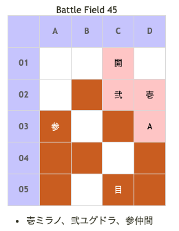

# Battle Field 45 魔竜ブロンガの間

- 出撃ユニット ユグドラ・ミラノ+1人
- カード3枚

- 1マスずつしか動けない。
- ガルカーサ(プロミネンス)
- ガルカーサのジェノサイドのPOWは7500とかなり高いので負けるとほぼ戦死確定。
- 敵はガルカーサ１体だけなので、ジハードを使って素早く倒すのが得策。
- なので下手にユニオンを組むよりユグドラ単体で戦闘した方が楽になる
- 主人公が育ちすぎている等、ＭＶＰ狙いで敢えてユニオンを組むならば、「クリティカル率50％」等の安全に勝ち戦が出来る装備を携えていかないと、主人公にＭＶＰを取られたり（主人公をわざと負けさせてもいいが士気ダメージがとても痛い）、そもそも戦闘に勝てない可能性も高い。
- 灼熱で毎ターン士気を削られる。3人目のユニットにユニオンを組ませる気がない場合、クルス等以後のステージで使用しないユニットを出撃させるのも手。今こそ革命を！
- なお、カードを3枚使い切るとガルカーサが目標地点に到達してBADEND（Bエンディング）。

## 勝利条件 

- 焔帝ガルカーサの野望を打ち砕け！

## 敗北条件 

- ユグドラorミラノ戦死 カードを使い果たす

## マップ 

## 取得可能アイテム 

|名前|-|位置|備考|
|---|---|---|---|
|サラマンドラorプロミネンス|落|A(ガルカーサ)|GEN★1 LUK★6 [Battle Field 44](BattleField44.md)でサラマンドラを入手したか否かで変化|

## 敵ユニット 

- ガルカーサ隊 ： ジェノサイド （Power 7500 Move 10）

|NO.|名前|ユニット|Lv|士気初期値|GEN|ATK|TEC|LUK|POW|アイテム|備考|
|---|---|---|---|---|---|---|---|---|---|---|---|
|A|ガルカーサ|ブロンガナイト|20|6600|14|60|60|60|120|サラマンドラ(1)orプロミネンス(2)|Rage火炎 全属性無効 同ダメージで反撃（サラマンドラ装備） ゲージ・レート蓄積（プロミネンス装備） ステータスはプロミネンス装備時のもの|

- プロミネンス装備の場合、ゲージ・レート蓄積が痛い。毎回ジェノサイドを発動される危険性が高いので、「クリティカル率50％」「瞬間チャージ」等でミラノ+スティールで初ターンに盗んでしまう方がいい。
- 「ドラゴンキラー」「ドラゴンイーター」等対策は色々考えられるが、ターン数が短いので「クリティカル率50％」等一発狙いの装備を使用するのが有効。「クリティカル率50％」の場合、スキル発動封印も大きい。

## 勝利後イベント 

- 特になし

## MVPターン数制限 

- ＋２：4ターン以下
- ＋１：5ターン
- 無し：リトライ

## 関連 

### 次 

- [Chapter 9](Chapter9.md)

- [Battle Field 46](BattleField46.md)

### 前 

- [Chapter 8](Chapter8.md)

- [Battle Field 44](BattleField44.md)
