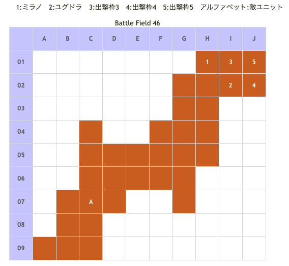

# Battle Field 46 失楽の地アンカルジア

- 出撃ユニット ユグドラ・ミラノ+3人
- カード7枚

## 勝利条件 

- キリエを撃破せよ！

## 敗北条件 

- ユグドラorミラノ戦死 カードを使い果たす

## マップ 

## 取得可能アイテム 

|名前|-|位置|備考|
|---|---|---|---|
|ブラッディローズ|盗|A(キリエ)|要スティール GEN★1 (PSP版は入手不可)|
|乙女の涙|必||キリエ撃破後入手|

## 敵ユニット 

- キリエ ： グラヴィティカオス （Power 8000 Move 09）

|NO.|名前|ユニット|Lv|士気初期値|GEN|ATK|TEC|LUK|POW|アイテム|備考|
|---|---|---|---|---|---|---|---|---|---|---|---|
|A|キリエ|グリフライダー|18|5920|14|50|40|43|120|ブラッディローズ|HIGH POW25%アップ(装備)|

(PSP版)

|NO.|名前|ユニット|Lv|士気初期値|GEN|ATK|TEC|LUK|POW|アイテム|備考|
|---|---|---|---|---|---|---|---|---|---|---|---|
|A|キリエ|グリフライダー|18|5920|10|42|35|43|120||HIGH|

- 敵はキリエ一人、隣接しても敵ターンで攻撃はしてこない。
- とはいえHIGH状態なので逆に倒しにくいかも…。

## 勝利後イベント 

- 乙女の涙入手

## MVPターン数制限 

- ＋２：7ターン以下
- ＋１：8ターン以上
- 無し：リトライ

## 関連 

### 次 

- [Chapter 9](Chapter9.md)

- [Battle Field 47](BattleField47.md)

### 前 

- [Chapter 8](Chapter8.md)

- [Battle Field 45](BattleField45.md)
